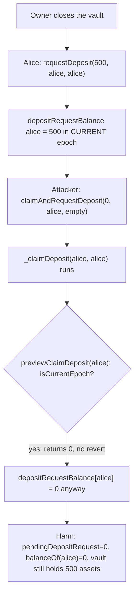
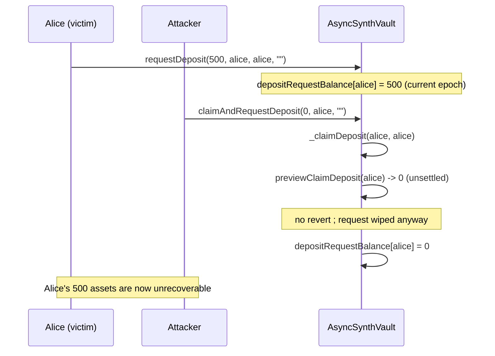

# Amphor — claim functions don't validate if the epoch is settled

> **Vulnerability classes:** vuln/logic/missing-state-check · vuln/access-control/missing-caller-check · vuln/loss-of-funds/griefing

> **Reproduction:** a self-contained Foundry PoC that compiles & runs in an
> isolated project with **only `forge-std`** — no fork, no RPC, no `anvil_state`.
> Full trace: [output.txt](output.txt). PoC:
> [test/30916-h-1-claim-functions-dont-validate-if-the-epoch-is-settled-sh_exp.sol](test/30916-h-1-claim-functions-dont-validate-if-the-epoch-is-settled-sh_exp.sol).

<!-- non-defihacklabs -->
<!-- source-auditvault: https://github.com/Auditware/AuditVault/blob/main/findings/30916-h-1-claim-functions-dont-validate-if-the-epoch-is-settled-sh.md -->
<!-- date: 2024-03 -->

**AuditVault taxonomy:** `lang/solidity` · `platform/sherlock` · `has/github` · `has/poc` · `severity/high` · `sector/zk` · genome: `wrong-condition` · `direct-drain` · `initializer-auth` · `integer-bounds`

---

## Key info

| | |
|---|---|
| **Impact** | **HIGH** — any pending deposit/redeem request can be permanently wiped for **0 shares/assets** before its epoch settles, and `claimAndRequestDeposit()` lets **anyone** trigger this on behalf of an arbitrary victim, for free |
| **Protocol** | [Amphor](https://github.com/AmphorProtocol/asynchronous-vault) — `AsyncSynthVault` (ERC-7540-style asynchronous vault) |
| **Vulnerable code** | `AsyncSynthVault._claimDeposit(owner, receiver)` / `_claimRedeem(owner, receiver)` |
| **Bug class** | Missing state check: claiming is allowed while the request's epoch is still the CURRENT (unsettled) one |
| **Finding** | Sherlock — Amphor, 2024-03 · #30916 (H-1) · reporters CryptoSan, aslanbek, cawfree, eeshenggoh, fugazzi, jennifer37, kennedy1030, mahdikarimi, pynschon, sammy, turvec, whitehair0330, zzykxx |
| **Report** | [2024-03-amphor-judging #72](https://github.com/sherlock-audit/2024-03-amphor-judging/issues/72) |
| **Source** | [AuditVault](https://github.com/Auditware/AuditVault/blob/main/findings/30916-h-1-claim-functions-dont-validate-if-the-epoch-is-settled-sh.md) |
| **Status** | Audit finding — caught in review (not exploited on-chain). Fixed by the protocol team ([PR #103](https://github.com/AmphorProtocol/asynchronous-vault/pull/103)). Reproduced here as a standalone local PoC. |
| **Compiler** | `^0.8.24` (PoC); real contract `0.8.21` |

This is an **audit finding**, not a historical on-chain incident. The real
`AsyncSynthVault` uses `Silo` helper contracts, ERC-7540 request bookkeeping,
and a full settlement pipeline (`open`/`_settle`); the PoC keeps the vulnerable
`_claimDeposit`/`previewClaimDeposit`/`_convertToShares` bodies and
`claimAndRequestDeposit`'s missing-authorization pattern faithful, with the
Silo mechanics simplified to direct vault-held accounting (they do not affect
the bug).

---

## TL;DR

1. When the vault is closed, users call `requestDeposit()` to queue an amount
   of assets against the **current epoch** (`epochId`). Nothing is convertible
   to shares until the owner later settles that epoch (via `open`/`_settle`),
   which advances `epochId` and snapshots the exchange rate.
2. `_claimDeposit(owner, receiver)` computes `shares = previewClaimDeposit(owner)`.
   `previewClaimDeposit` calls `_convertToShares`, which returns **exactly 0**
   whenever the request's epoch is still the current one (`isCurrentEpoch(requestId)`).
3. `_claimDeposit` never checks this before proceeding: it unconditionally
   zeroes `epochs[lastRequestId].depositRequestBalance[owner]` and credits
   `shares` (0) to the receiver — **destroying the request record** even
   though nothing has actually been converted yet.
4. `claimAndRequestDeposit(assets, receiver, data)` calls
   `_claimDeposit(receiver, receiver)` **on behalf of `receiver`**, with no
   check that the caller is `receiver`. So **any address** can wipe **any
   other account's** pending deposit request, for free, before it settles.
5. HARM in the PoC: a victim requests a 500-asset deposit; an attacker calls
   `claimAndRequestDeposit(0, victim, "")`; the victim's pending request drops
   to 0, the victim's share balance stays 0, and the 500 assets remain stuck
   in the vault with no shares outstanding to ever claim them.

---

## The vulnerable code

Verbatim from the report (`AsyncSynthVault.sol`):

```solidity
function _claimDeposit(
    address owner,
    address receiver
)
    internal
    returns (uint256 shares)
{
    shares = previewClaimDeposit(owner);                       // @> VULN

    uint256 lastRequestId = lastDepositRequestId[owner];
    uint256 assets = epochs[lastRequestId].depositRequestBalance[owner];
    epochs[lastRequestId].depositRequestBalance[owner] = 0;      // wiped regardless
    _update(address(claimableSilo), receiver, shares);
    emit ClaimDeposit(lastRequestId, owner, receiver, assets, shares);
}

function _convertToShares(
    uint256 assets,
    uint256 requestId,
    Math.Rounding rounding
)
    internal
    view
    returns (uint256)
{
    if (isCurrentEpoch(requestId)) {
        return 0;                                               // silently zero, no revert
    }
    ...
}
```

The missing-authorization amplifier:

```solidity
function claimAndRequestDeposit(
    uint256 assets,
    address receiver,
    bytes memory data
)
    external
{
    _claimDeposit(receiver, receiver);      // <- claims on behalf of ANY receiver
    requestDeposit(assets, receiver, _msgSender(), data);
}
```

The recommended fix (from the report) adds the missing check **before**
computing `shares`:

```diff
     function _claimDeposit(
         address owner,
         address receiver
     )
         internal
         returns (uint256 shares)
     {
+        uint256 lastRequestId = lastDepositRequestId[owner];
+        if (isCurrentEpoch(lastRequestId)) revert();

         shares = previewClaimDeposit(owner);

-        uint256 lastRequestId = lastDepositRequestId[owner];
         uint256 assets = epochs[lastRequestId].depositRequestBalance[owner];
         epochs[lastRequestId].depositRequestBalance[owner] = 0;
         _update(address(claimableSilo), receiver, shares);
         emit ClaimDeposit(lastRequestId, owner, receiver, assets, shares);
     }
```

---

## Root cause

`_claimDeposit`/`_claimRedeem` treat "compute the shares/assets owed" and
"clear the pending request" as unconditional, sequential steps. But
`_convertToShares`/`_convertToAssets` silently return **0** — not a revert —
whenever the request has not yet settled (`isCurrentEpoch(requestId) == true`).
Nothing stops a claim from proceeding on an unsettled request; it just
converts to zero and still wipes the bookkeeping. Because `claimAndRequestDeposit`
performs this claim on behalf of an arbitrary `receiver` argument with no
`msg.sender == receiver` check, the bug becomes a **free, permissionless
griefing primitive**: destroy anyone's pending request before it can ever
settle.

## Preconditions

- The vault is closed (`requestDeposit`/`requestRedeem` are only callable then).
- A victim has an outstanding, **unsettled** deposit or redeem request (the
  ordinary state between `requestDeposit()` and the owner's next `open()`/`_settle()`).
- The attacker needs no balance, no allowance, and no special role — anyone
  can call `claimAndRequestDeposit`.

## Attack walkthrough

From [output.txt](output.txt):

1. The owner closes the vault (`vaultIsOpen = false`), entering the current,
   unsettled epoch.
2. Alice approves and calls `requestDeposit(500, alice, alice, "")`. Her
   500-asset request is recorded under the **current** `epochId`.
3. An attacker (who holds no assets and has no relationship to Alice) calls
   `claimAndRequestDeposit(0, alice, "")`.
4. Internally this runs `_claimDeposit(alice, alice)`. `previewClaimDeposit(alice)`
   returns `0` because Alice's request is still in the current epoch — but
   `_claimDeposit` proceeds anyway and zeroes `depositRequestBalance[alice]`.
5. **HARM:** `pendingDepositRequest(alice) == 0`, `balanceOf(alice) == 0`, yet
   the vault's asset balance still holds Alice's 500 assets — permanently
   unaccounted, since no shares were ever minted against them and her request
   record no longer exists to reclaim them.

A control test (`test_control_claimAfterSettle_isCorrect`) confirms the
**intended** path: when the owner actually settles the epoch (advancing
`epochId` and snapshotting real exchange-rate values) before the claim, the
same `_claimDeposit` call yields correct, non-zero shares. This isolates the
missing "has this epoch settled?" guard as the sole defect.

## Diagrams





## Impact

- Alice's 500 requested assets remain in the vault's balance, but with no
  shares outstanding and no request record to reclaim them — a **permanent
  fund loss**, not merely a temporary lock.
- `claimAndRequestDeposit`/`claimAndRequestRedeem` make this a **free,
  permissionless griefing weapon**: an attacker with zero balance can destroy
  any number of other users' pending requests at any time before settlement.
- The redeem-side function (`_claimRedeem`) has the identical defect, so
  pending redemption requests (already-burned/escrowed shares awaiting
  assets) are equally at risk.

## Remediation

Per the report, add the missing settlement check **before** computing
`shares`/`assets`, for both `_claimDeposit` and `_claimRedeem`:

```diff
     function _claimDeposit(address owner, address receiver) internal returns (uint256 shares) {
+        uint256 lastRequestId = lastDepositRequestId[owner];
+        if (isCurrentEpoch(lastRequestId)) revert();

         shares = previewClaimDeposit(owner);
-        uint256 lastRequestId = lastDepositRequestId[owner];
         uint256 assets = epochs[lastRequestId].depositRequestBalance[owner];
         epochs[lastRequestId].depositRequestBalance[owner] = 0;
         _update(address(claimableSilo), receiver, shares);
         emit ClaimDeposit(lastRequestId, owner, receiver, assets, shares);
     }
```

## How to reproduce

```bash
cd ~/RustroverProjects/audits/evm-hack-registry/30916-h-1-claim-functions-dont-validate-if-the-epoch-is-settled-sh_exp
forge test -vvv
# Fully local — no fork, no RPC, no anvil_state required.
# Expected: all three tests PASS:
#   test_exploit                             (self-contained Exploit: griefing attack wipes Alice's request)
#   test_griefingWipesVictimRequest          (standalone rebuild mirroring the finding's PoC scenarios)
#   test_control_claimAfterSettle_isCorrect  (control: claiming AFTER settlement works correctly)
```

PoC source: [test/30916-h-1-claim-functions-dont-validate-if-the-epoch-is-settled-sh_exp.sol](test/30916-h-1-claim-functions-dont-validate-if-the-epoch-is-settled-sh_exp.sol)
— the verbatim vulnerable `_claimDeposit`/`previewClaimDeposit`/`_convertToShares`
reduction, plus the victim/attacker orchestration and a settlement control test.

> Note: the vault here is a minimal reduction (no `Silo` helper contracts, no
> full ERC-4626 share token, no fee/performance accounting); the epoch/request
> bookkeeping, the current-epoch zero-conversion, and the unconditional
> request-wipe in `_claimDeposit`/`claimAndRequestDeposit` are faithful to the
> finding.

---

*Reference: finding **#30916 (H-1)** in the [Sherlock Amphor review (Mar 2024)](https://github.com/sherlock-audit/2024-03-amphor-judging/issues/72) · curated by [AuditVault](https://github.com/Auditware/AuditVault/blob/main/findings/30916-h-1-claim-functions-dont-validate-if-the-epoch-is-settled-sh.md)*
