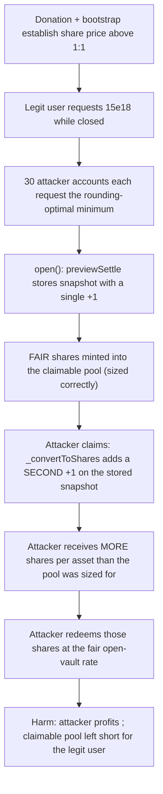
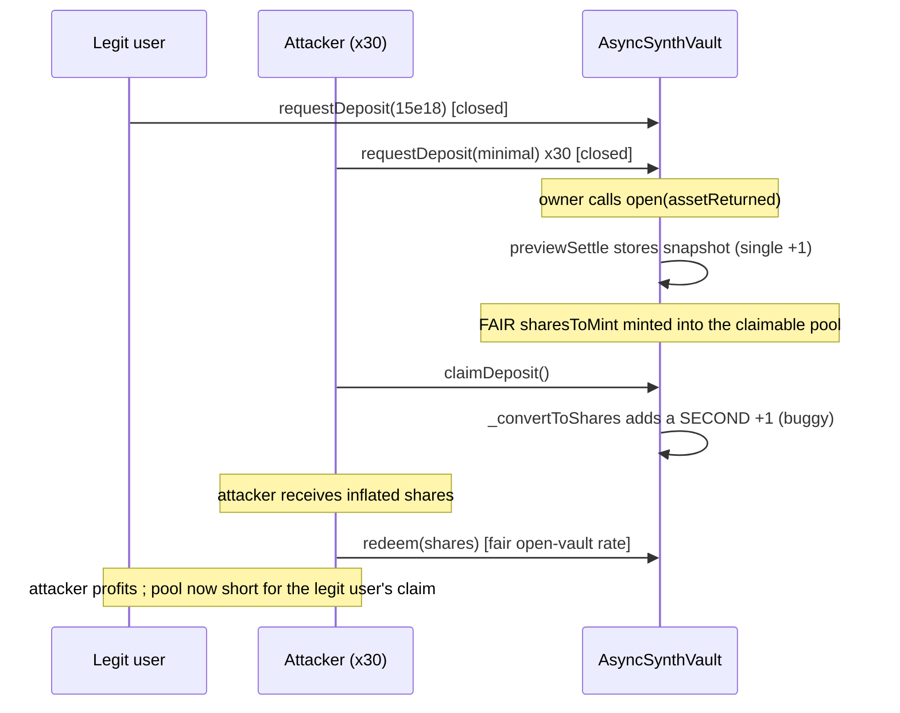

# Amphor — exchange rate is calculated incorrectly when the vault is closed

> **Vulnerability classes:** vuln/logic/rounding-mismatch · vuln/loss-of-funds/direct-drain · vuln/accounting/double-counted-offset

> **Reproduction:** a self-contained Foundry PoC that compiles & runs in an
> isolated project with **only `forge-std`** — no fork, no RPC, no `anvil_state`.
> Full trace: [output.txt](output.txt). PoC:
> [test/30918-h-3-exchange-rate-is-calculated-incorrectly-when-the-vault-i_exp.sol](test/30918-h-3-exchange-rate-is-calculated-incorrectly-when-the-vault-i_exp.sol).

<!-- non-defihacklabs -->
<!-- source-auditvault: https://github.com/Auditware/AuditVault/blob/main/findings/30918-h-3-exchange-rate-is-calculated-incorrectly-when-the-vault-i.md -->
<!-- date: 2024-03 -->

**AuditVault taxonomy:** `lang/solidity` · `platform/sherlock` · `has/github` · `has/poc` · `severity/high` · `sector/token` · `sector/zk` · genome: `frozen-funds` · `direct-drain` · `frontrun-exposure` · `integer-bounds`

---

## Key info

| | |
|---|---|
| **Impact** | **HIGH** — whenever a share is worth more than 1 asset, deposits requested while the vault is closed convert at a systematically too-generous rate, letting an attacker mint inflated shares with minimal capital and redeem them at the fair rate for real profit, funded out of what legitimate depositors are owed |
| **Protocol** | [Amphor](https://github.com/AmphorProtocol/asynchronous-vault) — `AsyncSynthVault` (ERC-7540-style asynchronous vault) |
| **Vulnerable code** | `AsyncSynthVault._convertToShares(assets, requestId, rounding)` / `_convertToAssets(...)`, combined with `previewSettle`'s stored snapshot values |
| **Bug class** | Double-counted rounding offset: the same `+1` "virtual share" term is added twice across two different functions |
| **Finding** | Sherlock — Amphor, 2024-03 · #30918 (H-3) · reporters Darinrikusham, fugazzi, whitehair0330, zzykxx |
| **Report** | [2024-03-amphor-judging #131](https://github.com/sherlock-audit/2024-03-amphor-judging/issues/131) |
| **Source** | [AuditVault](https://github.com/Auditware/AuditVault/blob/main/findings/30918-h-3-exchange-rate-is-calculated-incorrectly-when-the-vault-i.md) |
| **Status** | Audit finding — caught in review (not exploited on-chain). Fixed by the protocol team ([PR #104](https://github.com/AmphorProtocol/asynchronous-vault/pull/104)). Reproduced here as a standalone local PoC, using the report's own scenario numbers. |
| **Compiler** | `^0.8.24` (PoC); real contract `0.8.21` |

This is an **audit finding**, not a historical on-chain incident. The real
`AsyncSynthVault` uses `Silo` helper contracts for pending/claimable
bookkeeping and a full fee/redeem-request pipeline; the PoC keeps the
`previewSettle`/`_convertToShares` math and the `deposit`/`redeem` (open-vault,
single-`+1`) formulas faithful — the redeem-request path is omitted (it is
irrelevant to this bug; `pendingRedeem` is always 0 in the scenario).

---

## TL;DR

1. `AsyncSynthVault.deposit()`/`redeem()` (the standard open-vault ERC4626
   path) use the FAIR conversion rate: `assets.mulDiv(totalSupply()+1,
   totalAssets()+1)` — a single `+1` "virtual share" offset, applied fresh
   each call against the live `totalSupply()`/`totalAssets()`.
2. When the vault CLOSES and later settles (`previewSettle`, called from
   `open()`), it computes and **stores** snapshot values that ALREADY include
   this `+1` offset:
   ```solidity
   uint256 totalAssetsSnapshotForDeposit = _lastSavedBalance + 1;
   uint256 totalSupplySnapshotForDeposit = totalSupply + 1;
   ```
3. Later, when an individual claims their deposit, `_convertToShares` reads
   those STORED (already `+1`'d) values and adds **a second `+1` on top**:
   ```solidity
   uint256 totalAssets = epochs[requestId].totalAssetsSnapshotForDeposit + 1;
   uint256 totalSupply = epochs[requestId].totalSupplySnapshotForDeposit + 1;
   ```
4. Whenever a share is worth more than 1 asset, this double-counted offset
   makes the individual claim rate systematically MORE GENEROUS than the fair
   rate used to size the aggregate shares actually minted for the pool.
5. HARM in the PoC (the report's own numbers): a `1e18 - 1` donation +
   `1e18` bootstrap establish a share price above 1:1; a legit user requests
   a 15e18 deposit; 30 fresh attacker accounts each request the
   rounding-optimal minimum computed from the SAME buggy-rate arithmetic;
   after the epoch settles with 0 yield, each attacker claims (inflated
   shares) and immediately redeems (fair rate) — walking away with real,
   measurable profit, and leaving the claimable pool short of what the
   legitimate depositor is owed.

---

## The vulnerable code

Verbatim from the report (`AsyncSynthVault.sol`):

```solidity
// previewSettle — computes and STORES the snapshot (single +1, called from open())
uint256 totalAssetsSnapshotForDeposit = _lastSavedBalance + 1;
uint256 totalSupplySnapshotForDeposit = totalSupply + 1;
```

```solidity
// _convertToShares — reads the STORED (already +1'd) snapshot and adds ANOTHER +1
function _convertToShares(
    uint256 assets,
    uint256 requestId,
    Math.Rounding rounding
)
    internal
    view
    returns (uint256)
{
    if (isCurrentEpoch(requestId)) {
        return 0;
    }
    uint256 totalAssets =
        epochs[requestId].totalAssetsSnapshotForDeposit + 1;         // @> VULN
    uint256 totalSupply =
        epochs[requestId].totalSupplySnapshotForDeposit + 1;         // @> VULN

    return assets.mulDiv(totalSupply, totalAssets, rounding);
}
```

`_convertToAssets` (the redeem-side counterpart) has the identical defect
against `totalAssetsSnapshotForRedeem`/`totalSupplySnapshotForRedeem`.

## Root cause

The `+1` "virtual share" offset is Amphor's standard ERC4626 inflation-attack
mitigation, and it is meant to be applied **exactly once** per conversion. But
the closed-vault claim path applies it **twice**: once when `previewSettle`
computes the value that gets *stored* into the epoch snapshot, and again when
`_convertToShares`/`_convertToAssets` later *reads* that stored value to
convert an individual's request. The extra `+1` on both sides of the ratio
shifts the effective conversion rate away from the fair rate — and because
`totalSupply` is typically the smaller of the two numbers early in a vault's
life, the shift is large enough to be exploitable, not just a rounding dust
difference.

## Preconditions

- A share is worth more than 1 asset (achievable permissionlessly via a
  pre-bootstrap donation, as the report's own PoC does, or simply through
  organic vault yield).
- The vault has pending deposit requests waiting to settle (the ordinary
  state whenever users request deposits while the vault is closed).
- No special role is required — this is exploitable by any user who can
  deposit and redeem.

## Attack walkthrough

From [output.txt](output.txt), reproducing the report's own scenario:

1. An attacker donates `1e18 - 1` directly to the vault before anyone holds
   shares — inflating the future share price for free.
2. The owner bootstraps the vault with a `1e18` deposit (fair, open-vault
   rate) — the donation means this nets only 1 share.
3. A legitimate user deposits `10e18` while open (fair rate).
4. The owner closes the vault. `lastSavedBalance` snapshots the current NAV;
   the balance is drained to the owner (as designed).
5. The legitimate user requests a further `15e18` deposit while closed — a
   completely ordinary, honest action.
6. The attacker computes the rounding-optimal MINIMUM deposit using the same
   cached-`+1`-style arithmetic the buggy claim path will apply, and has 30
   fresh accounts each request exactly that amount.
7. The owner reopens the vault with 0 profit/loss (`assetReturned ==
   lastSavedBalance`) — isolating the rounding bug as the sole source of any
   profit; `previewSettle` stores the already-`+1`'d snapshot and mints the
   FAIR number of shares into the claimable pool.
8. **VULN:** each attacker account claims. `_convertToShares` adds a second
   `+1` on top of the stored snapshot, so each account's claim converts more
   generously than the rate that sized the pool.
9. Each attacker account immediately redeems its inflated shares at the fair,
   open-vault rate.
10. **HARM:** the attacker's total redeemed assets exceed what it deposited —
    real, measurable profit — and the claimable pool is left short of what
    the legitimate user is owed (their later claim reverts for insufficient
    balance, matching the report's "core functionality break" impact).

## Diagrams





## Impact

- Any user can extract real profit from the vault whenever the share price
  exceeds 1:1 — no special role or timing luck required, just ordinary
  deposit/claim/redeem calls.
- Because the aggregate shares minted into the claimable pool are sized by
  the FAIR rate while individual claims pay out at the MORE GENEROUS buggy
  rate, whoever claims first can drain the pool at the expense of whoever
  claims later — legitimate depositors risk being unable to claim their full
  entitlement (or at all).
- The redeem-side function (`_convertToAssets`) carries the identical defect
  against pending redemption requests.

## Remediation

Per the report: don't add the `+1` twice. Either strip it from the second
read, or don't add it when storing the snapshot:

```diff
     function _convertToShares(uint256 assets, uint256 requestId, Math.Rounding rounding) internal view returns (uint256) {
         if (isCurrentEpoch(requestId)) {
             return 0;
         }
-        uint256 totalAssets = epochs[requestId].totalAssetsSnapshotForDeposit + 1;
-        uint256 totalSupply = epochs[requestId].totalSupplySnapshotForDeposit + 1;
+        uint256 totalAssets = epochs[requestId].totalAssetsSnapshotForDeposit;
+        uint256 totalSupply = epochs[requestId].totalSupplySnapshotForDeposit;

         return assets.mulDiv(totalSupply, totalAssets, rounding);
     }
```

The report additionally recommends returning `0` when `requestId == 0` and
performing the initial bootstrap deposit inside `initialize()` with a
requirement that the vault holds `0` assets beforehand — hardening against the
related donation-frontrunning setup used here.

## How to reproduce

```bash
cd ~/RustroverProjects/audits/evm-hack-registry/30918-h-3-exchange-rate-is-calculated-incorrectly-when-the-vault-i_exp
forge test -vv
# Fully local — no fork, no RPC, no anvil_state required.
# Expected: all three tests PASS:
#   test_exploit                             (self-contained Exploit, report's own numbers, real profit)
#   test_directRebuild_attackerProfits       (standalone rebuild confirming the same mismatch independently)
#   test_poolInsolvency_legitUserCantFullyClaim  (secondary harm: legit user's claim reverts afterward)
```

PoC source: [test/30918-h-3-exchange-rate-is-calculated-incorrectly-when-the-vault-i_exp.sol](test/30918-h-3-exchange-rate-is-calculated-incorrectly-when-the-vault-i_exp.sol)
— the verbatim vulnerable `previewSettle`/`_convertToShares` double-`+1`
reduction, the fair open-vault `deposit`/`redeem` formulas, and the full
donation → bootstrap → close → request → settle → claim → redeem sequence
with the report's own numbers.

> Note: the vault here omits the redeem-request path, fees, and the real
> `Silo` claimable-token mechanics (modeled here as a `claimableSiloShares`
> pool counter that a claim draws down from, reverting on insufficient
> balance exactly like a real ERC20 transfer would); the settle/claim
> double-`+1` mismatch and the fair open-vault conversion formulas are
> faithful to the finding.

---

*Reference: finding **#30918 (H-3)** in the [Sherlock Amphor review (Mar 2024)](https://github.com/sherlock-audit/2024-03-amphor-judging/issues/131) · curated by [AuditVault](https://github.com/Auditware/AuditVault/blob/main/findings/30918-h-3-exchange-rate-is-calculated-incorrectly-when-the-vault-i.md)*
