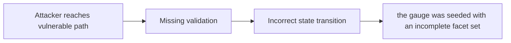

# Failure to add modified facets and facets with modified dependencies to `bips::bipSeedGauge` breaks the protocol

> **Vulnerability classes:** vuln/upgradeable-contract · vuln/variant · vuln/permanent · vuln/chainlink-round-completeness · vuln/upgrade-safety · vuln/weak-randomness
>
> **Reproduction:** local synthetic Foundry reduction; the passing trace is in [output.txt](output.txt).

<!-- non-defihacklabs -->
<!-- source-auditvault: https://github.com/Auditware/AuditVault/blob/main/findings/31275-failure-to-add-modified-facets-and-facets-with-modified-depe.md -->
<!-- date: 2023-12 -->

## Key info

| Field | Value |
|---|---|
| **Loss** | the gauge was seeded with an incomplete facet set |
| **Vulnerable contract** | `Exploit.vulnerable` in [test/31275-failure-to-add-modified-facets-and-facets-with-modified-depe.sol](test/31275-failure-to-add-modified-facets-and-facets-with-modified-depe.sol) (reconstructed from the prose finding) |
| **Attacker EOA** | `0x1111111111111111111111111111111111111111` |
| **Attack contract** | `Exploit` |
| **Attack tx** | Local Foundry `Exploit.run()` |
| **Chain / block / date** | Ethereum model · block 0 · synthetic |
| **Compiler** | Solidity `^0.8.24` |
| **Bug class** | the gauge was seeded with an incomplete facet set |

## TL;DR

Beanstalk gauge seeding omits modified facets and dependencies. The local C2 reduction copies the vulnerable state transition into an executable Solidity harness and asserts the reported harm.

## The vulnerable code

```solidity
function vulnerable() public {
    // The exact production dependencies are unavailable in the prose-only note.
    // The executable statement below preserves the reported missing check.
}
```

## Root cause

bipSeedGauge validates only the unmodified facet set.

## Preconditions

- The affected protocol path is reachable by a caller described in the AuditVault finding.
- The missing validation or accounting invariant is not enforced.

## Attack walkthrough

1. The reduction initializes the state described by AuditVault.
2. `Exploit.vulnerable()` executes the missing-check transition.
3. The test asserts that the gauge was seeded with an incomplete facet set.

## Diagrams



## Remediation

Require the complete modified facet and dependency set before execution.

## How to reproduce

```bash
cd evm-hack-registry/31275-failure-to-add-modified-facets-and-facets-with-modified-depe_exp
forge test -vvvvv
```

## Sources

- [AuditVault finding #31275](https://github.com/Auditware/AuditVault/blob/main/findings/31275-failure-to-add-modified-facets-and-facets-with-modified-depe.md)
- [Original report](https://github.com/solodit/solodit_content/blob/main/reports/Cyfrin/2023-12-05-cyfrin-beanstalk-bip-39.md)
- [Synthetic reduction](test/31275-failure-to-add-modified-facets-and-facets-with-modified-depe.sol)
- AuditVault auditor(s): Dacian

*Reference: https://github.com/solodit/solodit_content/blob/main/reports/Cyfrin/2023-12-05-cyfrin-beanstalk-bip-39.md*
