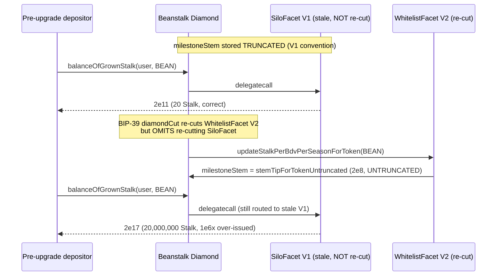

# Beanstalk BIP-39 upgrade omits a modified facet, inflating grown Stalk 1,000,000x

> **Vulnerability classes:** vuln/dependency/upgradeable-contract · vuln/logic/upgrade-safety · misassumption/external-call-is-safe
>
> **Reproduction:** the test deploys the REAL Beanstalk EIP-2535 diamond (real `Diamond` / `LibDiamond` / `DiamondCutFacet` / `DiamondLoupeFacet` / `OwnershipFacet`), the REAL `AppStorage` storage layout, and the REAL stem/stalk library math from both audited commits, then performs the BIP-39 `diamondCut` that omits re-cutting `SiloFacet`. A pre-upgrade deposit's claimable grown Stalk jumps from 20 to 20,000,000 — an exact 1e6x over-issuance.

<!-- source-auditvault: https://github.com/Auditware/AuditVault/blob/main/findings/31275-failure-to-add-modified-facets-and-facets-with-modified-depe.md -->
<!-- date: 2023-12 -->

## Root cause

Beanstalk is an EIP-2535 Diamond. At upgrade time, modified facets are re-cut by listing them in the relevant function of [`protocol/scripts/bips.js`](https://github.com/BeanstalkFarms/Beanstalk/blob/dfb418d185cd93eef08168ccaffe9de86bc1f062/protocol/scripts/bips.js). BIP-39 (Seed Gauge) changed the **stem-tip scale convention** inside `LibTokenSilo`, but the `bipSeedGauge` upgrade script fails to re-cut `SiloFacet`, `FieldFacet`, `BDVFacet`, `ConvertFacet`, `WhitelistFacet`, and every facet whose library dependencies changed.

Because Solidity `internal` libraries are **inlined** into each facet's bytecode, a facet that is not re-cut keeps executing the *old* library code even after the diamond's storage is rescaled by the newly-cut facets. The two conventions are irreconcilable:

- **Pre-upgrade** ([`LibTokenSilo.stemTipForToken` @ 76066733](https://github.com/BeanstalkFarms/Beanstalk/blob/76066733bcddb944b9af8f29acf150c02a5b8437/protocol/contracts/libraries/Silo/LibTokenSilo.sol)) adds `s.ss[token].milestoneStem` **un-divided** (truncated scale), and the milestone writer stores `milestoneStem` truncated.
- **BIP-39** ([`LibTokenSilo` @ dfb418d](https://github.com/BeanstalkFarms/Beanstalk/blob/dfb418d185cd93eef08168ccaffe9de86bc1f062/protocol/contracts/libraries/Silo/LibTokenSilo.sol)) introduces `stemTipForTokenUntruncated`, stores `milestoneStem` **untruncated (~1e6x larger)**, and divides the *whole* sum by `1e6`.

After the buggy upgrade the diamond still routes `stemTipForToken` / `balanceOfGrownStalk` to the stale V1 `SiloFacet`. Its inlined V1 math reads the freshly rescaled (untruncated) `milestoneStem` and adds it without dividing, so the returned stem tip — and therefore the grown Stalk of every pre-upgrade deposit — is inflated by ~1e6x. Stalk is Beanstalk's governance-and-yield token; over-issuing it breaks protocol accounting and lets pre-upgrade depositors Mow far more Stalk than intended.

The vulnerable, un-divided add is at [`SiloExit.stemTipForToken` → `LibTokenSilo.stemTipForToken`](https://github.com/BeanstalkFarms/Beanstalk/blob/76066733bcddb944b9af8f29acf150c02a5b8437/protocol/contracts/beanstalk/silo/SiloFacet/SiloExit.sol#L320); the milestone-writer divergence is in [`LibWhitelist.updateStalkPerBdvPerSeasonForToken`](https://github.com/BeanstalkFarms/Beanstalk/blob/dfb418d185cd93eef08168ccaffe9de86bc1f062/protocol/contracts/libraries/Silo/LibWhitelist.sol).

## What is real in this reproduction

Deployed unmodified from the audited commits:

- Real EIP-2535 diamond: `Diamond.sol`, `LibDiamond.sol`, `DiamondCutFacet.sol`, `DiamondLoupeFacet.sol`, `OwnershipFacet.sol` (`src/beanstalk`, `src/libraries`, `src/interfaces`).
- Real `AppStorage.sol` / `ReentrancyGuard.sol` / `LibAppStorage.sol` — the actual Beanstalk storage layout, so `s.ss[token].milestoneStem`, `s.season.current` and `s.a[account].mowStatuses[token]` sit at their real slots.
- Real library math, byte-identical function bodies (library symbols suffixed `V1`/`V2` only so both commit versions coexist in one compilation unit): `LibTokenSilo.stemTipForToken(Untruncated)`, `LibSilo.stalkReward` / `_balanceOfGrownStalk`, `LibWhitelist.updateStalkPerBdvPerSeasonForToken`.
- Real `SiloExit.stemTipForToken` / `balanceOfGrownStalk` bodies, exposed via `SiloViewFacetV1` / `SiloViewFacetV2`.

`SetupFacet` (whitelist + pre-upgrade deposit + season) reproduces the state that `InitBipNewSilo` and a real deposit/mow leave; it contains no vulnerability logic.

## Exploit walkthrough (with numbers)

Whitelisted token BEAN, `stalkEarnedPerSeason = 2e6`, deposit `bdv = 1000e6`, milestone at season 100, current season 200.

1. **Pre-upgrade (correct):** V1 `stemTipForToken = 0 + (2e6·100)/1e6 = 200`. Grown Stalk `= (200 − 0)·1000e6 = 2e11` → **20 Stalk**.
2. **BIP-39 buggy upgrade:** `diamondCut` replaces `WhitelistFacet` with V2 but does **not** re-cut `SiloFacet`.
3. **Post-upgrade milestone write:** V2 `updateStalkPerBdvPerSeasonForToken` stores `milestoneStem = stemTipForTokenUntruncated = 2e6·100 = 2e8` (untruncated).
4. **Harm:** the stale V1 `balanceOfGrownStalk` reads `milestoneStem = 2e8` and adds it un-divided → `stemTip = 2e8`. Grown Stalk `= (2e8 − 0)·1000e6 = 2e17` → **20,000,000 Stalk**.

Backward-compatibility invariant broken by exactly **1e6x**. The control run — which re-cuts `SiloFacet` to V2 — returns `2e11` (20 Stalk), confirming the omission is the sole cause.



## Reproduction

```bash
_shared/run-poc/run_poc.sh 31275-failure-to-add-modified-facets-and-facets-with-modified-depe_exp -vvvvv
```

Expected result: `1 passed`. The assertions in [`test/31275-failure-to-add-modified-facets-and-facets-with-modified-depe_exp.sol`](test/31275-failure-to-add-modified-facets-and-facets-with-modified-depe_exp.sol) verify the pre-upgrade baseline (`2e11`), the untruncated milestone rescale (`2e8`), the inflated post-upgrade value (`2e17 = grownStalkBefore·1e6`), and that the control upgrade which re-cuts `SiloFacet` stays backward-compatible (`2e11`).

## Sources

- [AuditVault finding #31275](https://github.com/Auditware/AuditVault/blob/main/findings/31275-failure-to-add-modified-facets-and-facets-with-modified-depe.md)
- [Cyfrin Beanstalk BIP-39 report](https://github.com/solodit/solodit_content/blob/main/reports/Cyfrin/2023-12-05-cyfrin-beanstalk-bip-39.md)
- [Pre-upgrade Beanstalk source `76066733`](https://github.com/BeanstalkFarms/Beanstalk/tree/76066733bcddb944b9af8f29acf150c02a5b8437)
- [BIP-39 Beanstalk source `dfb418d`](https://github.com/BeanstalkFarms/Beanstalk/tree/dfb418d185cd93eef08168ccaffe9de86bc1f062)
