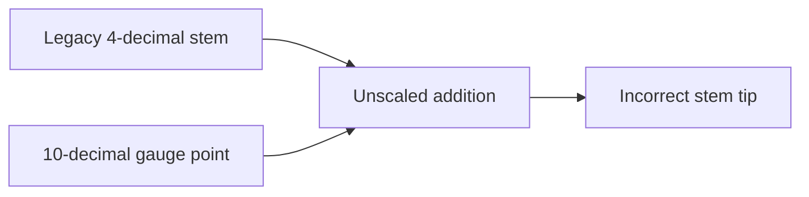

# Beanstalk Silo — legacy milestone stem decimal mismatch
<!-- non-defihacklabs -->
<!-- source-auditvault: https://github.com/Auditware/AuditVault/blob/main/findings/31276-the-previous-milestone-stem-should-be-scaled-for-use-with-th.md -->
<!-- date: 2023-12 -->
> **Vulnerability classes:** vuln/arithmetic/decimal-mismatch · vuln/logic/state-update
## Key info
| Field | Value |
|---|---|
| Impact | Grown-stalk accounting is understated after upgrade |
| Chain | Local synthetic |
## TL;DR
The upgrade moves gauge points to untruncated precision but leaves historic milestone stems truncated. Stem tip adds those incompatible units and depositors lose accrued grown stalk.
## The vulnerable code
```solidity
tip = milestoneStem + stalkEarnedPerSeason * (currentSeason - milestoneSeason); // @> VULN: legacy truncated milestoneStem is added to untruncated gauge points without multiplying it by 1e6.
```
## Attack walkthrough
The PoC uses a legacy stem of 100 and one season of 1,000,000 points. The unscaled result differs from the correctly scaled value by 99,999,900 units.
## Diagrams

## Remediation
During upgrade multiply every prior milestone stem by `1e6` before calculating untruncated stem tips.
## Sources
- [AuditVault finding #31276](https://github.com/Auditware/AuditVault/blob/main/findings/31276-the-previous-milestone-stem-should-be-scaled-for-use-with-th.md)
- [Beanstalk LibTokenSilo](https://github.com/BeanstalkFarms/Beanstalk/blob/dfb418d185cd93eef08168ccaffe9de86bc1f062/protocol/contracts/libraries/Silo/LibTokenSilo.sol)
