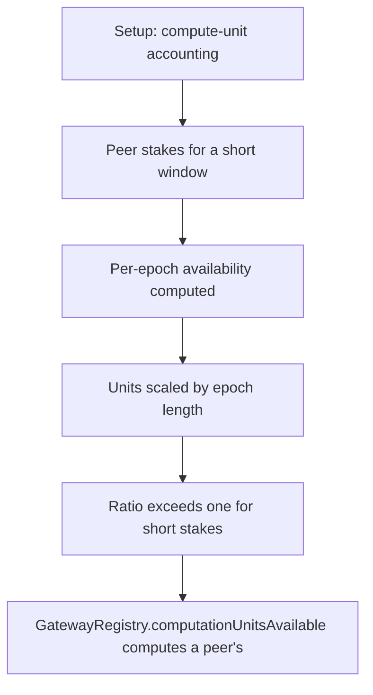

# Subsquid: computationUnitsAvailable over-reports for short stakes

> **Vulnerability classes:** vuln/logic
>
> **Reproduction:** a faithful minimal reproduction of the vulnerable finding — the vulnerable code is reproduced **verbatim** (marked `@>`) with faithful minimal doubles; local deploy, no fork.

<!-- source-auditvault: https://github.com/pashov/audits/blob/master/team/md/Subsquid-security-review.md -->

## Root cause

GatewayRegistry.computationUnitsAvailable computes a peer's per-epoch compute units as `computationUnits * epochLength / (lockEnd - lockStart)`, where `computationUnits` is the TOTAL units granted for the whole staking window and `(lockEnd - lockStart)` is that window's duration. There is no minimum staking duration, so when duration < epochLength the ratio epochLength/duration is > 1 and the reported per-epoch figure exceeds the total the peer ever paid for. Staking 10 SQD for a 1-block window against epochLength=5 grants 10 total units but computationUnitsAvailable reports 50 -- a 5x (factor = epochLength) free inflation of the compute-unit allocation. computationUnitsAvailable is consumed off-chain to allocate work to peers, so a malicious peer repeatedly staking tiny short-duration amounts inflates its allocation at no cost. Reproduces the report's exact logged output (Stake compute units: 10 / Available compute units: 50). Silent accounting/over-allocation harm with no positive transfer to the attacker -> the 40-unit free over-allocation (available - granted) is minted to SINK 0x..D00d on the CU marker token.

```solidity
        for (uint256 i = 0; i < _stakes.length; i++) {
            Stake memory _stake = _stakes[i];
            if (
                _stake.lockStart <= blockNumber && _stake.lockEnd > blockNumber
            ) {
                total +=
                    (_stake.computationUnits * epochLength) / // @> VULN (this line)
```

## Why it's exploitable here

GatewayRegistry.computationUnitsAvailable computes a peer's per-epoch compute units as `computationUnits * epochLength / (lockEnd - lockStart)`, where `computationUnits` is the TOTAL units granted for the whole staking window and `(lockEnd - lockStart)` is that window's duration. There is no minimum staking duration, so when duration < epochLength the ratio epochLength/duration is > 1 and the reported per-epoch figure exceeds the total the peer ever paid for. Staking 10 SQD for a 1-block window against epochLength=5 grants 10 total units but computationUnitsAvailable reports 50 -- a 5x (factor = epochLength) free inflation of the compute-unit allocation. computationUnitsAvailable is consumed off-chain to allocate work to peers, so a malicious peer repeatedly staking tiny short-duration amounts inflates its allocation at no cost. Reproduces the report's exact logged output (Stake compute units: 10 / Available compute units: 50). Silent accounting/over-allocation harm with no positive transfer to the attacker -> the 40-unit free over-allocation (available - granted) is minted to SINK 0x..D00d on the CU marker token.

## Attack path



## Marked-line walkthrough (Playground)

The EVM Playground pins each step to the exact executed source line in `0x671d353a77…`:

1. **L106** — Setup: compute-unit accounting: Setup: the registry tracks each peer's staked SQD and the compute units it was granted.
2. **L136** — Peer stakes for a short window: A peer stakes 10 SQD granting 10 total compute units over a 1-block lock window.
3. **L147** — Per-epoch availability computed: computationUnitsAvailable derives how many units the peer may use in the current epoch.
4. **L154** — Units scaled by epoch length: The available figure scales the granted units by epochLength over the stake's duration.
5. **L156** — Ratio exceeds one for short stakes: Root cause: per-epoch units = total * epochLength / duration; with no minimum duration, duration < epochLength makes the ratio > 1.
6. **L159** — 10 granted units report as 50: A 1-block stake against epochLength=5 reports 50 available units — 5x the 10 the peer paid for.
7. **L166** — Free compute-unit inflation: computationUnitsAvailable feeds off-chain work allocation, so a peer repeatedly staking tiny short amounts inflates its allocation at no cost.
8. **L175** — Over-allocation marked at sink: The 40-unit free over-allocation (available minus granted) is recorded at the harm-probe sink.

## PoC

Registry (Foundry, local deploy — verbatim vulnerable source + harm-asserting test):

```bash
cd 31547-h-02-computationunitsavailable-can-overestimate-number-of-av_exp
forge test -vvv
```

The browser Playground replays the same synthetic opcode-for-opcode and measures the harm. Both gates are green (registry `forge test` PASS + Playground `_verify-poc` **VERDICT: PASS**).
