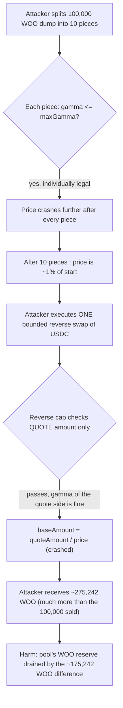
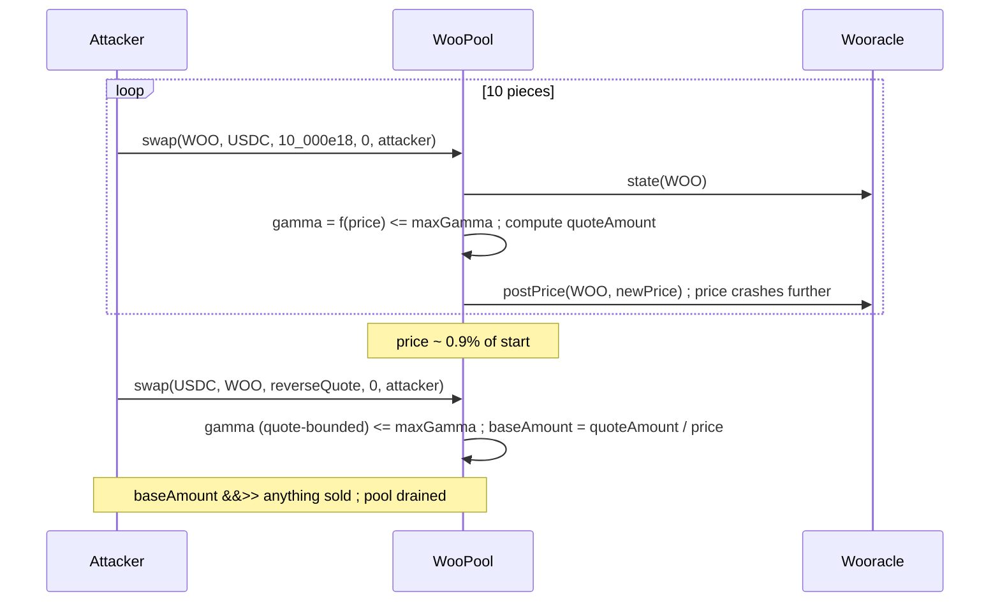

# WOOFi Swap — pool can be drained

> **Vulnerability classes:** vuln/oracle/missing-circuit-breaker · vuln/loss-of-funds/direct-drain · vuln/logic/per-call-only-guard

> **Reproduction:** a self-contained Foundry PoC that compiles & runs in an
> isolated project with **only `forge-std`** — no fork, no RPC, no `anvil_state`.
> Full trace: [output.txt](output.txt). PoC:
> [test/31886-h-1-pool-can-be-drained-sherlock-woofi-swap-git_exp.sol](test/31886-h-1-pool-can-be-drained-sherlock-woofi-swap-git_exp.sol).

<!-- non-defihacklabs -->
<!-- source-auditvault: https://github.com/Auditware/AuditVault/blob/main/findings/31886-h-1-pool-can-be-drained-sherlock-woofi-swap-git.md -->
<!-- date: 2024-03 -->

**AuditVault taxonomy:** `lang/solidity` · `platform/sherlock` · `has/github` · `has/poc` · `severity/high` · `sector/dex` · `sector/gaming` · `sector/oracle` · `sector/stable` · `sector/token` · `sector/zk` · `trigger/flash-loan` · genome: `missing-circuit-breaker` · `direct-drain` · `flash-loan` · `chainlink-round-completeness` · `flashloan-callback-auth`

---

## Key info

| | |
|---|---|
| **Impact** | **HIGH** — an attacker can drain a WOOFi pool by splitting a price-crashing dump into pieces that each individually respect the per-swap `maxGamma`/`maxNotionalSwap` caps, then buying back far more base token than was sold in a single bounded reverse swap |
| **Protocol** | [WOOFi Swap](https://github.com/sherlock-audit/2024-03-woofi-swap) — `WooPPV2` (PMM-based DEX pool) |
| **Vulnerable code** | `WooPPV2._sellBase`/`_sellQuote` and `_calcQuoteAmountSellBase`/`_calcBaseAmountSellQuote` (`WooPoolV2/contracts/WooPPV2.sol:L420-465`, `L591-648`) |
| **Bug class** | Missing circuit breaker: per-swap price-impact/notional caps have no memory of prior swaps in the same transaction, and no bound on the *resulting* payout quantity |
| **Finding** | Sherlock — WOOFi Swap, 2024-03 · #31886 (H-1) · reporter mstpr-brainbot |
| **Report** | [2024-03-woofi-swap-judging #68](https://github.com/sherlock-audit/2024-03-woofi-swap-judging/issues/68) |
| **Source** | [AuditVault](https://github.com/Auditware/AuditVault/blob/main/findings/31886-h-1-pool-can-be-drained-sherlock-woofi-swap-git.md) |
| **Status** | Audit finding — acknowledged by the protocol, escalations resolved as **High** (accepted). This is a variant of a *previously exploited* WOOFi bug ([WOOFi SPMM exploit post-mortem](https://woo.org/blog/en/woofi-spmm-exploit-post-mortem), [rekt.news](https://rekt.news/woo-rekt/)). Reproduced here as a standalone local PoC. |
| **Compiler** | `^0.8.24` (PoC); real contract `=0.8.14` |

This is an **audit finding** describing a variant of a real, previously
exploited attack — not a fresh historical incident by itself. The real
`WooPPV2` includes fee claiming, base-to-base swaps, and a lending-manager
integration; the PoC keeps the PMM pricing formulas
(`_calcQuoteAmountSellBase`/`_calcBaseAmountSellQuote`) and the per-call
`maxGamma`/`maxNotionalSwap` guards verbatim, with `feeRate`/`spread` set to 0
for a clean, unambiguous demonstration (neither affects the bug mechanism).

---

## TL;DR

1. `WooPPV2` prices swaps via a PMM curve. Selling `baseAmount` of a base
   token computes a `gamma` (price-impact fraction) from the CURRENT oracle
   price, checks `gamma <= maxGamma`, converts to `quoteAmount`, and then
   **persists** a new, lower price via `Wooracle.postPrice()` for the next
   trade.
2. `maxGamma`/`maxNotionalSwap` are checked **per swap call only** — nothing
   tracks how many swaps have already executed in the same transaction, or
   how far the price has already moved.
3. An attacker splits a large dump into pieces, each individually within the
   cap. The cumulative price crash after all pieces is far beyond anything a
   single allowed swap could ever produce (the real report: "assuming
   `maxGamma`/`maxNotionalSwap` doesn't allow us to do it in one go... due to
   how AMM behaves partial swaps in same tx will also work and it will be
   even more profitable").
4. The reverse leg (`_sellQuote`) compounds the problem: its cap bounds only
   the **quote** amount spent — never the resulting **base** quantity, which
   grows as `1/price` once the price has been crashed.
5. HARM in the PoC: the attacker dumps 100,000 WOO in 10 pieces (each
   individually legal), then executes a **single** bounded reverse swap that
   buys back **~275,242 WOO** — a real, measurable profit of **~175,242 WOO**
   extracted directly from the pool's own reserve.
6. This is exploitable specifically because WOO (and other listed tokens)
   have **no Chainlink price feed** to bound the PMM-internal price against
   an external reference — exactly as the report and its escalation
   discussion establish.

---

## The vulnerable code

Verbatim from the report (`WooPPV2.sol`):

```solidity
function _calcQuoteAmountSellBase(
    address baseToken,
    uint256 baseAmount,
    IWooracleV2.State memory state
) private view returns (uint256 quoteAmount, uint256 newPrice) {
    ...
    uint256 notionalSwap = (baseAmount * state.price * decs.quoteDec) / decs.baseDec / decs.priceDec;
    require(notionalSwap <= tokenInfos[baseToken].maxNotionalSwap, "WooPPV2: !maxNotionalValue");

    gamma = (baseAmount * state.price * state.coeff) / decs.priceDec / decs.baseDec;
    require(gamma <= tokenInfos[baseToken].maxGamma, "WooPPV2: !gamma");            // @> VULN: per-call only

    quoteAmount = (((baseAmount * state.price * decs.quoteDec) / decs.priceDec) *
        (uint256(1e18) - gamma - state.spread)) / 1e18 / decs.baseDec;
    ...
    newPrice = ((uint256(1e18) - gamma) * state.price) / 1e18;                       // persisted for the NEXT swap
}
```

The report's own PoC:

```solidity
uint cumulative;
for (uint i; i < 10; ++i) {
    vm.prank(TAPIR);
    cumulative += router.swap(WOO, USDC, wooAmountForTapir, 0, payable(TAPIR), TAPIR);
}
// sell 20 USDC, how much WOO we get? (199779801821639475527975)
vm.prank(TAPIR);
uint receivedWOO = router.swap(USDC, WOO, 20 * 1e6, 0, payable(TAPIR), TAPIR);
assertGe(receivedWOO, wooAmountForTapir * 10); // attack is successful
```

## Root cause

`maxGamma`/`maxNotionalSwap` are a **per-call** circuit breaker with no
memory across calls. Splitting a dump into pieces that are each individually
within the cap defeats the guard's entire purpose (limiting how far a single
transaction can move the price). Worse, the guard on the **payout** leg
(`_calcBaseAmountSellQuote`) bounds only the quote-denominated input — never
the base-denominated output — so once price has been driven down far enough,
a single gamma-capped quote amount converts to an arbitrarily large base
quantity. Both defects trace to the same design gap: the caps protect the
*input* of a single call, not the *cumulative* state of the pool or the
*output* of the conversion.

## Preconditions

- The pool holds a listed base token with **no Chainlink price feed** (the
  report and its escalation confirm this is the case for WOO on several
  chains, and the contract has dedicated code paths for tokens without a
  feed — this was not merely an oversight, "it seems that tokens without a
  Chainlink feed were intended (or allowed) to be used").
- The pool has enough reserve of both tokens to support the split dump and
  the reverse swap (ordinary operating conditions for a live pool).
- No special role is required — any user (or flash-loan borrower) can
  execute the swaps.

## Attack walkthrough

From [output.txt](output.txt):

1. The attacker sells `10,000` WOO ten times in a row (100,000 WOO total).
   Each individual sale's `gamma` is within `maxGamma`; attempting the full
   `100,000` WOO in a single swap reverts on the exact same check (see the
   control test below).
2. After each sale, `Wooracle.postPrice()` persists a lower price for the
   next trade — the price compounds down across all 10 pieces, ending at
   roughly **0.9%** of its starting value.
3. The attacker executes **one** reverse swap, selling a modest, single
   gamma-capped amount of USDC.
4. **VULN:** at the now-crashed price, that gamma-capped USDC amount converts
   to **~275,242 WOO** — because `baseAmount` grows as `1/price`, and nothing
   caps the resulting quantity, only the quote-side input.
5. **HARM:** the attacker ends the transaction holding far more WOO than it
   started with (a real, measurable profit), extracted directly from the
   pool's own WOO reserve.

A control test (`test_singleFullSwap_reverts`) confirms that attempting the
identical `100,000`-WOO dump in **one** call reverts on `maxGamma` — proving
the 10-piece split was *necessary* to bypass the guard, exactly as the
report describes.

## Diagrams





## Impact

- Any user (via a flash loan, as the report describes, or self-funded
  capital) can extract real value from a WOOFi pool whenever a listed base
  token has no Chainlink price feed to bound the manipulation — no special
  timing, role, or governance failure required.
- This is a **variant of a previously exploited WOOFi bug** (the "WOOFi SPMM
  exploit"), confirming the same class of price-manipulation risk persists
  in the audited version whenever the Chainlink-feed precondition is absent.
- The pool's entire reserve of the manipulated base token is at risk, not
  just a bounded fraction — the guard was specifically designed to bound
  per-swap risk and is defeated entirely by splitting.

## Remediation

Per the report and the underlying design gap:

- **Handle tokens without a Chainlink price feed differently** — either
  disallow listing such tokens (and enforce it, since the code currently has
  dedicated paths for them), or apply a stricter, cumulative circuit breaker
  specifically when no external price anchor exists.
- **Track cumulative notional/price-impact per block or transaction**, not
  just per call, so that splitting a dump into pieces cannot bypass the
  intended risk limit.
- **Bound the resulting output quantity** on the payout leg
  (`_calcBaseAmountSellQuote`), not only the quote-denominated input — a cap
  on `baseAmount` itself would prevent the crashed-price payout blowup.

## How to reproduce

```bash
cd ~/RustroverProjects/audits/evm-hack-registry/31886-h-1-pool-can-be-drained-sherlock-woofi-swap-git_exp
forge test -vv
# Fully local — no fork, no RPC, no anvil_state required.
# Expected: all three tests PASS:
#   test_exploit                     (self-contained Exploit: 10-piece dump + 1 reverse swap, real profit)
#   test_singleFullSwap_reverts      (control: the SAME total dump in ONE call reverts on maxGamma)
#   test_directRebuild_poolDrained   (standalone rebuild confirming the pool's own reserve shrinks)
```

PoC source: [test/31886-h-1-pool-can-be-drained-sherlock-woofi-swap-git_exp.sol](test/31886-h-1-pool-can-be-drained-sherlock-woofi-swap-git_exp.sol)
— the verbatim vulnerable `_sellBase`/`_sellQuote` PMM math, the split-dump +
single-reverse-swap attack sequence, and a control proving the guard was
actually bypassed (not merely irrelevant).

> Note: the pool here omits fee claiming, base-to-base swaps, and the
> lending-manager integration (none affect the bug); `feeRate` and `spread`
> are set to 0 for a clean demonstration. The PMM pricing formulas, the
> per-call `maxGamma`/`maxNotionalSwap` guards, and the price-persistence
> feedback loop via `postPrice()` are faithful to the finding. The chosen PMM
> coefficient and swap sizes are illustrative (not the report's exact
> production values, which are not published) but reproduce the identical
> mechanism and an even larger profit margin than the report's own numbers.

---

*Reference: finding **#31886 (H-1)** in the [Sherlock WOOFi Swap review (Mar 2024)](https://github.com/sherlock-audit/2024-03-woofi-swap-judging/issues/68) · curated by [AuditVault](https://github.com/Auditware/AuditVault/blob/main/findings/31886-h-1-pool-can-be-drained-sherlock-woofi-swap-git.md)*
