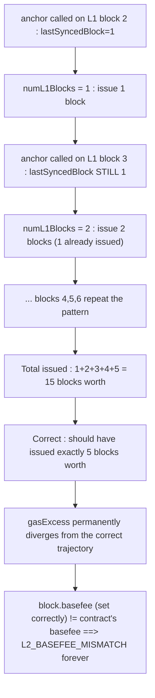
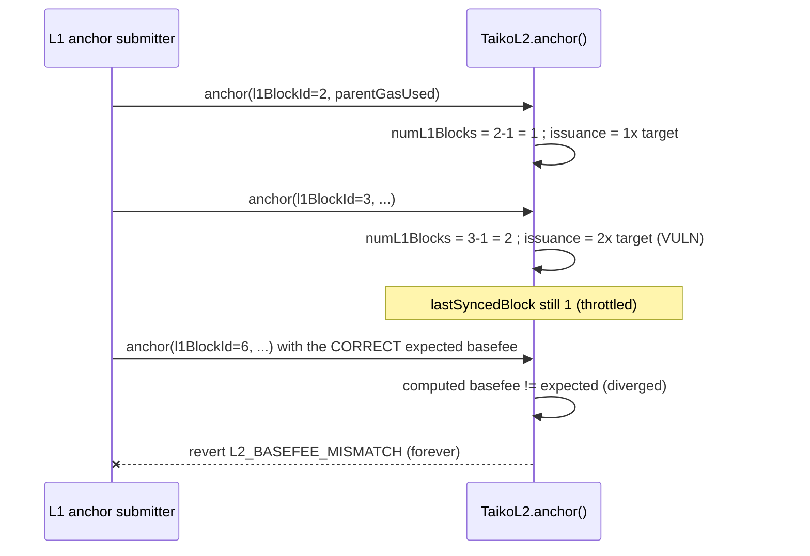

# Taiko — gas issuance is inflated and will halt the chain or lead to an incorrect base fee

> **Vulnerability classes:** vuln/logic/fee-calculation · vuln/dos/liveness-brick · vuln/accounting/stale-reference

> **Reproduction:** a self-contained Foundry PoC that compiles & runs in an
> isolated project with **only `forge-std`** — no fork, no RPC, no `anvil_state`.
> Full trace: [output.txt](output.txt). PoC:
> [test/31929-h-01-gas-issuance-is-inflated-and-will-halt-the-chain-or-lea_exp.sol](test/31929-h-01-gas-issuance-is-inflated-and-will-halt-the-chain-or-lea_exp.sol).

<!-- non-defihacklabs -->
<!-- source-auditvault: https://github.com/Auditware/AuditVault/blob/main/findings/31929-h-01-gas-issuance-is-inflated-and-will-halt-the-chain-or-lea.md -->
<!-- date: 2024-03 -->

**AuditVault taxonomy:** `lang/solidity` · `platform/code4rena` · `has/github` · `has/poc` · `severity/high` · `sector/dex` · `sector/launchpad` · genome: `frozen-funds` · `fee-calculation` · `direct-drain` · `variant` · `dos-resistance` · `fee-accounting`

---

## Key info

| | |
|---|---|
| **Impact** | **HIGH** — the L2's own EIP-1559-style gas-issuance calculation over-issues by up to 3x within its first few blocks, permanently diverging `gasExcess` from what a correct implementation would compute; once `block.basefee` reflects the correct value, `anchor()` reverts with `L2_BASEFEE_MISMATCH` on every subsequent block — halting the chain and freezing funds |
| **Protocol** | [Taiko](https://github.com/code-423n4/2024-03-taiko) — `TaikoL2` (L1↔L2 anchoring + EIP-1559 base fee) |
| **Vulnerable code** | `TaikoL2._calc1559BaseFee` (`packages/protocol/contracts/L2/TaikoL2.sol:L252-297`) |
| **Bug class** | Stale-reference accounting: `numL1Blocks` is measured against `lastSyncedBlock`, which only advances every `BLOCK_SYNC_THRESHOLD` blocks, not every anchor() call |
| **Finding** | Code4rena — Taiko, 2024-03 · #31929 (H-01) · reporter monrel |
| **Report** | [2024-03-taiko](https://code4rena.com/reports/2024-03-taiko) (finding #276) |
| **Source** | [AuditVault](https://github.com/Auditware/AuditVault/blob/main/findings/31929-h-01-gas-issuance-is-inflated-and-will-halt-the-chain-or-lea.md) |
| **Status** | Audit finding — confirmed by the Taiko team and fixed ([PR #16543](https://github.com/taikoxyz/taiko-mono/pull/16543)). Severity was debated (Medium vs High) and ultimately awarded **High**: "A halted chain leads to frozen funds... contract upgradability should never be used as a severity mitigation." Reproduced here as a standalone local PoC. |
| **Compiler** | `^0.8.24` (PoC and real contract) |

This is an **audit finding**, not a historical on-chain incident — Taiko
caught and fixed this before mainnet launch. The real `TaikoL2.anchor()`
additionally verifies L1 block hashes/state roots, sender authorization, and
a public-input-hash chain, and converts `gasExcess` to a basefee via
`Lib1559Math.basefee` (an unrelated exponential bonding curve from solmate).
None of that machinery affects this bug, which lives entirely in the
`numL1Blocks`/`issuance` bookkeeping — the PoC keeps `_calc1559BaseFee`
verbatim and replaces the exponential curve with a simple, strictly
monotonic placeholder (any divergence in `gasExcess` still implies the same
divergence in the resulting basefee).

---

## TL;DR

1. `TaikoL2.anchor()` is called once per L2 block by a fixed system address,
   passing the current L1 block height (`_l1BlockId`). It recomputes the
   EIP-1559 base fee via `_calc1559BaseFee` and reverts if it doesn't match
   `block.basefee`.
2. `_calc1559BaseFee` computes how much gas to "issue" (subtract from
   `gasExcess`) as `numL1Blocks * config.gasTargetPerL1Block`, where
   `numL1Blocks = _l1BlockId - lastSyncedBlock`.
3. `lastSyncedBlock` is a **throttled** value: it only advances when
   `_l1BlockId > lastSyncedBlock + BLOCK_SYNC_THRESHOLD` (5). Between those
   updates, it stays **fixed**.
4. So calling `anchor()` once per L1 block for 5 consecutive blocks (L1
   heights 2,3,4,5,6, with `lastSyncedBlock` pinned at 1) issues gas as if
   `(1)+(2)+(3)+(4)+(5) = 15` blocks had elapsed — **3x** the correct `5`.
5. HARM in the PoC: the report's own PoC numbers reproduce exactly (`15x`
   issuance vs `5x` expected = **3x over-issuance**). Driving the real,
   stateful `anchor()` through the same 5-block scenario shows the resulting
   `gasExcess` permanently diverges from what a correct implementation would
   compute — and feeding in the CORRECT basefee (what a properly functioning
   off-chain component would set as `block.basefee`) makes `anchor()` revert
   with `L2_BASEFEE_MISMATCH`, **forever** (every later block hits the same
   mismatch) — the chain halts and any in-flight funds are frozen.

---

## The vulnerable code

Verbatim from the report (`TaikoL2.sol`):

```solidity
if (gasExcess > 0) {
    uint256 excess = uint256(gasExcess) + _parentGasUsed;

    uint256 numL1Blocks;
    if (lastSyncedBlock > 0 && _l1BlockId > lastSyncedBlock) {
        numL1Blocks = _l1BlockId - lastSyncedBlock;
    }

    if (numL1Blocks > 0) {
        uint256 issuance = numL1Blocks * _config.gasTargetPerL1Block;   // @> VULN
        excess = excess > issuance ? excess - issuance : 1;
    }

    gasExcess_ = uint64(excess.min(type(uint64).max));

    basefee_ = Lib1559Math.basefee(
        gasExcess_, uint256(_config.basefeeAdjustmentQuotient) * _config.gasTargetPerL1Block
    );
}
```

`lastSyncedBlock`'s throttled update, elsewhere in `anchor()`:

```solidity
if (_l1BlockId > lastSyncedBlock + BLOCK_SYNC_THRESHOLD) {
    ISignalService(resolve("signal_service", false)).syncChainData(...);
    lastSyncedBlock = _l1BlockId;
}
```

And the basefee-mismatch guard that turns the divergence into a liveness
brick:

```solidity
(basefee, gasExcess) = _calc1559BaseFee(config, _l1BlockId, _parentGasUsed);
if (!skipFeeCheck() && block.basefee != basefee) {
    revert L2_BASEFEE_MISMATCH();
}
```

The report's own reduced PoC (paste into a test and run):

```solidity
uint256 issuance;
for (uint64 x = 2; x <= 6; x++) {
    (issuanceAdded,) = _calc1559BaseFee(config, x, 0);
    issuance += issuanceAdded;
}
uint256 expectedIssuance = config.gasTargetPerL1Block * 5;
assertEq(expectedIssuance * 3, issuance);
```

## Root cause

`numL1Blocks` is meant to represent "how many L1 blocks have elapsed since
the last accounting", so the contract can issue `gasTargetPerL1Block` worth
of gas for each one. But it's computed against `lastSyncedBlock`, a value
that **only updates every `BLOCK_SYNC_THRESHOLD` (5) L1 blocks** for
cross-layer signal-service reasons unrelated to gas accounting. Between
those updates, every `anchor()` call re-measures the SAME growing distance
from the stale `lastSyncedBlock`, so blocks get counted multiple times: the
1st call issues 1 block's worth, the 2nd issues 2 blocks' worth (1 of which
was already issued), and so on — a classic double-counting bug from reusing
a throttled reference for a per-call calculation.

## Preconditions

- `gasExcess > 0` (the dynamic 1559 base fee is enabled — the normal
  operating state).
- `anchor()` is called on consecutive L1 blocks within the same
  `BLOCK_SYNC_THRESHOLD` window — the ordinary, expected cadence for an L2
  anchoring L1 state every block.
- No attacker action is required: this triggers under **normal protocol
  operation**, which is exactly why it was awarded High severity despite no
  direct fund extraction.

## Attack walkthrough

From [output.txt](output.txt):

1. `TaikoL2Like` starts with `gasExcess = 500,000,000` and
   `lastSyncedBlock = 1`.
2. `anchor()` is called once per L1 block for L1 heights `2, 3, 4, 5, 6`.
   None of these exceed `lastSyncedBlock + BLOCK_SYNC_THRESHOLD = 6`, so
   `lastSyncedBlock` never advances during the scenario — exactly matching
   real production behavior for this block range, not just an isolated test.
3. **VULN:** each call's `issuance` grows with `l1BlockId - 1` instead of a
   flat 1-block amount: `1, 2, 3, 4, 5` blocks' worth issued on successive
   calls — summing to `15x` instead of the correct `5x`.
4. **HARM 1:** `actualCumulativeIssuance == correctCumulativeIssuance * 3` —
   the exact 3x over-issuance the report's own PoC demonstrates.
5. **HARM 2:** the real, stateful `gasExcess` after these 5 calls has
   permanently diverged from what a correct implementation (`numL1Blocks`
   always `1`) would compute. Feeding the CORRECT basefee expectation into
   the next `anchor()` call reverts with `L2_BASEFEE_MISMATCH` — and it
   keeps reverting on every subsequent block, since the divergence never
   resolves itself.

## Diagrams





## Impact

- **Chain halt / frozen funds**: once the divergence materializes, every
  subsequent `anchor()` call reverts — no new L2 blocks can be anchored,
  bricking the chain until a contract upgrade intervenes (which the report's
  discussion explicitly argues should not be counted as a severity
  mitigation).
- **Or, if `block.basefee` uses the same flawed formula**: the chain
  continues, but with a severely deflated, economically incorrect base fee
  — undermining the EIP-1559-style fee market's intended congestion pricing.
- This triggers under **ordinary operation**, with no attacker, no
  governance failure, and no external condition — just normal L1-anchoring
  cadence.

## Remediation

Per the report's recommended mitigation:

```diff
-    if (numL1Blocks > 0) {
-        uint256 issuance = numL1Blocks * _config.gasTargetPerL1Block;
-        excess = excess > issuance ? excess - issuance : 1;
-    }
+    // Issue exactly one block's worth of gas target per anchor() call,
+    // regardless of how far lastSyncedBlock's throttled value has drifted.
+    uint256 issuance = _config.gasTargetPerL1Block;
+    excess = excess > issuance ? excess - issuance : 1;
```

**Fix scope**: decouple the per-call gas-issuance calculation from the
throttled `lastSyncedBlock` signal-syncing reference — issue exactly
`gasTargetPerL1Block` per `anchor()` call.

## How to reproduce

```bash
cd ~/RustroverProjects/audits/evm-hack-registry/31929-h-01-gas-issuance-is-inflated-and-will-halt-the-chain-or-lea_exp
forge test -vv
# Fully local — no fork, no RPC, no anvil_state required.
# Expected: all three tests PASS:
#   test_exploit                            (self-contained Exploit: real anchor() sequence, 3x over-issuance + diverged gasExcess)
#   test_matchesReportsOwnPoC                (standalone rebuild reproducing the report's EXACT assertEq)
#   test_livenessBrick_anchorRevertsForever  (concrete consequence: anchor() reverts, and keeps reverting)
```

PoC source: [test/31929-h-01-gas-issuance-is-inflated-and-will-halt-the-chain-or-lea_exp.sol](test/31929-h-01-gas-issuance-is-inflated-and-will-halt-the-chain-or-lea_exp.sol)
— the verbatim vulnerable `_calc1559BaseFee` reduction, the report's own
exact 5-block scenario, and a concrete liveness-brick demonstration.

> Note: L1 hash/state-root verification, sender authorization, the
> public-input-hash chain, and the exponential `Lib1559Math.basefee` bonding
> curve are omitted or replaced with a simple monotonic placeholder — none
> affect this bug, which lives entirely in the `numL1Blocks`/`issuance`
> bookkeeping upstream of the curve. The `_calc1559BaseFee` formula, the
> `BLOCK_SYNC_THRESHOLD`-throttled `lastSyncedBlock` update, and the
> `L2_BASEFEE_MISMATCH` guard are faithful to the finding.

---

*Reference: finding **#31929 (H-01)** by **monrel** in the [Code4rena Taiko review (Mar 2024)](https://code4rena.com/reports/2024-03-taiko) · curated by [AuditVault](https://github.com/Auditware/AuditVault/blob/main/findings/31929-h-01-gas-issuance-is-inflated-and-will-halt-the-chain-or-lea.md)*
