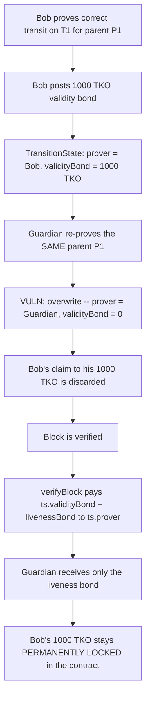
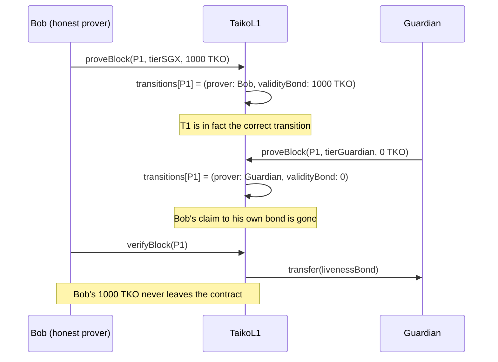

# Taiko — Validity and contest bonds can be incorrectly burned for the correct and ultimately verified transition

> **Vulnerability classes:** vuln/loss-of-funds/frozen-funds · vuln/logic/state-overwrite · vuln/accounting/reward-refund

> **Reproduction:** a self-contained Foundry PoC that compiles & runs in an
> isolated project with **only `forge-std`** — no fork, no RPC, no `anvil_state`.
> Full trace: [output.txt](output.txt). PoC:
> [test/31930-h-02-validity-and-contests-bond-ca-be-incorrectly-burned-for.sol](test/31930-h-02-validity-and-contests-bond-ca-be-incorrectly-burned-for.sol).

<!-- non-defihacklabs -->
<!-- source-auditvault: https://github.com/Auditware/AuditVault/blob/main/findings/31930-h-02-validity-and-contests-bond-ca-be-incorrectly-burned-for.md -->
<!-- date: 2024-03 -->

---

## Key info

| | |
|---|---|
| **Impact** | **HIGH** — an honest prover's validity bond is permanently locked in the protocol even though the transition they proved is the one that is ultimately verified correct |
| **Protocol** | [Taiko](https://taiko.xyz) — a based, Ethereum-equivalent ZK-rollup, where block proposers/provers post bonds that back the correctness of the transitions they submit |
| **Vulnerable code** | `LibProving.sol` — the transition-state overwrite (`_ts.validityBond = _tier.validityBond; ... _ts.prover = msg.sender;`); `LibVerifying.sol` — `tko.transfer(ts.prover, bondToReturn)` pays out only the CURRENT record holder |
| **Bug class** | Unconditional state overwrite that drops the previous actor's claim to an already-escrowed bond; payout keyed to "current record" instead of "who was actually correct" |
| **Finding** | Code4rena — Taiko, 2024-03 · #31930 · reporter **monrel** |
| **Report** | [code4rena.com/reports/2024-03-taiko](https://code4rena.com/reports/2024-03-taiko) |
| **Source** | [AuditVault](https://github.com/Auditware/AuditVault/blob/main/findings/31930-h-02-validity-and-contests-bond-ca-be-incorrectly-burned-for.md) |
| **Status** | Audit finding — caught in review (not exploited on-chain). Taiko acknowledged the behavior ("known... by design") but the judge kept it **High** because there is a direct, permanent loss of funds. Reproduced here as a standalone local PoC. |
| **Compiler** | `^0.8.24` (PoC) |

This is an **audit finding**, not a historical on-chain incident. The PoC keeps
the two blamed overwrite/payout lines verbatim (adapted to a single-parent
reduction of Taiko's per-block `TransitionState`), so the frozen-bond outcome
becomes a measurable, asserted TKO balance.

---

## TL;DR

1. Taiko's `TransitionState` for a block records one prover, one tier and one
   `validityBond` — whoever most recently proved (or re-proved / overrode) the
   transition.
2. `LibProving`'s prove path **unconditionally overwrites** that record with
   the newest prover's data, on every call — there is no bookkeeping that
   preserves the PREVIOUS prover's bond claim.
3. `LibVerifying.verifyBlock` refunds the validity bond to whichever address
   is **CURRENTLY** on record when the block is finalized — never to the
   prover whose transition is the one *actually* being verified, if the
   record was overwritten in between.
4. In the report's example: Bob proves the correct transition T1 for parent
   P1 and posts a 1000 TKO bond. Later a Guardian re-proves the SAME parent
   (confirming T1 was correct all along). The overwrite wipes Bob's record;
   verification then pays out based on the Guardian's (zero) bond, not Bob's.
5. **Bob's 1000 TKO validity bond is never refunded to anyone — it is
   permanently locked inside the contract — even though his T1 is the
   transition that ends up verified.**

---

## The vulnerable code

The unconditional transition-state overwrite (verbatim, `LibProving.sol`
L387-392):

```solidity
_ts.validityBond = _tier.validityBond; // @> discards the PREVIOUS prover's bond claim
_ts.contestBond = 1;
_ts.contester = address(0);
_ts.prover = msg.sender;               // @> record now points at the newest prover only
_ts.tier = _proof.tier;
```

The guardian override path that only ever restores the *liveness* bond, never
the validity/contest bonds (verbatim, `LibProving.sol` L189-199):

```solidity
if (isTopTier) {
    bool returnLivenessBond = blk.livenessBond > 0 && _proof.data.length == 32
        && bytes32(_proof.data) == RETURN_LIVENESS_BOND;
    if (returnLivenessBond) {
        tko.transfer(blk.assignedProver, blk.livenessBond);
        blk.livenessBond = 0;
    }
}
```

Verification pays out whoever is **currently** on record (verbatim,
`LibVerifying.sol` L178-189):

```solidity
uint256 bondToReturn = uint256(ts.validityBond) + blk.livenessBond;
if (ts.prover != blk.assignedProver) {
    bondToReturn -= blk.livenessBond >> 1;
}
IERC20 tko = IERC20(_resolver.resolve("taiko_token", false));
tko.transfer(ts.prover, bondToReturn); // @> pays the CURRENT `ts.prover`, not the historically-correct one
```

## Root cause

The protocol tracks exactly one `(prover, validityBond, tier)` triple per
transition slot, and every prove/re-prove call replaces it wholesale. Nothing
records *who proved the transition that is actually correct* independent of
*who is currently on record*. Since verification only ever consults the
current record, any intervening override (contest, higher-tier proof, or a
guardian re-confirmation) permanently severs the original prover's claim to
their own bond — even when their original proof turns out to have been right
all along.

## Preconditions

- A transition for a given parent block is proved, contested, or re-proved
  more than once before the block is verified (a normal occurrence whenever a
  higher-tier prover or a guardian steps in).
- The final on-record prover differs from the prover whose transition is the
  one that ends up verified.

## Attack walkthrough

From [output.txt](output.txt):

1. Bob proves the correct transition T1 for parent block P1, posting his 1000
   TKO validity bond. The transition record now shows `(prover=Bob,
   validityBond=1000 TKO)`.
2. A Guardian later re-proves the SAME parent P1 — in the report's own
   example, this happens after an intervening contest/higher-tier proof, but
   the mechanism is the same regardless of how many hops occur in between:
   whichever prove call runs LAST wins the record. The overwrite sets
   `(prover=Guardian, validityBond=0)`, discarding Bob's 1000 TKO claim.
3. The block is verified. `verifyBlock` pays out `ts.validityBond +
   livenessBond` to `ts.prover` — the Guardian — using the record's current
   (zero) validity bond. Bob's 1000 TKO never left the contract's balance in
   this payout.
4. **HARM:** Bob's 1000 TKO validity bond is never refunded to him, the
   Guardian, or anyone — it is **permanently frozen** inside the contract,
   even though Bob's own T1 is the transition that was ultimately proven
   correct and verified.

A control test (`test_control_noOverride_bobIsRefundedCorrectly`) confirms
that when nobody overwrites Bob's record before verification, Bob is refunded
his bond exactly as expected — the bug requires an intervening re-prove of the
same parent by a different address.

## Diagrams





## Impact

- Any prover whose correct transition is subsequently re-proved by another
  address (contest, higher tier, or guardian override) permanently loses
  their validity bond, regardless of whether their original proof was
  correct.
- The funds are not merely misdirected to the wrong party — they become
  **unrecoverable dead weight** locked inside the protocol, since nothing
  tracks the original prover's claim once the record is overwritten.
- This directly disincentivizes honest, fast proving: a prover who is later
  "confirmed correct" by a guardian still loses their bond, undermining the
  bond-based security model the protocol relies on.

## Sources

- AuditVault finding: https://github.com/Auditware/AuditVault/blob/main/findings/31930-h-02-validity-and-contests-bond-ca-be-incorrectly-burned-for.md
- Original report: https://code4rena.com/reports/2024-03-taiko
- Reduced-source provenance: blamed lines quoted directly from the AuditVault
  finding, which cites `github.com/code-423n4/2024-03-taiko` commit
  `f58384f44dbf4c6535264a472322322705133b11`,
  `packages/protocol/contracts/L1/libs/LibProving.sol` (L189-199, L387-392)
  and `packages/protocol/contracts/L1/libs/LibVerifying.sol` (L178-189).

## Taxonomy (AuditVault)

- **genome:** frozen-funds, direct-drain, reward-accounting, timestamp-dependence
- **sector:** staking, zk
- **severity:** high
