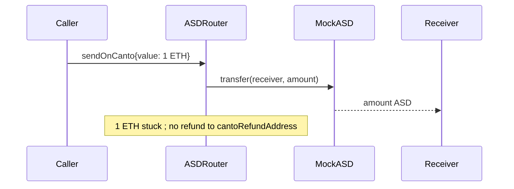

# Canto — native gas tokens stuck in `ASDRouter` on successful redemption

> **Vulnerability classes:** vuln/fee/missing-refund · vuln/bridge/stuck-asset · genome: frozen-funds · locked-funds · bridge-stuck-asset

> **Reproduction:** a self-contained Foundry PoC that compiles & runs in an
> isolated project with **only `forge-std`** — no fork, no RPC, no `anvil_state`.
> Full trace: [output.txt](output.txt). PoC:
> [test/32129-h-01-native-gas-tokens-can-become-stuck-in-asdrouter-contrac_exp.sol](test/32129-h-01-native-gas-tokens-can-become-stuck-in-asdrouter-contrac_exp.sol).

<!-- non-defihacklabs -->
<!-- source-auditvault: https://github.com/Auditware/AuditVault/blob/main/findings/32129-h-01-native-gas-tokens-can-become-stuck-in-asdrouter-contrac.md -->
<!-- date: 2024-03 -->

**AuditVault taxonomy:** `lang/solidity` · `platform/code4rena` · `has/github` · `has/poc` · `severity/high` · `sector/insurance` · genome: `frozen-funds` · `locked-funds` · `bridge-stuck-asset`

---

## Key info

| | |
|---|---|
| **Impact** | **HIGH** — excess `msg.value` permanently stuck on `ASDRouter` (no recovery path) |
| **Protocol** | [Canto asD / ASDRouter](https://code4rena.com/reports/2024-03-canto) |
| **Vulnerable code** | `ASDRouter._sendASD` — success path never refunds leftover native value |
| **Bug class** | Missing native refund / stuck ETH |
| **Finding** | Code4rena 2024-03-canto · H-01 · #32129 |
| **Report** | [code4rena.com/reports/2024-03-canto](https://code4rena.com/reports/2024-03-canto) |
| **Source** | [AuditVault](https://github.com/Auditware/AuditVault/blob/main/findings/32129-h-01-native-gas-tokens-can-become-stuck-in-asdrouter-contrac.md) |
| **Status** | Confirmed (Canto). Reproduced as standalone local PoC. |
| **Compiler** | `^0.8.24` (PoC) |

---

## TL;DR

1. Successful `lzCompose` → `_sendASD` on same-chain delivery uses **0** of `msg.value`.
2. Error paths refund fully; success paths do not refund the remainder.
3. Protocol invariant: `ASDRouter` native balance should always be zero.
4. HARM in the PoC: 1 ETH stuck on the router after a successful on-Canto send.

---

## The vulnerable code

```solidity
if (_payload._dstLzEid == cantoLzEID) {
    // just transfer the ASD tokens to the destination receiver
    ASDOFT(_payload._cantoAsdAddress).transfer(_payload._dstReceiver, _amount); // @> VULN: 0 of msg.value used; remainder never refunded
} else {
    // … only _feeForSend of msg.value used on cross-chain success …
}
// missing: refund address(this).balance to _cantoRefundAddress
```

**Fix:** after success, refund remaining native balance to `_cantoRefundAddress`.

---

## Root cause

Refunds exist only on failure (`_refundToken`). Success paths assume callers send exact value, but the contract neither requires nor refunds overpayment — so leftover CANTO/ETH is trapped with no owner recovery.

---

## Preconditions

- A successful asD redemption/compose path runs with non-zero `msg.value` (same-chain) or `msg.value > _feeForSend` (cross-chain).

---

## Attack walkthrough

1. Compose path delivers ASD on Canto with `msg.value = 1 ETH`.
2. `_sendASD` transfers ASD; uses none of the attached value.
3. **HARM:** router balance is 1 ETH; refund address receives 0.

---

## Diagrams



---

## Impact

Native gas tokens are irrecoverably stuck on `ASDRouter`, breaking the documented zero-balance invariant. Severity raised to High because there is no safe recovery path once success returns.

---

## How to reproduce

```bash
cd evm-hack-registry/32129-h-01-native-gas-tokens-can-become-stuck-in-asdrouter-contrac_exp
forge test -vvv
```

---

## Sources

- [AuditVault finding #32129](https://github.com/Auditware/AuditVault/blob/main/findings/32129-h-01-native-gas-tokens-can-become-stuck-in-asdrouter-contrac.md)
- [Code4rena report 2024-03-canto](https://code4rena.com/reports/2024-03-canto)
- Reduced from [code-423n4/2024-03-canto@15160280](https://github.com/code-423n4/2024-03-canto/blob/1516028017a34ccfb4b0b19f5c5f17f5fa4cad42/contracts/asd/asdRouter.sol) `_sendASD`
