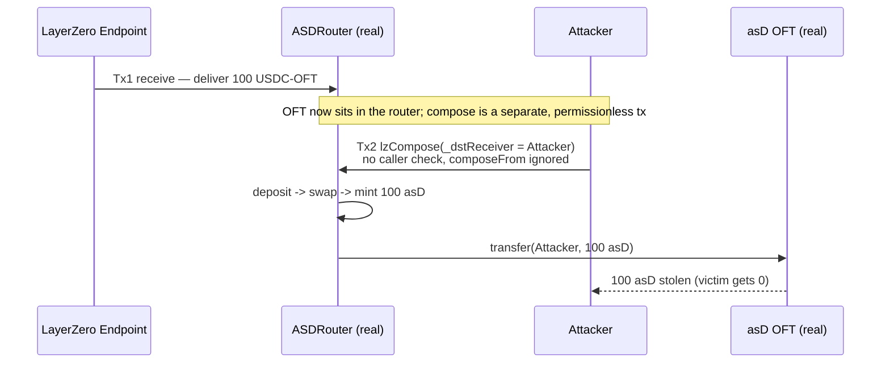

# [H-02] Canto asD — permissionless `lzCompose` lets anyone steal a bridged composed-message transfer

Canto's `ASDRouter` receives USDC-style LayerZero OFTs and, via a **composed
message**, swaps them to `$NOTE`, mints `asD`, and forwards the `asD` to the
user. LayerZero V2 delivers a composed message in **two separate transactions**
on the destination chain:

1. **Receive** — the LayerZero endpoint transfers the OFT to `ASDRouter`.
2. **Compose** — an *executor* permissionlessly calls
   [`ASDRouter.lzCompose(...)`](https://github.com/code-423n4/2024-03-canto/blob/1516028017a34ccfb4b0b19f5c5f17f5fa4cad42/contracts/asd/asdRouter.sol#L61-L111)
   to run the swap/mint/forward logic.

Because step 2 is a **later, separate, permissionless** transaction, the OFT is
already sitting in the router when anyone may call `lzCompose`. `lzCompose` has
**no `msg.sender` restriction** and **never binds the composed payload to
`composeFrom`** (the original sender). An attacker who watches the router for a
freshly delivered OFT can craft their own composed message — setting
`_dstReceiver` to themselves — and call `lzCompose` **before** the honest
executor, redirecting the resulting `asD` to their own address. The victim's
bridged value is stolen outright.

## Root cause

```solidity
// contracts/asd/asdRouter.sol  (audited commit)
function lzCompose(address _from, bytes32 _guid, bytes calldata _message, address _executor, bytes calldata _extraData) external payable {
    // ^ no access control; anyone may call, and the OFT is already in the router.
    (, , uint256 amountLD, bytes32 composeFrom, bytes memory composeMsg) = _decodeOFTComposeMsg(_message);
    // composeFrom (the real sender) is decoded but NEVER used to authorize the receiver.
    OftComposeMessage memory payload = abi.decode(composeMsg, (OftComposeMessage));
    ...
    _sendASD(_guid, payload, amountNote);   // sends asD to payload._dstReceiver — attacker-chosen
}

function _sendASD(bytes32 _guid, OftComposeMessage memory _payload, uint _amount) internal {
    if (_payload._dstLzEid == cantoLzEID) {
        ASDOFT(_payload._cantoAsdAddress).transfer(_payload._dstReceiver, _amount); // L140
    } ...
}
```

`_dstReceiver` comes from the caller-supplied payload and is trusted verbatim.

## PoC — real audited contracts, local deploy

The PoC deploys the **unmodified audited sources** — `ASDRouter`, `ASDUSDC`, and
the `asD` LayerZero **OFT** (`ASDOFT`, extending `@layerzerolabs/lz-evm-oapp-v2`
`OFT` → `OFTCore` → `OApp`) — vendored from the audited commit under
`src/canto/`. Only genuinely external systems are doubled: the LayerZero
endpoint (its cross-chain messaging is irrelevant here — the real `lzCompose`
handling runs unchanged), the Ambient DEX, the Compound `cNOTE` market, and the
source-chain USDC OFT token.

Flow reproduced with concrete numbers (`AMOUNT = 100e18`):

1. **Tx 1 (receive):** LayerZero has delivered `100` USDC-OFT to the router.
2. **Tx 2 (compose):** the attacker calls `lzCompose` with a payload whose
   `_dstReceiver = attacker`. The router:
   - deposits the 100 USDC-OFT into `ASDUSDC` → 100 `asdUSDC` (real),
   - swaps `asdUSDC` → 100 `$NOTE` (Ambient double),
   - `ASDOFT.mint(100)` — pulls `$NOTE`, mints via `cNOTE`, mints 100 `asD` to the router (real),
   - `ASDOFT.transfer(attacker, 100)` — **the theft** (real).

**Asserted harm:** attacker `asD` balance `0 → 100e18`; victim `asD` balance `0`;
router's delivered OFT fully consumed (`100e18 → 0`). The honest user receives
nothing.



## Reproduce

```bash
_shared/run-poc/run_poc.sh 32130-h-02-dual-transaction-nature-of-composed-message-transfer-al_exp -vvvvv
```

Expected: `[PASS] test_attackerFrontRunsComposedMessageAndStealsFunds`.

## Mitigation

Restrict `lzCompose` to trusted/whitelisted executors, or redesign to implement
`_lzReceive` directly (an `OApp`) so no separate composed transaction — and thus
no front-runnable window — exists. At minimum, bind the composed payload's
receiver to the authenticated `composeFrom`.

Sources: [AuditVault finding #32130](https://github.com/Auditware/AuditVault/blob/main/findings/32130-h-02-dual-transaction-nature-of-composed-message-transfer-al.md) · [Canto @ `1516028`](https://github.com/code-423n4/2024-03-canto/blob/1516028017a34ccfb4b0b19f5c5f17f5fa4cad42/contracts/asd/asdRouter.sol#L61-L111) · [Code4rena report](https://code4rena.com/reports/2024-03-canto) · fix PR: [Plex-Engineer/ASD-V2#4](https://github.com/Plex-Engineer/ASD-V2/pull/4).
