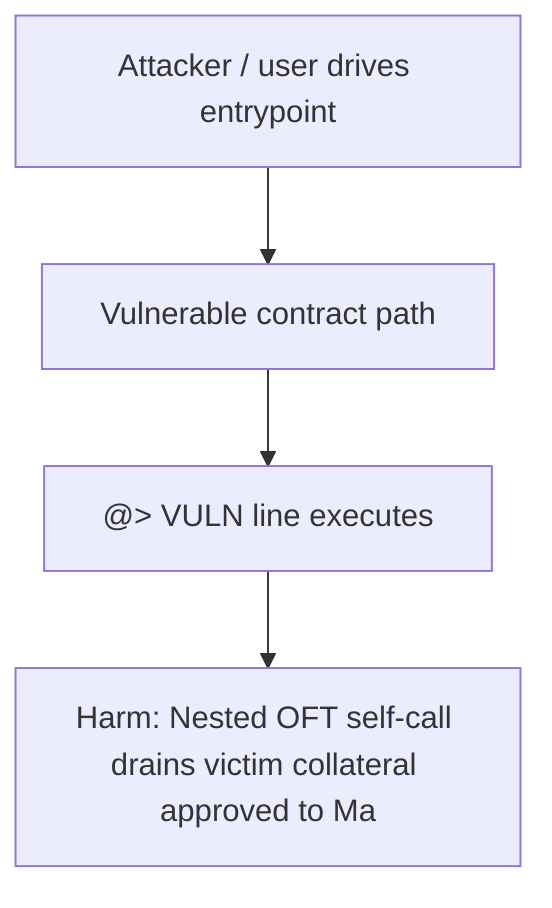

# Tapioca DAO — OFT self-call makes Magnetar msg.sender and bypasses _checkSender

> **Vulnerability classes:** missing-modifier, direct-drain, access-roles

> **Reproduction:** self-contained Foundry PoC (only `forge-std`) — no fork, no RPC.
> Full trace: [output.txt](output.txt). PoC: [test/32317-h-06-attacker-can-use-magnetaractionoft-action-of-the-magnet_exp.sol](test/32317-h-06-attacker-can-use-magnetaractionoft-action-of-the-magnet_exp.sol).

<!-- non-defihacklabs -->
<!-- source-auditvault: https://github.com/Auditware/AuditVault/blob/main/findings/32317-h-06-attacker-can-use-magnetaractionoft-action-of-the-magnet.md -->
<!-- date: 2024-02 -->

---

## Key info

| | |
|---|---|
| **Impact** | **HIGH** — Nested OFT self-call drains victim collateral approved to Magnetar |
| **Protocol** | Tapioca DAO |
| **Vulnerable code** | `Magnetar` (see `@>` in synthetic) |
| **Finding** | Code4rena · #32317 |
| **Report** | [https://code4rena.com/reports/2024-02-tapioca](https://code4rena.com/reports/2024-02-tapioca) |
| **Source** | [AuditVault](https://github.com/Auditware/AuditVault/blob/main/findings/32317-h-06-attacker-can-use-magnetaractionoft-action-of-the-magnet.md) |
| **Status** | Audit finding — reproduced as a standalone local PoC |
| **Compiler** | `^0.8.24` |

---

## TL;DR

OFT self-call makes Magnetar msg.sender and bypasses _checkSender. Harm demonstrated: **Nested OFT self-call drains victim collateral approved to Magnetar**.

---

## The vulnerable code

See `test/32317-h-06-attacker-can-use-magnetaractionoft-action-of-the-magnet.sol` — the blamed line is marked `// @> VULN`.

---

## Root cause

See the synthetic header comment and the AuditVault finding for the full root-cause write-up. The Playground preserves the vulnerable line verbatim and asserts the concrete harm in `Exploit.run()`.

## Attack walkthrough

1. Deploy the reduced vulnerable system (CREATE order: Cluster, MockERC20, Market, Magnetar).
2. Seed the preconditions from the finding (approvals, balances, whitelist).
3. Execute the attack path; the `@>` line runs.
4. `require(...)` asserts the harm.

## Diagrams

## Impact

Nested OFT self-call drains victim collateral approved to Magnetar

## Taxonomy

- missing-modifier, direct-drain, access-roles

## Sources

- [AuditVault finding](https://github.com/Auditware/AuditVault/blob/main/findings/32317-h-06-attacker-can-use-magnetaractionoft-action-of-the-magnet.md)
- [Code4rena report](https://code4rena.com/reports/2024-02-tapioca)
- Reduced from: `Tapioca-DAO/tapioca-periph Magnetar._processOFTOperation + _checkSender`
