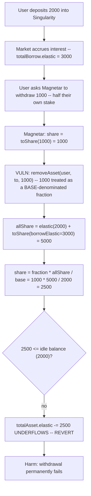
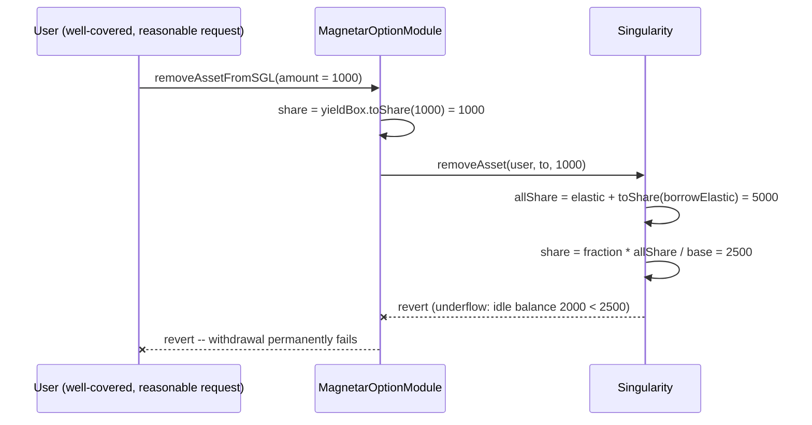

# Tapioca DAO — Incorrect math means removeAssetFromSGL will never work once SGL has accrued interest

> **Vulnerability classes:** vuln/logic/argument-type-confusion · vuln/availability/liveness-brick · vuln/accounting/rebase-scaling

> **Reproduction:** a self-contained Foundry PoC that compiles & runs in an
> isolated project with **only `forge-std`** — no fork, no RPC, no `anvil_state`.
> Full trace: [output.txt](output.txt). PoC:
> [test/32318-h-07-incorrect-math-means-dataremoveandrepaydataremoveassetf.sol](test/32318-h-07-incorrect-math-means-dataremoveandrepaydataremoveassetf.sol).

<!-- non-defihacklabs -->
<!-- source-auditvault: https://github.com/Auditware/AuditVault/blob/main/findings/32318-h-07-incorrect-math-means-dataremoveandrepaydataremoveassetf.md -->
<!-- date: 2024-02 -->

---

## Key info

| | |
|---|---|
| **Impact** | **HIGH** — an ordinary, well-covered withdrawal through the Magnetar periphery helper permanently reverts the instant the Singularity market has accrued any interest at all |
| **Protocol** | [Tapioca DAO](https://tapioca.xyz) — an omnichain money market; `Singularity` is its lending market, `YieldBox` its shared token-share vault, `Magnetar` a periphery helper that batches user actions |
| **Vulnerable code** | `MagnetarOptionModule.removeAssetFromSGL` — converts a withdrawal AMOUNT into raw YieldBox shares via `toShare`, then passes those shares into `Singularity.removeAsset()`'s `fraction` parameter, which `SGLCommon._removeAsset` scales by the pool's ENTIRE value (idle + lent out) |
| **Bug class** | Argument-type confusion: raw YieldBox shares passed where a `totalAsset.base`-denominated fraction is expected |
| **Finding** | Code4rena — Tapioca, 2024-02 · #32318 · reporter **KIntern_NA** |
| **Report** | [code4rena.com/reports/2024-02-tapioca](https://code4rena.com/reports/2024-02-tapioca) |
| **Source** | [AuditVault](https://github.com/Auditware/AuditVault/blob/main/findings/32318-h-07-incorrect-math-means-dataremoveandrepaydataremoveassetf.md) |
| **Status** | Audit finding — caught in review (not exploited on-chain). Tapioca confirmed the bug and shipped a fix PR. Reproduced here as a standalone local PoC. |
| **Compiler** | `^0.8.24` (PoC) |

This is an **audit finding**, not a historical on-chain incident. The PoC
keeps the three blamed lines verbatim — the `toShare` conversion and the
`removeAsset` call in `MagnetarOptionModule`, and the fraction-scaling formula
in `SGLCommon._removeAsset` — so the "will never work" outcome becomes a
measurable, asserted revert.

---

## TL;DR

1. A user asks the Magnetar periphery helper to withdraw a specific **amount**
   of the underlying asset from a Singularity market via
   `removeAssetFromSGL`.
2. Magnetar converts that amount into raw **YieldBox shares** with
   `yieldBox.toShare(assetId, removeAmount, false)`.
3. It then passes those raw shares straight into
   `Singularity.removeAsset(user, to, share)`'s third parameter — which
   Singularity's `_removeAsset` treats as a **fraction of `totalAsset.base`**
   (its own internal LP-accounting unit), not as YieldBox shares.
4. `_removeAsset` scales that "fraction" by `allShare = totalAsset.elastic +
   yieldBox.toShare(totalBorrow.elastic)` — the pool's **entire** value,
   including everything currently lent out to borrowers.
5. The two quantities only coincide while `totalAsset.elastic ==
   totalAsset.base`, i.e. **before any interest-bearing borrow exists**. The
   instant the market has any outstanding borrow interest, the resulting
   `share` figure exceeds the pool's real idle balance and the subtraction
   underflows — reverting the entire withdrawal.
6. **Every withdrawal through this path permanently fails once the market has
   accrued any interest at all** — exactly the report's title.

---

## The vulnerable code

The Magnetar conversion and mis-plumbed call (verbatim,
`MagnetarOptionModule.sol`):

```solidity
uint256 share = yieldBox_.toShare(_assetId, _removeAmount, false); // L153

singularity_.removeAsset(data.user, removeAssetTo, share);          // L158-159
```

Singularity's fraction-scaling formula, which the caller above never
satisfies once interest has accrued (verbatim, `SGLCommon.sol` L199-216):

```solidity
function _removeAsset(address from, address to, uint256 fraction) internal returns (uint256 share) {
    if (totalAsset.base == 0) {
        return 0;
    }
    Rebase memory _totalAsset = totalAsset;
    uint256 allShare = _totalAsset.elastic + yieldBox.toShare(assetId, totalBorrow.elastic, false);
    share = (fraction * allShare) / _totalAsset.base; // @> fraction must be base-denominated, NOT raw shares
}
```

## Root cause

`fraction` is Singularity's own internal accounting unit — a share of the
pool's *total* claim (idle liquidity plus everything currently out on loan),
scaled against `totalAsset.base` (the LP-fraction supply). Raw YieldBox
shares of a withdrawal amount are a completely different unit that happens to
numerically coincide with a base-denominated fraction only in the special
case where the pool has never had any borrow activity. Magnetar's helper
computes the wrong unit and hands it directly to a function whose scaling
factor grows monotonically with every unit of interest the market accrues.

## Preconditions

- The Singularity market has any outstanding borrow (`totalBorrow.elastic >
  0`) — i.e. it has accrued **any** interest at all, which is the normal
  steady state of a functioning lending market.
- A user calls `removeAssetFromSGL` for any amount that, once mis-scaled by
  `allShare / totalAsset.base`, exceeds the pool's actual idle YieldBox
  balance.

## Attack walkthrough

From [output.txt](output.txt):

1. A depositor puts 2000 units into the Singularity market via `addAsset`
   (`totalAsset.elastic == totalAsset.base == 2000`).
2. The market accrues interest from normal borrowing activity
   (`totalBorrow.elastic` grows to 3000).
3. The depositor asks Magnetar to withdraw 1000 units — only half of their
   own stake, comfortably covered by both their SGL balance and the market's
   real liquidity.
4. Magnetar computes `share = toShare(1000) = 1000` and passes it as
   `fraction` into `removeAsset`. Singularity computes `allShare = 2000 +
   3000 = 5000` and `share = 1000 * 5000 / 2000 = 2500` — **2.5x more than the
   pool's actual idle balance (2000)**.
5. `totalAsset.elastic -= 2500` underflows against the actual idle balance of
   2000 and **reverts**. **HARM:** the withdrawal fails completely, even
   though the request was entirely reasonable and well within the user's
   means.
6. A control call directly against Singularity, using the correctly-scaled
   fraction the report's suggested fix (`getFractionForAmount`) would
   produce, succeeds and returns exactly the requested amount — proving the
   market itself is solvent and functional. The bug is purely Magnetar's
   argument-type confusion.

## Diagrams





## Impact

- Any withdrawal through `removeAssetFromSGL` reverts once the market has
  accrued any interest at all — which is the normal, expected state of a
  functioning lending market, not an edge case.
- This is a **liveness brick** on a core user action (withdrawing deposited
  assets), not a fund-extraction bug: users cannot get their own money out
  through this path at all, for as long as the market has any outstanding
  interest.
- Because the mis-scaling amplifies with the size of outstanding borrow
  relative to idle liquidity, the failure gets *more* certain, not less, the
  longer the market operates normally — the bug does not self-resolve.

## Sources

- AuditVault finding: https://github.com/Auditware/AuditVault/blob/main/findings/32318-h-07-incorrect-math-means-dataremoveandrepaydataremoveassetf.md
- Original report: https://code4rena.com/reports/2024-02-tapioca
- Reduced-source provenance: blamed lines quoted directly from the AuditVault
  finding, which cites
  `github.com/Tapioca-DAO/tapioca-periph` commit
  `2ddbcb1cde03b548e13421b2dba66435d2ac8eb5`,
  `contracts/Magnetar/modules/MagnetarOptionModule.sol` (L153, L158-159), and
  `github.com/Tapioca-DAO/Tapioca-bar` commit
  `c2031ac2e2667ac8f9ac48eaedae3dd52abef559`,
  `contracts/markets/singularity/SGLCommon.sol` (L199-216).

## Taxonomy (AuditVault)

- **genome:** precision-loss, specific-token-type, direct-drain, integer-bounds
- **sector:** governance, lending, token
- **severity:** high
