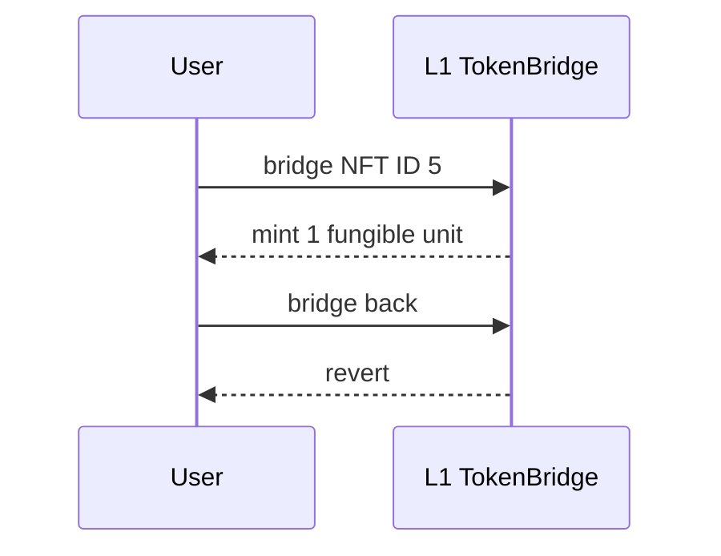

# Linea TokenBridge — ERC721 becomes permanently one-way
<!-- non-defihacklabs -->
<!-- source-auditvault: https://github.com/Auditware/AuditVault/blob/main/findings/33298-tokenbridgebridgetoken-allows-1-way-erc721-bridging-causing.md -->
<!-- date: 2024-05 -->
> **Vulnerability classes:** vuln/bridge/missing-validation · vuln/dos/frozen-funds
## Key info
| Field | Value |
|---|---|
| Loss | NFT stays permanently locked in L1 bridge |
| Chain | Local synthetic |
## TL;DR
The ERC20 bridge accepts an ERC721 because both expose a `transferFrom`-shaped call. The NFT is locked and represented as one fungible unit, but the return flow cannot release it.
## The vulnerable code
```solidity
IERC721Like(token).transferFrom(msg.sender, address(this), amount); // @> VULN: an ERC721 is accepted as an ERC20 bridge asset and becomes one-way.
```
## Attack walkthrough
The PoC bridges NFT ID 5, confirms bridge ownership and one L2 unit, catches the failed return path, then asserts ownership is still the bridge.
## Diagrams

## Remediation
Reject unsupported token standards by requiring ERC20 `decimals` success or robust interface detection.
## Sources
- [AuditVault finding #33298](https://github.com/Auditware/AuditVault/blob/main/findings/33298-tokenbridgebridgetoken-allows-1-way-erc721-bridging-causing.md)
- [Linea fix `35c7807`](https://github.com/Consensys/zkevm-monorepo/commit/35c7807756ccac2756be7da472f5e6ce0fd9b16a)
