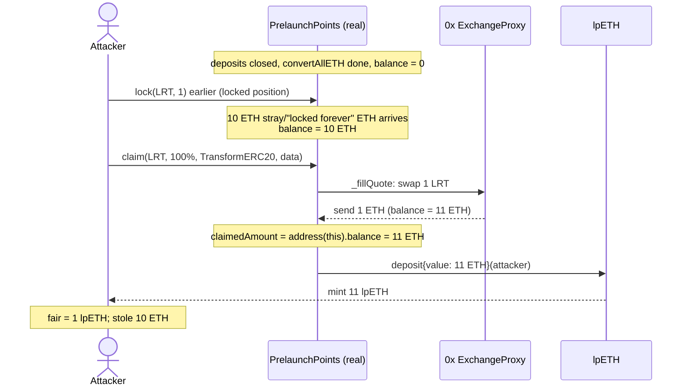

# LoopFi PrelaunchPoints — H-01: availability-of-deposit invariant can be bypassed

**Protocol:** LoopFi (Loop Protocol prelaunch staking)
**Source:** Code4rena *2024-05-loop* — [report](https://code4rena.com/reports/2024-05-loop) · finding [#33354](https://github.com/code-423n4/2024-05-loop-findings/issues/33)
**Real code:** [`code-423n4/2024-05-loop` `src/PrelaunchPoints.sol`](https://github.com/code-423n4/2024-05-loop/blob/main/src/PrelaunchPoints.sol) (commit `20d9013`), Solidity 0.8.20, OpenZeppelin 5.0.2.

This POC deploys the **real, unmodified** `PrelaunchPoints.sol` (byte-identical to the audited source — see `src/loop/PrelaunchPoints.sol`) together with the project's own real mocks (`MockLpETH`, `MockLpETHVault`, `LRToken`). The only stand-in is the truly-external, out-of-scope 0x `ExchangeProxy`, modelled by a minimal contract that honours the exact interface `PrelaunchPoints` uses (pull the approved sell-token, return the swapped ETH). No mainnet fork — everything is deployed fresh in an empty genesis.

## Root cause

The audited claim path for wrapped-LRT tokens converts the swapped ETH into `lpETH` **1:1**, but reads the amount to mint from the contract's *entire* ETH balance:

```solidity
// PrelaunchPoints._claim  (src/PrelaunchPoints.sol:259-263)
_fillQuote(IERC20(_token), userClaim, _data);      // swaps LRT -> ETH into this contract

// Convert swapped ETH to lpETH (1 to 1 conversion)
claimedAmount = address(this).balance;             // @> whole balance, NOT just the swap output
lpETH.deposit{value: claimedAmount}(_receiver);
```

`claimedAmount` is meant to be only the ETH bought from the caller's own swap (`buyAmount`). Because it is `address(this).balance`, **any other ETH sitting in the contract is minted as `lpETH` to the claimer.** The contract's own `receive()` even documents that directly-sent ETH is "locked forever" — but the LRT claim path lets an attacker sweep it.

This breaks two of the audit's stated main invariants:
- *"Deposits are active up to the lpETH/lpETHVault contracts are set"* — fresh ETH injected **after** activation becomes `lpETH`, bypassing the `onlyBeforeDate(loopActivation)` lock gate.
- *"Users that deposit ETH/WETH get the correct amount of lpETH on claim (1 to 1 conversion)"* — the claimer mints far more than their locked position is worth.

The fix (confirmed by the team) is to set `claimedAmount` to the swap's `buyAmount`, not the balance.

## Exploit walkthrough (concrete numbers)

Attacker holds a **1 LRT** locked position (worth 1 ETH at swap). Deposits are then closed and `convertAllETH` sweeps the contract (balance → 0). **10 ETH** of unrelated / "locked-forever" ETH later lands in the contract.

1. Attacker `claim(LRT, 100%, TransformERC20, data)`.
2. `_validateData` accepts the real 0x `TransformERC20` calldata; `_fillQuote` swaps 1 LRT → **1 ETH** into the contract (balance now `10 + 1 = 11 ETH`).
3. `claimedAmount = address(this).balance = 11 ETH` → `lpETH.deposit` mints **11 lpETH** to the attacker.

| Quantity | Value |
|---|---|
| Attacker locked position | 1 LRT (= 1 ETH fair swap) |
| Stray / locked-forever ETH in contract | 10 ETH |
| `lpETH` minted to attacker | **11 lpETH** |
| Fair 1:1 entitlement | 1 lpETH |
| **Stolen (excess)** | **10 ETH** worth of `lpETH` |

The attacker walks away with 11 `lpETH` (redeemable 1:1) for a 1-LRT position — a net **+10 ETH** at the expense of the stray ETH holder.



## Reproduce

```bash
_shared/run-poc/run_poc.sh 33354-h-01-availability-of-deposit-invariant-can-be-bypassed-code4_exp -vvvvv
```

Asserts `lpETH` minted to attacker `== 11 ether`, fair `== 1 ether`, stolen excess `== 10 ether`, and the contract's stray ETH is swept to `0`.

Sources: [AuditVault #33354](https://github.com/Auditware/AuditVault/blob/main/findings/33354-h-01-availability-of-deposit-invariant-can-be-bypassed-code4.md), [Code4rena 2024-05-loop report](https://code4rena.com/reports/2024-05-loop).
