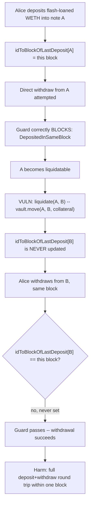
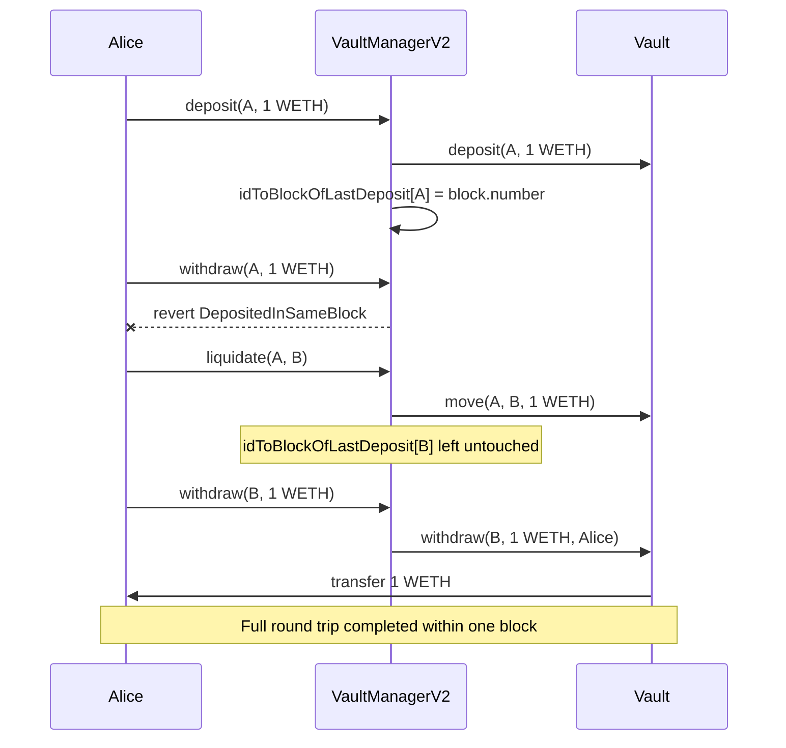

# DYAD — Flash loan protection mechanism can be bypassed via self-liquidations

> **Vulnerability classes:** vuln/access-control/guard-bypass · vuln/logic/state-not-refreshed · vuln/flash-loan/protection-bypass

> **Reproduction:** a self-contained Foundry PoC that compiles & runs in an
> isolated project with **only `forge-std`** — no fork, no RPC, no `anvil_state`.
> Full trace: [output.txt](output.txt). PoC:
> [test/33466-h-10-flash-loan-protection-mechanism-can-be-bypassed-via-sel.sol](test/33466-h-10-flash-loan-protection-mechanism-can-be-bypassed-via-sel.sol).

<!-- non-defihacklabs -->
<!-- source-auditvault: https://github.com/Auditware/AuditVault/blob/main/findings/33466-h-10-flash-loan-protection-mechanism-can-be-bypassed-via-sel.md -->
<!-- date: 2024-04 -->

---

## Key info

| | |
|---|---|
| **Impact** | **HIGH** — DYAD's flash-loan same-block deposit/withdraw guard, the centerpiece safeguard added in `VaultManagerV2`, is bypassable via a (self-)liquidation, re-enabling flash-loan-scale manipulation of the Kerosene collateralization mechanism |
| **Protocol** | [DYAD](https://dyadstable.org) — an over-collateralized stablecoin (DYAD) with a secondary "Kerosene" governance/collateral token whose price is derived from the system's own free collateral |
| **Vulnerable code** | `VaultManagerV2` — `deposit`/`withdraw`'s `idToBlockOfLastDeposit` same-block guard, and `liquidate()`, which calls `vault.move()` to transfer collateral between notes without refreshing the receiving note's guard marker |
| **Bug class** | A security guard keyed by an identity (note id) that a second code path (liquidation) can silently substitute without updating the guard's bookkeeping |
| **Finding** | Code4rena — DYAD, 2024-04 · #33466 · reporter **carrotsmuggler** |
| **Report** | [code4rena.com/reports/2024-04-dyad](https://code4rena.com/reports/2024-04-dyad) |
| **Source** | [AuditVault](https://github.com/Auditware/AuditVault/blob/main/findings/33466-h-10-flash-loan-protection-mechanism-can-be-bypassed-via-sel.md) |
| **Status** | Audit finding — caught in review (not exploited on-chain). DYAD confirmed the bug; the judge initially set Medium, then raised to **High** after discussion of the bypassed safeguard's centrality to `VaultManagerV2`. Reproduced here as a standalone local PoC. |
| **Compiler** | `^0.8.24` (PoC) |

This is an **audit finding**, not a historical on-chain incident. This
reduction isolates the guard-bypass **mechanism** itself — the two blamed
snippets quoted verbatim in the report's Impact section — rather than the
full multi-account Kerosene-price-manipulation narrative the report uses to
make the liquidation trigger naturally; the report itself treats that price
manipulation as *"a separate issue"* from the guard bypass documented here.

---

## TL;DR

1. `VaultManagerV2` records `idToBlockOfLastDeposit[id] = block.number` on
   every `deposit()`, and `withdraw()` reverts if that marker equals the
   current block — blocking a same-block deposit-then-withdraw on the **same**
   note id. This is the flash-loan protection the report is about.
2. `liquidate(id, to)` transfers the liquidated note's **entire** collateral
   balance to a **different** note (`to`) via `vault.move()` — but never sets
   `idToBlockOfLastDeposit[to]`.
3. So an attacker can: deposit flash-loaned collateral into note A (blocked
   from withdrawing directly, as designed) → trigger a **self-liquidation**
   of A that moves the collateral into note B → **withdraw from B in the
   same block**, because B's guard marker was never touched.
4. The full flash-loan-funded deposit-and-withdraw round trip completes
   within one block — exactly what the guard exists to prevent.

---

## The vulnerable code

The same-block guard (verbatim, from the finding's Impact section):

```solidity
//function deposit
idToBlockOfLastDeposit[id] = block.number;

//function withdraw
if (idToBlockOfLastDeposit[id] == block.number) revert DepositedInSameBlock();
```

The liquidation path that moves funds without refreshing the receiver's
marker (verbatim, from the finding's Impact section):

```solidity
function liquidate(
    uint id,
    uint to
  )
  {
    //...
    vault.move(id, to, collateral);
    //...
  }
```

## Root cause

The guard is keyed by note id and assumes the **only** way collateral enters
a note is `deposit()` — the single code path that refreshes the marker.
`liquidate()` is a second, independent code path that credits a note with
fresh collateral (via `vault.move()`) without going through `deposit()`, so
it never refreshes the guard. Any code path that can move collateral into an
account without calling `deposit()` reopens the exact flash-loan window the
guard was built to close.

## Preconditions

- The attacker controls (or can trigger the liquidation of) two notes: a
  deposit target (A) and a liquidation-receiving target (B).
- Note A can be made liquidatable within the same block the flash-loaned
  funds are deposited (in the real system, via the separately-discussed
  Kerosene price manipulation; this reduction takes "A is liquidatable" as a
  given precondition, matching the report's own framing of price
  manipulation as a distinct issue).

## Attack walkthrough

From [output.txt](output.txt):

1. Alice takes out a flashloan and deposits 1 WETH into note A.
   `idToBlockOfLastDeposit[A]` is set to the current block.
2. **Control:** Alice tries to withdraw directly from A in the same block —
   the guard correctly reverts with `DepositedInSameBlock`. The direct path
   is protected, exactly as designed.
3. Note A becomes liquidatable (via price manipulation in the real attack,
   taken as a precondition here).
4. Alice liquidates herself: `liquidate(A, B)` moves A's entire collateral
   balance to note B via `vault.move()`. `idToBlockOfLastDeposit[B]` is
   **never updated** — it still reflects whatever it was before this block.
5. Alice withdraws from B in the **same block**. Because B's marker was never
   refreshed, the guard's same-block check passes and the withdrawal
   succeeds.
6. **HARM:** Alice's WETH balance is back to the full flash-loaned amount,
   and note B ends with zero collateral — a complete deposit-then-withdraw
   round trip within a single block, achieved purely by routing the funds
   through a self-liquidation instead of a direct withdrawal.

## Diagrams





## Impact

- Bypasses the specific safeguard `VaultManagerV2` was migrated to add over
  `VaultManagerV1`, re-opening the flash-loan attack surface it was designed
  to close.
- Combined with the (separately-discussed) ability to manipulate Kerosene's
  price via deposits/withdrawals of free collateral, this lets an attacker
  use flash-loan-scale capital to mint DYAD at a collateralization ratio far
  weaker than the nominal 1.5x, then unwind everything within one block —
  leaving the protocol holding accounts near a 1.0x CR that are one small
  price move away from bad debt.
- Flash-loan-funded liquidation bots are common infrastructure, so this
  bypass is realistically reachable by any sufficiently capitalized actor,
  not just a sophisticated attacker with pre-existing capital.

## Sources

- AuditVault finding: https://github.com/Auditware/AuditVault/blob/main/findings/33466-h-10-flash-loan-protection-mechanism-can-be-bypassed-via-sel.md
- Original report: https://code4rena.com/reports/2024-04-dyad
- Reduced-source provenance: blamed lines quoted directly from the AuditVault
  finding, which cites `github.com/code-423n4/2024-04-dyad` commit
  `44becc2f09c3a75bd548d5ec756a8e88a345e826`,
  `src/core/Vault.kerosine.sol` (L47-L59) and
  `src/core/VaultManagerV2.sol` (L225-L226), plus the finding's own inline
  quotes of the `deposit`/`withdraw`/`liquidate` guard logic.

## Taxonomy (AuditVault)

- **genome:** spot-price, data-corruption/price-manipulation, flash-loan,
  trigger/price-manipulation, flash-loan-available, debt-accrual-update,
  flashloan-callback-auth, liquidation-underwater, frontrun-exposure,
  oracle-manipulation-resistance
- **sector:** cdp, lending, nft, nft-lending, oracle, stable, staking, token
- **severity:** high
