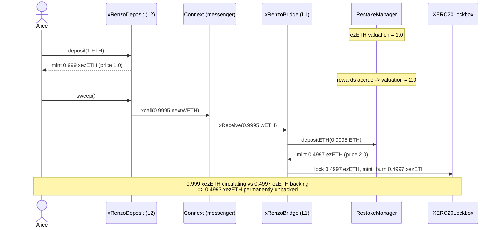

# Renzo bridge: xezETH supply desyncs from ezETH backing (H-06)

**Source:** Code4rena `2024-04-renzo`, commit `b5b5b76aeafd26c3607d1f0cda6835934d9e7b9e`
(`https://github.com/code-423n4/2024-04-renzo`).
**Vulnerable files:** `contracts/Bridge/L2/xRenzoDeposit.sol`,
`contracts/Bridge/L1/xRenzoBridge.sol`.

## Root cause

Minting xezETH is a two-step, two-chain flow and BOTH steps price the deposit at
the *current* ezETH valuation — sampled at two different times:

1. **L2** — `xRenzoDeposit.deposit()` mints `xezETH = amountOut * 1e18 / lastPrice`
   at the L2 valuation at deposit time.
2. **L1** — after `sweep()`, Connext calls `xRenzoBridge.xReceive()`, which deposits
   the bridged ETH into `RestakeManager.depositETH()`. That mints ezETH at the
   *L1* valuation via `RenzoOracle.calculateMintAmount(...)`, locks it in the
   `XERC20Lockbox`, mints an equal amount of xezETH and immediately **burns** it
   (an equivalent amount was already minted on L2).

`xReceive` never receives or reconciles the amount of xezETH the L2 actually
minted — it re-derives ezETH purely from the L1 valuation. When the ezETH price
rises between step 1 and step 3 (reward accrual, the normal case), the L1 mints
*fewer* ezETH than the xezETH already circulating on L2. Because
`XERC20Lockbox.withdraw()` always redeems xezETH → ezETH 1:1, the surplus xezETH
becomes permanently unbacked — akin to protocol bad debt.

## What the PoC deploys (all REAL audited source)

The real, unmodified `xRenzoDeposit`, `xRenzoBridge`, `XERC20` (xezETH) and
`XERC20Lockbox` are deployed. The L1 ezETH mint-rate uses the audited
`RenzoOracle.calculateMintAmount` formula verbatim inside a thin
`RestakeManagerStub` (the EigenLayer TVL plumbing that only *computes* TVL is
opaque restaking infra and is not part of this finding). The **only** mock is the
opaque cross-chain messenger (Connext), which carries none of the accounting.

## Exploit walkthrough (concrete numbers)

1. ezETH valuation starts at **1.0** (L1 TVL 100, supply 100).
2. Alice deposits **1 ETH** of WETH on L2 → mints **0.999000250000000000 xezETH**
   (1 ETH − 5 bps deposit fee − 5 bps router fee, ÷ price 1.0).
3. Rewards accrue: L1 valuation rises to **2.0** (TVL 200, supply 100).
4. `sweep()` → `xcall` → `xReceive` deposits the ~0.9995 ETH batch into Renzo,
   which mints only **0.499749999999999921 ezETH** at the 2.0 valuation. That
   ezETH is locked in the lockbox; a matching xezETH is minted and burned.
5. Result: **0.999000… xezETH in circulation** backed by only
   **0.499749… ezETH** in the lockbox.

**Harm:** Alice can redeem at most the backed half; attempting to redeem her full
balance 1:1 reverts (the lockbox is insolvent). She is left holding
**0.499250250000000079 xezETH** that is permanently unredeemable.



## Reproduce

```bash
_shared/run-poc/run_poc.sh 33493-h-06-the-amount-of-xezeth-in-circulation-will-not-represent_exp -vvvvv
```

Asserts: circulating xezETH `0.999000250000000000` > lockbox ezETH backing
`0.499749999999999921`; full-balance 1:1 redemption reverts; and
`0.499250250000000079` xezETH is left stranded and unredeemable.

<!-- source-auditvault: https://github.com/Auditware/AuditVault/blob/main/findings/33493-h-06-the-amount-of-xezeth-in-circulation-will-not-represent.md -->
