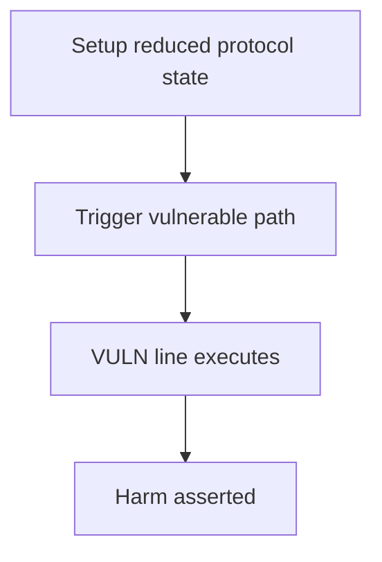

# Renzo — incorrect withdraw queue balance in TVL calculation

> **Vulnerability classes:** precision-loss · data-corruption/price-manipulation

> **Reproduction:** a self-contained Foundry PoC that compiles & runs in an
> isolated project with **only `forge-std`** — no fork, no RPC, no `anvil_state`.
> Full trace: [output.txt](output.txt). PoC:
> [test/33495-h-08-incorrect-withdraw-queue-balance-in-tvl-calculation-cod_exp.sol](test/33495-h-08-incorrect-withdraw-queue-balance-in-tvl-calculation-cod_exp.sol).

<!-- non-defihacklabs -->
<!-- source-auditvault: https://github.com/Auditware/AuditVault/blob/main/findings/33495-h-08-incorrect-withdraw-queue-balance-in-tvl-calculation-cod.md -->
<!-- date: 2024-04 -->

---

## Key info

| | |
|---|---|
| **Impact** | **HIGH — withdraw-queue TVL uses the wrong collateral index, understating TVL and minting excess shares** |
| **Protocol** | Renzo |
| **Vulnerable code** | `RestakeManager` |
| **Bug class** | precision-loss |
| **Finding** | Code4rena — Renzo, 2024-04 · #33495 · reporter **josephdara** |
| **Report** | [code4rena.com/reports/2024-04-renzo](https://code4rena.com/reports/2024-04-renzo) |
| **Source** | [AuditVault](https://github.com/Auditware/AuditVault/blob/main/findings/33495-h-08-incorrect-withdraw-queue-balance-in-tvl-calculation-cod.md) |
| **Status** | Audit finding — caught in review, not exploited on-chain. Reproduced as a standalone local PoC. |
| **Compiler** | `^0.8.24` (PoC) |

This is an **audit finding**, not a historical on-chain incident. The PoC keeps
the vulnerable logic **verbatim** (marked `@> VULN`) and reduces dependencies
to the minimum needed to show the claimed harm.

---

## TL;DR

1. TVL loops ODs (i) then collateral tokens (j).
2. Withdraw-queue oracle call uses collateralTokens[i] for price but balanceOf token j.
3. With 1 OD and 3 tokens, token0 is priced 3×; tokens 1/2 ignored.
4. Deposit against understated TVL mints excess shares.

---

## The vulnerable code

See `test/33495-h-08-incorrect-withdraw-queue-balance-in-tvl-calculation-cod.sol` — the `@> VULN` marker is on the blamed line (line 98 in the synthetic).

## Root cause

Wrong loop index on the oracle token identity for the withdraw-queue contribution.

## Preconditions

Protocol operating conditions that make the path reachable (see finding report). No exotic privileges beyond those the real call path requires.

## Attack walkthrough

From [output.txt](output.txt): the `Exploit.run()` path executes the attack end-to-end and `require`s the harm.

## Diagrams

## Impact

Miscalculated TVL drives mint/redeem; excess shares dilute honest LPs.

## Sources

- [AuditVault finding](https://github.com/Auditware/AuditVault/blob/main/findings/33495-h-08-incorrect-withdraw-queue-balance-in-tvl-calculation-cod.md)
- [Code4rena report](https://code4rena.com/reports/2024-04-renzo)
- Protocol source: https://github.com/code-423n4/2024-04-renzo
