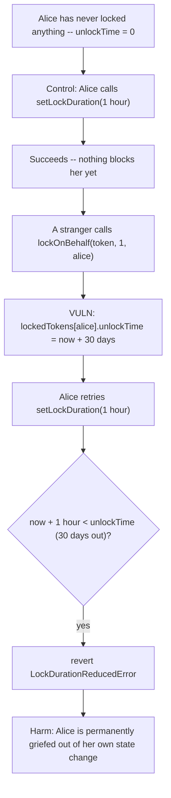
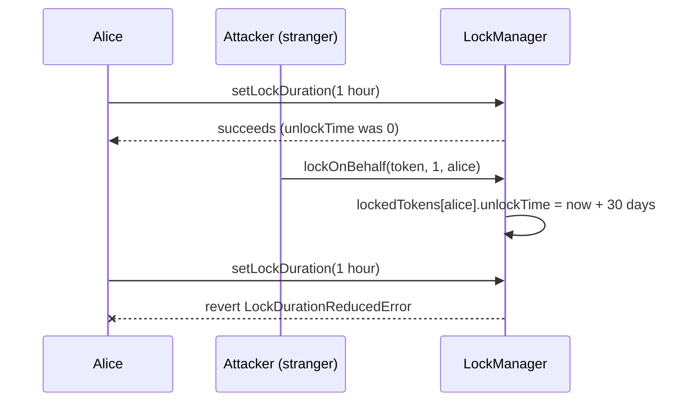

# Munchables — Malicious user can call lockOnBehalf to repeatedly extend a user's unlockTime

> **Vulnerability classes:** vuln/access-control/missing-authorization · vuln/dos/griefing · vuln/loss-of-funds/locked-funds

> **Reproduction:** a self-contained Foundry PoC that compiles & runs in an
> isolated project with **only `forge-std`** — no fork, no RPC, no `anvil_state`.
> Full trace: [output.txt](output.txt). PoC:
> [test/33594-h-01-malicious-user-can-call-lockonbehalf-repeatedly-extend.sol](test/33594-h-01-malicious-user-can-call-lockonbehalf-repeatedly-extend.sol).

<!-- non-defihacklabs -->
<!-- source-auditvault: https://github.com/Auditware/AuditVault/blob/main/findings/33594-h-01-malicious-user-can-call-lockonbehalf-repeatedly-extend.md -->
<!-- date: 2024-05 -->

---

## Key info

| | |
|---|---|
| **Impact** | **HIGH** — anyone can permanently grief any other user's `LockManager` state via an unconsented, near-zero-cost "donation," either delaying their withdrawal indefinitely or blocking their ability to lower their preferred lock duration |
| **Protocol** | [Munchables](https://munchables.game) — an NFT/staking game where users lock tokens (ETH/ERC20) for a chosen duration to earn in-game benefits |
| **Vulnerable code** | `LockManager.lockOnBehalf` — resets the **receiver's** `lockedToken.unlockTime` with no access control and no minimum `_quantity` |
| **Bug class** | Missing access control on a function that mutates another user's security-relevant state, with no minimum-value requirement to raise attacker cost |
| **Finding** | Code4rena — Munchables, 2024-05 · #33594 · reporter **3** |
| **Report** | [code4rena.com/reports/2024-05-munchables](https://code4rena.com/reports/2024-05-munchables) |
| **Source** | [AuditVault](https://github.com/Auditware/AuditVault/blob/main/findings/33594-h-01-malicious-user-can-call-lockonbehalf-repeatedly-extend.md) |
| **Status** | Audit finding — caught in review (not exploited on-chain). Munchables confirmed and fixed by restricting `lockOnBehalf` to the `MigrationManager` contract only. Reproduced here as a standalone local PoC. |
| **Compiler** | `^0.8.24` (PoC) |

This is an **audit finding**, not a historical on-chain incident. This
reduction reproduces the report's own **second** demonstrated attack vector
verbatim — a stranger's unconsented donation blocking the victim's
`setLockDuration` call — because it is provable within a single, cheatcode-free
transaction (the report's *first* vector requires real wall-clock time to
elapse between griefing calls, which a single-block local synthetic cannot
model). Both vectors share the exact same root cause and the exact same
blamed line.

---

## TL;DR

1. `LockManager.lockOnBehalf(tokenContract, quantity, onBehalfOf)` lets
   **any** caller donate tokens "on behalf of" **any** other address — with
   **no access control** and **no minimum `quantity`** (0 is accepted).
2. It unconditionally resets `lockedTokens[onBehalfOf][tokenContract].unlockTime
   = block.timestamp + lockDuration` — the **receiver's** unlock time, not the
   caller's.
3. `setLockDuration` refuses to shorten a user's preferred lock duration if
   doing so would put the new unlock time before the currently recorded
   `unlockTime`.
4. So a stranger can donate a single unit of value to a victim and
   permanently prevent that victim from ever lowering their own preferred
   lock duration — or, given time between calls, keep pushing the victim's
   real withdrawal date further and further into the future.
5. **The attacker risks nothing of value to inflict this: `quantity` can be
   as low as they like, and there is no cost to calling the function
   repeatedly.**

---

## The vulnerable code

The blamed line, resetting the receiver's unlock time unconditionally
(verbatim, from the finding):

```solidity
lockedToken.unlockTime = uint32(block.timestamp) + uint32(_lockDuration);
```

The companion check this line poisons, blocking the victim's own attempt to
shorten their preferred duration (verbatim, from the finding):

```solidity
if (
    uint32(block.timestamp) + uint32(_duration) <
    lockedTokens[msg.sender][tokenContract].unlockTime
    ) {
    revert LockDurationReducedError();
    }
```

## Root cause

`lockOnBehalf` is meant to let users "gift" locked tokens to others, but it
reuses the exact same unlock-time-setting logic as a user locking their own
tokens — without distinguishing "I am extending MY OWN lock because I just
added more of MY OWN tokens" from "a stranger just changed MY unlock time
without asking me." Any state that gates a user's own future actions
(`unlockTime` gating `setLockDuration` and `withdraw`) must never be
writable by an unauthorized third party, especially not for the price of a
near-zero donation.

## Preconditions

- None beyond the vulnerable function being publicly callable, which it is
  by design (that is the entire point of "locking on behalf of" someone).
- The victim must have (or later acquire) a `LockManager` slot for the
  targeted `tokenContract` — trivially true for anyone who has ever locked,
  or who is about to lock, that token.

## Attack walkthrough

From [output.txt](output.txt):

1. **Control:** Alice has never locked anything (`unlockTime == 0`). She
   calls `setLockDuration(1 hour)` to set her preferred future lock duration
   — it succeeds, since `block.timestamp + 1 hour` is never less than an
   unlock time of `0`.
2. A stranger calls `lockOnBehalf(token, 1, alice)` — donating a single unit
   of value on Alice's behalf, something Alice never asked for and never
   consented to. This resets `lockedTokens[alice].unlockTime` to
   `block.timestamp + 30 days`.
3. Alice retries the **exact same** `setLockDuration(1 hour)` call that
   succeeded moments ago. It now **reverts**, because `block.timestamp + 1
   hour` is far less than the 30-day unlock time the stranger just imposed
   on her.
4. **HARM:** a stranger's unconsented, essentially free donation permanently
   blocks Alice from lowering her own preferred lock duration — a state
   change that is entirely hers to make, until someone else made it
   impossible.

## Diagrams





## Impact

- Any user can be permanently blocked from lowering their preferred lock
  duration by a stranger they never interacted with, for the cost of a
  near-zero "donation."
- With repeated calls timed shortly before a victim's existing `unlockTime`
  elapses (the report's first attack vector, which additionally requires
  real wall-clock time to pass between calls), the same root cause lets an
  attacker indefinitely delay a victim's ability to withdraw tokens they have
  already locked — a direct, ongoing denial of access to the victim's own
  funds.
- Because `lockOnBehalf` has no minimum quantity, the attacker's cost is
  effectively zero regardless of which variant they run, making this
  trivially repeatable against any number of victims.

## Sources

- AuditVault finding: https://github.com/Auditware/AuditVault/blob/main/findings/33594-h-01-malicious-user-can-call-lockonbehalf-repeatedly-extend.md
- Original report: https://code4rena.com/reports/2024-05-munchables
- Reduced-source provenance: blamed lines and both attack-vector PoCs quoted
  directly from the AuditVault finding (Code4rena 2024-05-munchables,
  `LockManager.lockOnBehalf` / `LockManager.setLockDuration`).

## Taxonomy (AuditVault)

- **genome:** griefing, variant, locked-funds, access-roles, dos-resistance,
  reward-accounting, timestamp-dependence
- **sector:** nft
- **severity:** high
