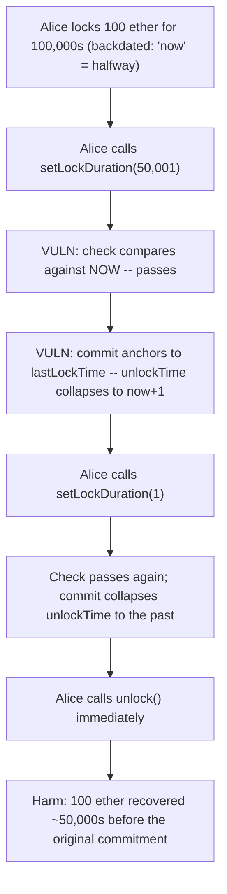
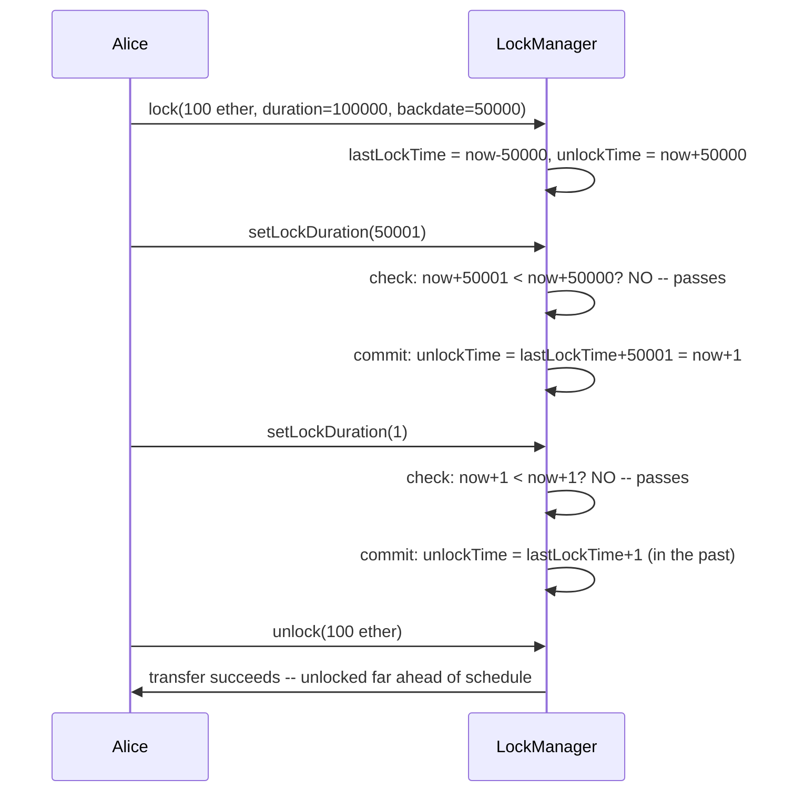

# Munchables — Invalid validation allows users to unlock early

> **Vulnerability classes:** vuln/logic/mismatched-invariant-anchor · vuln/access-control/reward-gaming · vuln/timestamp-dependence

> **Reproduction:** a self-contained Foundry PoC that compiles & runs in an
> isolated project with **only `forge-std`** — no fork, no RPC, no `anvil_state`.
> Full trace: [output.txt](output.txt). PoC:
> [test/33595-h-02-invalid-validation-allows-users-to-unlock-early-code4re.sol](test/33595-h-02-invalid-validation-allows-users-to-unlock-early-code4re.sol).

<!-- non-defihacklabs -->
<!-- source-auditvault: https://github.com/Auditware/AuditVault/blob/main/findings/33595-h-02-invalid-validation-allows-users-to-unlock-early-code4re.md -->
<!-- date: 2024-05 -->

---

## Key info

| | |
|---|---|
| **Impact** | **HIGH** — a user can repeatedly call `setLockDuration` to collapse their own remaining lock time toward zero, unlocking tokens far earlier than the duration they originally committed to (and, per the report, claiming reward-eligible NFT reveals honest users cannot) |
| **Protocol** | [Munchables](https://munchables.game) — an NFT/staking game where users lock tokens for a chosen duration in exchange for in-game benefits scaled to that commitment |
| **Vulnerable code** | `LockManager.setLockDuration` — validates a reduction against `block.timestamp + _duration < unlockTime`, but commits the new value as `lastLockTime + _duration` |
| **Bug class** | A security check and its corresponding state commit use two different time anchors ("now" vs. "the original lock time"), so they silently disagree once real time has elapsed |
| **Finding** | Code4rena — Munchables, 2024-05 · #33595 · reporter **leegh** |
| **Report** | [code4rena.com/reports/2024-05-munchables](https://code4rena.com/reports/2024-05-munchables) |
| **Source** | [AuditVault](https://github.com/Auditware/AuditVault/blob/main/findings/33595-h-02-invalid-validation-allows-users-to-unlock-early-code4re.md) |
| **Status** | Audit finding — caught in review (not exploited on-chain). Munchables confirmed and fixed; the judge raised severity to **High**, noting each re-adjustment can roughly halve the remaining lock time and the trick is repeatable. Reproduced here as a standalone local PoC. |
| **Compiler** | `^0.8.24` (PoC) |

This is an **audit finding**, not a historical on-chain incident. This
reduction keeps both blamed lines verbatim. Because a single-block,
cheatcode-free Playground synthetic cannot advance `block.timestamp`
mid-execution, `lock()` takes a documented PoC-only `backdateSeconds`
parameter to establish the ONE time gap the bug needs ("some real time has
passed since the lock") — mirroring the report's own PoC, which issues a
single `vm.warp(10000)` and then runs its whole sequence of
`setLockDuration` calls at that one later timestamp. A control scenario with
zero elapsed time proves the bug is inert without that gap.

---

## TL;DR

1. When a user locks tokens, `unlockTime = block.timestamp + lockDuration`
   and `lastLockTime = block.timestamp` are recorded together, at the same
   instant.
2. `setLockDuration` lets a user change their preferred duration at any
   time, even mid-lock. Before committing, it checks:
   `block.timestamp + _duration < unlockTime` → revert if true.
3. But it then **commits** `unlockTime = lastLockTime + _duration` — anchored
   to the **original** lock time, not to `block.timestamp`.
4. While no time has passed (`block.timestamp == lastLockTime`), the check
   and the commit agree and the guard works correctly.
5. Once real time HAS passed, the check (using "now") is far more lenient
   than the commit (using the old anchor) — so a user can call
   `setLockDuration` repeatedly, each time passing its own check, while the
   ACTUAL unlock time collapses toward the original lock time plus a tiny
   duration — i.e. **toward "now" or earlier**.

---

## The vulnerable code

The mismatched check and commit (verbatim, from the finding's
`setLockDuration`):

```solidity
        // check they are not setting lock time before current unlocktime
        if (
            uint32(block.timestamp) + uint32(_duration) <
            lockedTokens[msg.sender][tokenContract].unlockTime
        ) {
            revert LockDurationReducedError();
        }

        uint32 lastLockTime = lockedTokens[msg.sender][tokenContract]
            .lastLockTime;
        lockedTokens[msg.sender][tokenContract].unlockTime =
            lastLockTime +
            uint32(_duration);
```

## Root cause

The check is written as if it validates against the SAME anchor the commit
uses (`lastLockTime`), but it actually validates against `block.timestamp`
("now"). The two are only the same instant the lock is made. Every second
that passes after that, "now" runs ahead of `lastLockTime`, so satisfying
the check (`now + _duration >= unlockTime`) becomes progressively easier
than the commit's own effective guarantee (`lastLockTime + _duration >=
unlockTime`) would allow. The report's own numeric example: a 100-day lock,
touched at day 50 with `setLockDuration(51 days)` — the check computes
`50 + 51 = 101 > 100` (passes), but the commit sets `unlockTime = 0 + 51 =
day 51`, a real reduction from day 100 to day 51.

## Preconditions

- The caller has an existing lock with `quantity > 0` for the token in
  question.
- Some real time has elapsed since that lock was made (`block.timestamp >
  lastLockTime`) — true for essentially any lock that isn't unlocked in the
  very same block it was created.

## Attack walkthrough

From [output.txt](output.txt):

1. Alice locks 100 ether, committing to a 100,000-second duration. (For this
   reduction, the lock is deliberately backdated by 50,000 seconds to place
   "now" at the halfway point of her original window — mirroring the
   report's own single `vm.warp` before its sequence of calls.)
2. Alice calls `setLockDuration(50,001)` — on its face, barely shortening her
   preferred duration. The check compares `now + 50,001` against the current
   `unlockTime` (`now + 50,000`) and **passes**. The commit sets
   `unlockTime = lastLockTime + 50,001`, which — because 50,000 seconds have
   already elapsed — lands just **1 second** in the future, not the ~50,000
   the check seemed to guarantee.
3. Alice repeats the trick with `setLockDuration(1)`. The check again passes
   (comparing against the now-nearly-elapsed `unlockTime`), and the commit
   collapses `unlockTime` to a point already in the past.
4. **HARM:** Alice calls `unlock()` immediately and recovers her full 100
   ether — roughly 50,000 seconds before her originally committed
   100,000-second lock duration would have permitted, despite every
   individual `setLockDuration` call satisfying its own guard.
5. A control run with zero elapsed time (a genuine same-block lock +
   reduction attempt) shows the identical first `setLockDuration` call is
   correctly **blocked** — the bug specifically requires real time to have
   passed since the original lock.

## Diagrams





## Impact

- Any user can unlock their tokens far earlier than the duration they
  originally committed to, by issuing a short sequence of
  `setLockDuration` calls — no special privileges or external conditions
  required.
- Per the report, users exploiting this receive disproportionately more
  reward-eligible NFT reveals (via `nftOverlord.addReveal`) than honest
  users who wait out their full committed duration, directly undermining
  the protocol's commitment-based reward design.
- The trick is repeatable and compounding: each call can roughly halve the
  remaining lock time relative to "now," so a determined user can collapse
  an arbitrarily long lock to nearly instant with a handful of calls.

## Sources

- AuditVault finding: https://github.com/Auditware/AuditVault/blob/main/findings/33595-h-02-invalid-validation-allows-users-to-unlock-early-code4re.md
- Original report: https://code4rena.com/reports/2024-05-munchables
- Reduced-source provenance: blamed lines and the report's own coded PoC
  (`SpeedRun.t.sol::test_Early`) quoted directly from the AuditVault finding
  (Code4rena 2024-05-munchables, `src/managers/LockManager.sol` L257-L258,
  L265-L267).

## Taxonomy (AuditVault)

- **genome:** griefing, permanent, timestamp-dependence
- **sector:** nft
- **severity:** high
