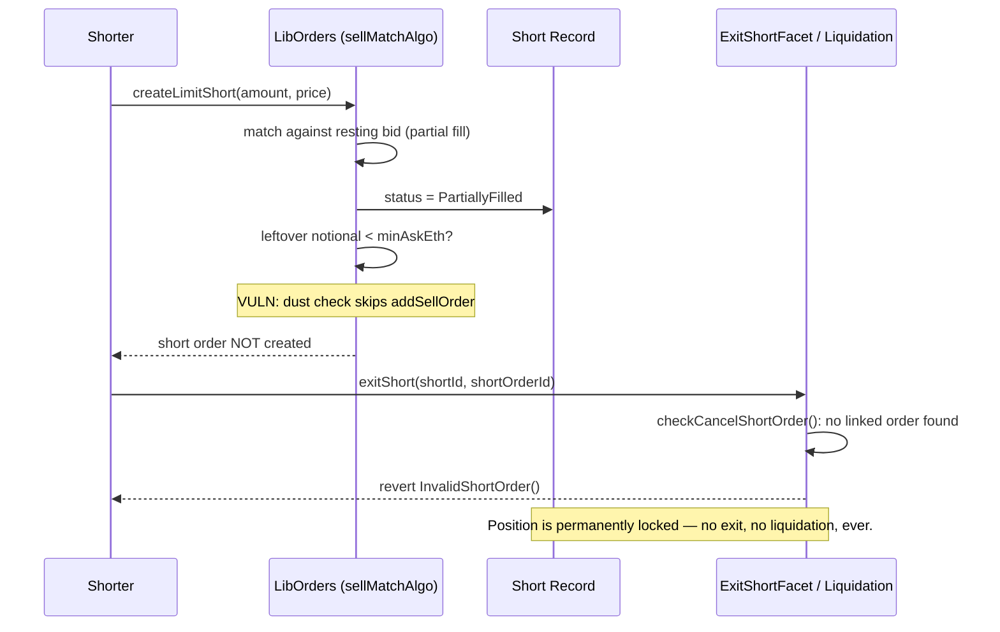

# DittoETH — partially filled Short Records created without a short order cannot be liquidated or exited

> **Vulnerability classes:** vuln/dos/permanent-lock · vuln/logic/state-order-mismatch · vuln/access-control/missing-linkage

> **Reproduction:** a self-contained Foundry PoC that compiles & runs in an
> isolated project with **only `forge-std`** — no fork, no RPC, no `anvil_state`.
> Full trace: [output.txt](output.txt). PoC:
> [test/34174-h-04-partially-filled-short-records-created-without-a-short_exp.sol](test/34174-h-04-partially-filled-short-records-created-without-a-short_exp.sol).

<!-- non-defihacklabs -->
<!-- source-auditvault: https://github.com/Auditware/AuditVault/blob/main/findings/34174-h-04-partially-filled-short-records-created-without-a-short.md -->
<!-- date: 2024-03 -->

---

## Key info

| | |
|---|---|
| **Impact** | **HIGH** — a partially-filled Short Record can end up with NO linked short order at all; every exit and liquidation path then permanently reverts, permanently locking the position (and letting a user create a Short Record below the protocol minimum debt) |
| **Protocol** | [DittoETH](https://ditto.eth.limo) — decentralized synthetic-asset exchange (order-book shorts) |
| **Vulnerable code** | `LibOrders.sellMatchAlgo` — the dust-threshold check that decides whether to list a partially-filled short's remainder on the order book |
| **Bug class** | State-ordering mismatch: a status flag (`PartiallyFilled`) is set unconditionally before a conditional side effect (listing the leftover order) that the status implicitly promises |
| **Finding** | code4rena — 2024-03-dittoeth · [H-04] · reporter **0xbepresent** |
| **Report** | [code4rena.com/reports/2024-03-dittoeth](https://code4rena.com/reports/2024-03-dittoeth) |
| **Source** | [AuditVault](https://github.com/Auditware/AuditVault/blob/main/findings/34174-h-04-partially-filled-short-records-created-without-a-short.md) |
| **Status** | Audit finding — caught in review, confirmed by the DittoETH team (not exploited on-chain). Reproduced here as a standalone local PoC. |
| **Compiler** | `^0.8.24` (PoC) |

This is an **audit finding**, not a historical on-chain incident. The real DittoETH
matching engine walks a full doubly-linked order book across several facets
(`LibOrders`, `ExitShortFacet`, `PrimaryLiquidationFacet`, `SecondaryLiquidationFacet`,
`LibSRUtil`); the PoC keeps the exact blamed dust-check (`@> VULN`) verbatim and the
exact ownership check every exit/liquidation path relies on (`LibSRUtil.sol#L57`),
reduced to a single resting bid so the branch is trivially forced.

---

## TL;DR

1. When a short only partially matches the order book, `sellMatchAlgo` marks the
   Short Record's status `PartiallyFilled` — implying "the rest of this short is
   still resting on the market as a sell order."
2. Separately, it only actually creates that resting sell order if the leftover's
   notional value clears a dust threshold (`minAskEth`).
3. If the leftover is dust, **no order is created at all** — but the status is
   already `PartiallyFilled`.
4. Every exit and liquidation function requires a short order linked to the Short
   Record (an ownership check in `LibSRUtil`). With none existing, they **all
   permanently revert** with `InvalidShortOrder()`.
5. The position can never be exited by its owner, nor liquidated by anyone —
   even once it becomes underwater. It is a permanent, unrecoverable lock.

---

## The vulnerable code

From `LibOrders.sol#L591-L597` (audited commit `91faf46`):

```solidity
                    // loop
                    startingId = highestBid.nextId;
                    if (startingId == C.TAIL) {
❌                       matchIncomingSell(asset, incomingAsk, matchTotal);
❌                       if (incomingAsk.ercAmount.mul(incomingAsk.price) >= minAskEth) {
                            addSellOrder(incomingAsk, asset, orderHintArray);
                        }
                        s.bids[asset][C.HEAD].nextId = C.TAIL;
                        return;
```

By the time this branch runs, the Short Record has already been marked
`SR.PartiallyFilled` earlier in the same call (in `createLimitShort`'s handling of
the match result). `addSellOrder` — the ONLY thing that attaches a short order to
the Short Record — only fires when the leftover notional value clears
`minAskEth`. Below that, the Short Record is left with a status that promises a
resting order that does not exist.

Every downstream consumer assumes that promise holds. `ExitShortFacet` requires a
`shortOrderId` argument and validates it via `LibSRUtil.sol#L57`:

```solidity
if (shortOrder.shortRecordId != shortRecordId || shortOrder.addr != shorter) revert Errors.InvalidShortOrder();
```

`PrimaryLiquidationFacet.liquidate` calls the same check. `SecondaryLiquidationFacet`
has a loop-level `continue` for a single bad Short Record in a batch, but if it is
the ONLY element, `SecondaryLiquidationNoValidShorts()` reverts.

The PoC's `Vulnerable` contract preserves the exact if-check as `@> VULN` inside a
minimal single-bid matching function (`createLimitShort`), and reproduces the exact
`LibSRUtil.sol#L57` ownership check inside its own `exitShort`/`liquidate`.

---

## Root cause

The status write (`sr.status = SR.PartialFill`) and the order-listing decision
(`addSellOrder` gated by the dust check) are two independent effects of the same
match result, but only one of them is conditional. The status always claims
"there's a resting order for the leftover"; the dust check can silently make that
false. Nothing re-checks or reconciles the two.

## Preconditions

- A short is opened whose unmatched remainder, valued at the short's limit price,
  falls below the market's `minAskEth` dust threshold. This requires no special
  privilege — any user creating a short with a not-quite-round size relative to the
  resting bid can trigger it, intentionally or not.

## Attack walkthrough

1. A resting bid smaller than the intended short size sits on the book.
2. The attacker (or an unlucky ordinary user) opens a short whose price times the
   unmatched remainder is below `minAskEth`.
3. The match loop matches the resting bid, sets the Short Record to
   `PartiallyFilled`, evaluates the dust check, and — because it fails — skips
   creating a short order for the remainder.
4. The Short Record now exists with `status == PartialFill` and no linked order.
5. Any subsequent call to `exitShort` (by the owner) or `liquidate` /
   `liquidateSecondary` (by anyone) reverts with `InvalidShortOrder()`, because the
   ownership check can never find a matching order — there isn't one.
6. The position, and the collateral/debt it represents, is now permanently
   unreachable through any normal protocol function.

---

## Diagrams



---

## Impact

- **Liveness/DoS (permanent)**: the affected Short Record can never be exited by
  its owner.
- **Liquidation DoS**: if the position later becomes underwater, neither primary
  nor (in the single-element-batch case) secondary liquidation can close it,
  leaving bad debt the protocol cannot clean up.
- **Minimum-debt bypass**: because the dust remainder never gets folded back in,
  a user can end up with a Short Record whose `ercDebt` is below the protocol's
  `minShortErc`, undermining an economic assumption relied on elsewhere.

## Remediation

DittoETH's own recommended fix — zero the incoming ask's `ercAmount` before the
match call, so the leftover is folded into the fill and the Short Record becomes
`FullyFilled` instead of dangling:

```diff
                     if (startingId == C.TAIL) {
-                        matchIncomingSell(asset, incomingAsk, matchTotal);
-
-                        if (incomingAsk.ercAmount.mul(incomingAsk.price) >= minAskEth) {
-                            addSellOrder(incomingAsk, asset, orderHintArray);
-                        }
+                        incomingAsk.ercAmount = 0;
+                        matchIncomingSell(asset, incomingAsk, matchTotal);
                         s.bids[asset][C.HEAD].nextId = C.TAIL;
                         return;
                     }
```

## How to reproduce

```bash
export PATH="$HOME/.foundry/bin:$PATH"
cd 34174-h-04-partially-filled-short-records-created-without-a-short_exp
forge test -vvv
```

Both tests pass: the main PoC demonstrates the harm (SR left `PartialFill`, exit and
liquidation both permanently revert with `InvalidShortOrder()`); the control test
shows that when the leftover clears the dust threshold, a short order IS created
and exit succeeds normally — isolating the bug to the dust-threshold branch.

---

## Sources

- AuditVault finding: [34174-h-04-partially-filled-short-records-created-without-a-short.md](https://github.com/Auditware/AuditVault/blob/main/findings/34174-h-04-partially-filled-short-records-created-without-a-short.md)
- Original report: [code4rena.com/reports/2024-03-dittoeth](https://code4rena.com/reports/2024-03-dittoeth) — [H-04]
- Reduced source: [github.com/code-423n4/2024-03-dittoeth](https://github.com/code-423n4/2024-03-dittoeth) @ `91faf46078bb6fe8ce9f55bcb717e5d2d302d22e` — `contracts/libraries/LibOrders.sol#L591-L597`, `contracts/libraries/LibSRUtil.sol#L57`, `contracts/facets/ExitShortFacet.sol`, `contracts/facets/PrimaryLiquidationFacet.sol`, `contracts/facets/SecondaryLiquidationFacet.sol`

**Taxonomy (AuditVault):** `genome/liquidation-logic` · `genome/permanent` · `genome/dos-resistance` · `genome/liquidation-underwater` · `genome/timestamp-dependence` · `sector/lending` · `sector/oracle` · `severity/high`
