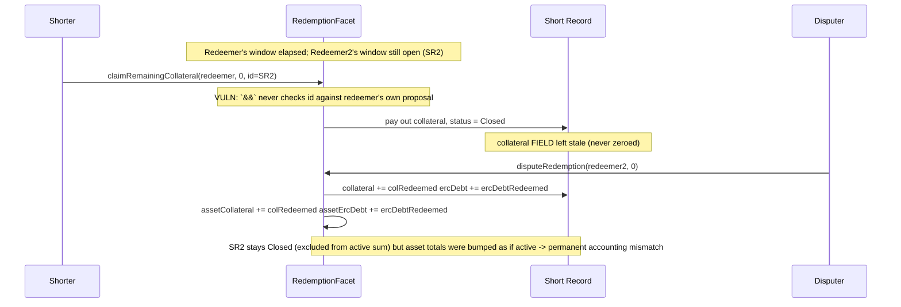

# DittoETH — flawed `&&` check corrupts protocol-wide collateral/debt accounting

> **Vulnerability classes:** vuln/logic/wrong-boolean-operator · vuln/accounting/invariant-break · vuln/access-control/insufficient-guard

> **Reproduction:** a self-contained Foundry PoC that compiles & runs in an
> isolated project with **only `forge-std`** — no fork, no RPC, no `anvil_state`.
> Full trace: [output.txt](output.txt). PoC:
> [test/34175-h-05-flawed-if-check-causes-inaccurate-tracking-of-the-proto_exp.sol](test/34175-h-05-flawed-if-check-causes-inaccurate-tracking-of-the-proto_exp.sol).

<!-- non-defihacklabs -->
<!-- source-auditvault: https://github.com/Auditware/AuditVault/blob/main/findings/34175-h-05-flawed-if-check-causes-inaccurate-tracking-of-the-proto.md -->
<!-- date: 2024-03 -->

---

## Key info

| | |
|---|---|
| **Impact** | **HIGH** — a shorter can claim collateral from a Short Record whose redeemer's dispute window hasn't elapsed; a subsequent, entirely honest dispute then permanently corrupts the protocol's asset-level `ercDebt`/collateral totals |
| **Protocol** | [DittoETH](https://ditto.eth.limo) — decentralized synthetic-asset exchange (redemption mechanism) |
| **Vulnerable code** | `RedemptionFacet.claimRemainingCollateral` — the `&&` ownership/id check |
| **Bug class** | Wrong boolean operator (`&&` instead of `||`) that silently drops one half of a two-part authorization check |
| **Finding** | code4rena — 2024-03-dittoeth · [H-05] · reporter **Samuraii77** |
| **Report** | [code4rena.com/reports/2024-03-dittoeth](https://code4rena.com/reports/2024-03-dittoeth) |
| **Source** | [AuditVault](https://github.com/Auditware/AuditVault/blob/main/findings/34175-h-05-flawed-if-check-causes-inaccurate-tracking-of-the-proto.md) |
| **Status** | Audit finding — caught in review, confirmed by the DittoETH team (not exploited on-chain). Reproduced here as a standalone local PoC. |
| **Compiler** | `^0.8.24` (PoC) |

This is an **audit finding**, not a historical on-chain incident. The real
`RedemptionFacet` uses SSTORE2-packed proposal slates across `proposeRedemption`,
`claimRemainingCollateral`, and `disputeRedemption`; the PoC keeps the exact blamed
`&&` check (`@> VULN`) verbatim and faithfully reduces the propose/claim/dispute
bookkeeping so the resulting accounting corruption is directly measurable.

---

## TL;DR

1. `claimRemainingCollateral(redeemer, claimIndex, id)` lets a shorter reclaim a
   fully-redeemed Short Record's leftover collateral, but only after the NAMED
   redeemer's dispute window has elapsed.
2. It's supposed to check BOTH that `msg.sender` is the redeemed shorter AND that
   `id` matches the redeemer's own proposal (`claimProposal.shortId`).
3. It uses `&&` instead of `||`, so whenever `msg.sender == claimProposal.shorter`
   the whole check evaluates to `false` — `id` is **never actually validated**.
4. A shorter can therefore name a redeemer whose window has elapsed while passing
   the `id` of a **completely different** Short Record, closing that one early —
   even if its own redeemer's dispute window is still wide open.
5. Later, an entirely honest dispute of that still-open proposal blindly restores
   collateral/debt onto the now-closed Short Record and re-credits the same amounts
   into the protocol's asset-level totals — permanently breaking the
   "asset totals == sum of active Short Records" invariant.

---

## The vulnerable code

From `RedemptionFacet.sol#L361` (audited commit `91faf46`):

```solidity
        MTypes.ProposalData memory claimProposal = decodedProposalData[claimIndex];

❌      if (claimProposal.shorter != msg.sender && claimProposal.shortId != id) revert Errors.CanOnlyClaimYourShort();
```

`&&` means the revert only fires when BOTH sub-conditions are true. If
`msg.sender == claimProposal.shorter` (the common, honest-looking case — the caller
really is a shorter with a redeemed Short Record somewhere), the first sub-condition
is already `false`, so the AND short-circuits to `false` and the whole check never
reverts — **regardless of what `id` is**. `id` is the argument that's supposed to
tie the claim to `claimProposal.shortId`; with `&&`, that tie is fiction.

The PoC's `Vulnerable` contract preserves this exact check as `@> VULN`, along with
a faithful reduction of `proposeRedemption` (RedemptionFacet.sol#L152,
`Asset.ercDebt -= p.totalAmountProposed`) and `disputeRedemption`
(RedemptionFacet.sol#L263-L276, which restores collateral/ercDebt onto every Short
Record in the disputed slate and re-credits the asset-level totals).

---

## Root cause

Two independent facts need to be true for a legitimate early claim: (1) the caller
owns the redeemed Short Record, and (2) the `id` argument names THAT redeemer's
actual proposal. The code conflates them with `&&`, which only enforces "at least
one holds" is false to trigger a revert — but since fact (1) is almost always true
for a legitimate-looking caller, fact (2) is effectively unchecked.

## Preconditions

- A shorter has (at least) two Short Records, redeemed by two different redeemers
  whose dispute windows end at different times.
- One redeemer's window has already elapsed; another's has not.

No special privilege is required — any shorter with two in-flight redemptions can
trigger this, and the subsequent corruption only needs an ordinary, honest disputer
acting on the still-open proposal.

## Attack walkthrough

1. Redeemer proposes redemption of SR#1 (owned by Shorter). Its dispute window is
   short and elapses almost immediately.
2. Redeemer2 proposes redemption of SR#2 (also owned by Shorter), with a
   dispute window that stays open far longer.
3. Shorter calls `claimRemainingCollateral(redeemer, claimIndex=0, id=SR#2's id)` —
   naming Redeemer (whose window elapsed) but passing SR#2's id (whose OWN
   redeemer's window has not elapsed). The flawed `&&` check lets this through:
   SR#2 is closed and its collateral paid out, before it should have been claimable.
4. A disputer, with no knowledge of step 3, legitimately disputes Redeemer2's
   proposal (correctly proving a lower-CR Short Record should have been included
   instead). `disputeRedemption` iterates the ENTIRE disputed slate and restores
   collateral/ercDebt onto every named Short Record — including SR#2, which is
   already closed — and re-credits the protocol's asset-level totals by the same
   amounts.
5. SR#2's fields now hold nonzero collateral/debt again, but its status stays
   `Closed` (excluded from any sum over active Short Records), while the
   asset-level totals were bumped as though SR#2 were still active. The mismatch is
   permanent — there is no path that reconciles it after the fact.

---

## Diagrams



---

## Impact

- **Accounting corruption (permanent)**: the protocol's asset-level `ercDebt` and
  collateral totals no longer equal the sum across active Short Records — every
  downstream calculation that relies on these totals (fee rates, redemption
  eligibility, solvency checks) now operates on wrong numbers, with no way to
  reconcile after the fact.
- **Broken dispute-window guarantee**: a redeemer's dispute window can be bypassed
  by aiming a claim at a DIFFERENT Short Record than the one actually eligible.

## Remediation

```diff
-        if (claimProposal.shorter != msg.sender && claimProposal.shortId != id) revert Errors.CanOnlyClaimYourShort();
+        if (claimProposal.shorter != msg.sender || claimProposal.shortId != id) revert Errors.CanOnlyClaimYourShort();
```

## How to reproduce

```bash
export PATH="$HOME/.foundry/bin:$PATH"
cd 34175-h-05-flawed-if-check-causes-inaccurate-tracking-of-the-proto_exp
forge test -vvv
```

Both tests pass: the main PoC runs the full propose → premature-claim → honest-dispute
sequence and asserts the exact numeric mismatch (`assetCollateral` overshoots by SR#2's
resurrected 10 ether; `assetErcDebt` overshoots by SR#2's resurrected 5000 ether). The
control test shows that when the claimed `id` genuinely matches the named redeemer's
proposal, no corruption is possible — isolating the bug to the flawed `&&`.

---

## Sources

- AuditVault finding: [34175-h-05-flawed-if-check-causes-inaccurate-tracking-of-the-proto.md](https://github.com/Auditware/AuditVault/blob/main/findings/34175-h-05-flawed-if-check-causes-inaccurate-tracking-of-the-proto.md)
- Original report: [code4rena.com/reports/2024-03-dittoeth](https://code4rena.com/reports/2024-03-dittoeth) — [H-05]
- Reduced source: [github.com/code-423n4/2024-03-dittoeth](https://github.com/code-423n4/2024-03-dittoeth) @ `91faf46078bb6fe8ce9f55bcb717e5d2d302d22e` — `contracts/facets/RedemptionFacet.sol#L152,L263-L276,L347-L364`, `contracts/libraries/AppStorage.sol#L92`

**Taxonomy (AuditVault):** `genome/wrong-condition` · `genome/data-corruption/price-manipulation` · `genome/access-roles` · `genome/liquidation-underwater` · `genome/oracle-freshness` · `sector/governance` · `sector/lending` · `severity/high`
