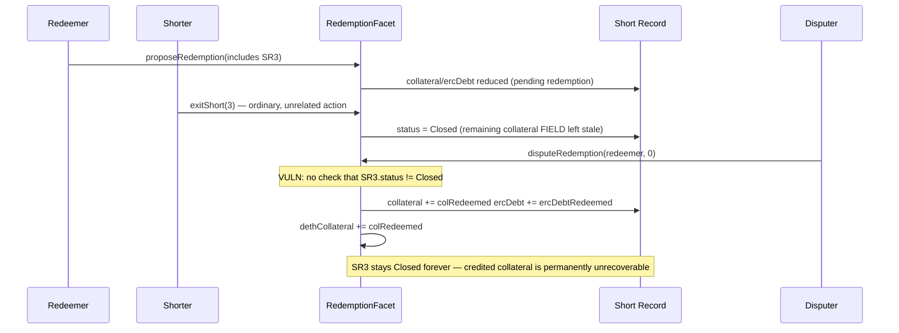

# DittoETH — disputing a closed Short Record permanently locks its collateral

> **Vulnerability classes:** vuln/loss-of-funds/direct-drain · vuln/logic/missing-state-check · vuln/accounting/dead-credit

> **Reproduction:** a self-contained Foundry PoC that compiles & runs in an
> isolated project with **only `forge-std`** — no fork, no RPC, no `anvil_state`.
> Full trace: [output.txt](output.txt). PoC:
> [test/34176-h-06-closing-a-sr-during-a-wrong-redemption-proposal-leads-t_exp.sol](test/34176-h-06-closing-a-sr-during-a-wrong-redemption-proposal-leads-t_exp.sol).

<!-- non-defihacklabs -->
<!-- source-auditvault: https://github.com/Auditware/AuditVault/blob/main/findings/34176-h-06-closing-a-sr-during-a-wrong-redemption-proposal-leads-t.md -->
<!-- date: 2024-03 -->

---

## Key info

| | |
|---|---|
| **Impact** | **HIGH** — if a Short Record referenced by a redemption proposal is closed (exit/liquidation/transfer) before the proposal is disputed, the dispute still credits it with collateral it can never pay out again — a direct, permanent fund loss |
| **Protocol** | [DittoETH](https://ditto.eth.limo) — decentralized synthetic-asset exchange (redemption mechanism) |
| **Vulnerable code** | `RedemptionFacet.disputeRedemption` — the collateral/ercDebt restoration loop |
| **Bug class** | Missing state check: a "give back" operation doesn't verify its target is still live before crediting it |
| **Finding** | code4rena — 2024-03-dittoeth · [H-06] · reporter **klau5** |
| **Report** | [code4rena.com/reports/2024-03-dittoeth](https://code4rena.com/reports/2024-03-dittoeth) |
| **Source** | [AuditVault](https://github.com/Auditware/AuditVault/blob/main/findings/34176-h-06-closing-a-sr-during-a-wrong-redemption-proposal-leads-t.md) |
| **Status** | Audit finding — caught in review, confirmed by the DittoETH team (not exploited on-chain). Reproduced here as a standalone local PoC. |
| **Compiler** | `^0.8.24` (PoC) |

This is an **audit finding**, not a historical on-chain incident. The PoC keeps the
blamed restoration lines (`@> VULN`) verbatim and reduces the propose/exit/dispute
flow to the minimum needed to force a Short Record closed while it is still
referenced by an undisputed proposal.

---

## TL;DR

1. A redemption proposal removes debt (and marks pending) collateral from a Short
   Record, but does **not** lock that Short Record against ordinary closure.
2. The shorter can still exit the Short Record normally at any time — nothing
   checks whether a live proposal references it.
3. If a disputer later (rightfully) disputes the proposal, `disputeRedemption`
   blindly restores collateral/ercDebt onto every Short Record in the proposal's
   slate — **without checking whether it's still open.**
4. If it was closed in the meantime, the credited collateral lands on a struct
   whose status is permanently `Closed` — no user-facing function will ever read
   or pay it out again.
5. The protocol's global collateral total is bumped by the same amount, so the
   protocol believes it holds funds that, in reality, are gone for good.

---

## The vulnerable code

From `RedemptionFacet.sol#L267-L268` (audited commit `91faf46`):

```solidity
            for (uint256 i = incorrectIndex; i < decodedProposalData.length; i++) {
                currentProposal = decodedProposalData[i];

                STypes.ShortRecord storage currentSR = s.shortRecords[d.asset][currentProposal.shorter][currentProposal.shortId];
❌              currentSR.collateral += currentProposal.colRedeemed;
❌              currentSR.ercDebt += currentProposal.ercDebtRedeemed;

                d.incorrectCollateral += currentProposal.colRedeemed;
                d.incorrectErcDebt += currentProposal.ercDebtRedeemed;
            }

            s.vault[Asset.vault].dethCollateral += d.incorrectCollateral;
            Asset.dethCollateral += d.incorrectCollateral;
            Asset.ercDebt += d.incorrectErcDebt;
```

`currentSR` is fetched fresh from storage and written to unconditionally — there is
no `if (currentSR.status != SR.Closed)` guard anywhere in this loop. The asset-level
`dethCollateral` (see `AppStorage.sol#L92`) is bumped by the same amount right
after, regardless of whether the credit actually landed somewhere live.

---

## Root cause

`disputeRedemption` assumes every Short Record named in a proposal's slate is still
the same live position it was when the proposal was created. Nothing in the
protocol prevents the shorter from closing it in the meantime through a completely
ordinary path (exit, being liquidated, or a transfer) — the proposal creates no
lock, hold, or reference-count on the Short Record it points at.

## Preconditions

- A redemption proposal references a Short Record.
- That Short Record is closed by any ordinary means before the proposal is
  disputed.
- Someone disputes the proposal (for any legitimate reason — the bug does not
  depend on how the dispute is won).

## Attack walkthrough

1. A redeemer proposes redemption that (wrongly) includes a shorter's Short
   Record, immediately removing part of its collateral/debt as pending
   redemption.
2. Independently of the proposal, the shorter performs an ordinary exit on the
   same Short Record. This is completely legitimate — nothing stops it. The
   Short Record's status becomes `Closed`.
3. A disputer later proves the proposal was wrong and disputes it. `disputeRedemption`
   iterates the entire slate and credits collateral/ercDebt back onto every
   referenced Short Record — including the one that is now `Closed`.
4. The Short Record's fields hold nonzero collateral again, but its status
   never leaves `Closed` — no further protocol function can ever act on it.
5. The protocol's global collateral counter was bumped by the same amount as if
   the credit were recoverable. It is not. The funds are gone.

---

## Diagrams



---

## Impact

- **Direct, permanent fund loss**: collateral credited onto a Closed Short Record
  can never be paid out to anyone through any protocol function.
- **Accounting corruption**: the protocol's global collateral total is inflated by
  the exact amount that is now stuck, compounding the loss with an inaccurate
  system-wide number.

## Remediation

Skip (or redirect elsewhere) the restoration when the targeted Short Record is
already closed:

```diff
             for (uint256 i = incorrectIndex; i < decodedProposalData.length; i++) {
                 currentProposal = decodedProposalData[i];

                 STypes.ShortRecord storage currentSR = s.shortRecords[d.asset][currentProposal.shorter][currentProposal.shortId];
+                if (currentSR.status == SR.Closed) {
+                    // handle separately — e.g. route to the redeemer/disputer instead of a dead SR
+                    continue;
+                }
                 currentSR.collateral += currentProposal.colRedeemed;
                 currentSR.ercDebt += currentProposal.ercDebtRedeemed;
                 ...
```

## How to reproduce

```bash
export PATH="$HOME/.foundry/bin:$PATH"
cd 34176-h-06-closing-a-sr-during-a-wrong-redemption-proposal-leads-t_exp
forge test -vvv
```

Both tests pass: the main PoC runs the full propose → exit → dispute sequence and
asserts the closed Short Record's collateral field is re-credited (from 15 to 20
ether) yet permanently unrecoverable (a further exit attempt reverts), while the
protocol's global total was bumped by the stuck 5 ether. The control test shows
that when the Short Record stays open through the dispute, the same credit lands
correctly and remains claimable — isolating the bug to the missing status check.

---

## Sources

- AuditVault finding: [34176-h-06-closing-a-sr-during-a-wrong-redemption-proposal-leads-t.md](https://github.com/Auditware/AuditVault/blob/main/findings/34176-h-06-closing-a-sr-during-a-wrong-redemption-proposal-leads-t.md)
- Original report: [code4rena.com/reports/2024-03-dittoeth](https://code4rena.com/reports/2024-03-dittoeth) — [H-06]
- Reduced source: [github.com/code-423n4/2024-03-dittoeth](https://github.com/code-423n4/2024-03-dittoeth) @ `91faf46078bb6fe8ce9f55bcb717e5d2d302d22e` — `contracts/facets/RedemptionFacet.sol#L267-L268`, `contracts/libraries/AppStorage.sol#L92`

**Taxonomy (AuditVault):** `genome/griefing` · `genome/direct-drain` · `genome/liquidation-underwater` · `sector/governance` · `sector/lending` · `severity/high`
