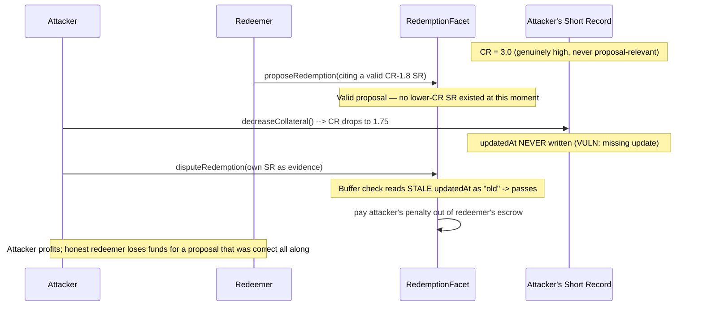

# DittoETH — attacker games a stale `updatedAt` to dispute a valid redemption and steal the penalty

> **Vulnerability classes:** vuln/loss-of-funds/direct-drain · vuln/logic/missing-state-update · vuln/access-control/timing-manipulation

> **Reproduction:** a self-contained Foundry PoC that compiles & runs in an
> isolated project with **only `forge-std`** — no fork, no RPC, no `anvil_state`.
> Full trace: [output.txt](output.txt). PoC:
> [test/34177-h-07-valid-redemption-proposals-can-be-disputed-by-decreasin_exp.sol](test/34177-h-07-valid-redemption-proposals-can-be-disputed-by-decreasin_exp.sol).

<!-- non-defihacklabs -->
<!-- source-auditvault: https://github.com/Auditware/AuditVault/blob/main/findings/34177-h-07-valid-redemption-proposals-can-be-disputed-by-decreasin.md -->
<!-- date: 2024-03 -->

---

## Key info

| | |
|---|---|
| **Impact** | **HIGH** — an attacker with a genuinely high-CR Short Record can decrease its collateral after an honest redemption proposal, dispute that entirely valid proposal using the freshly-lowered CR, and steal the disputer's penalty fee from the proposer |
| **Protocol** | [DittoETH](https://ditto.eth.limo) — decentralized synthetic-asset exchange (redemption dispute mechanism) |
| **Vulnerable code** | `ShortRecordFacet.decreaseCollateral` — missing `updatedAt` write |
| **Bug class** | Missing state update: one collateral-changing function updates a staleness timestamp, a sibling function does not |
| **Finding** | code4rena — 2024-03-dittoeth · [H-07] · reporter **ilchovski** |
| **Report** | [code4rena.com/reports/2024-03-dittoeth](https://code4rena.com/reports/2024-03-dittoeth) |
| **Source** | [AuditVault](https://github.com/Auditware/AuditVault/blob/main/findings/34177-h-07-valid-redemption-proposals-can-be-disputed-by-decreasin.md) |
| **Status** | Audit finding — caught in review, confirmed by the DittoETH team (not exploited on-chain). Reproduced here as a standalone local PoC. |
| **Compiler** | `^0.8.24` (PoC) |

This is an **audit finding**, not a historical on-chain incident. The PoC keeps
the exact dispute-buffer check from `RedemptionFacet` verbatim and faithfully
reduces `ShortRecordFacet.decreaseCollateral`'s missing `updatedAt` write, next to
a correctly-updating `increaseCollateral` for contrast.

---

## TL;DR

1. `disputeRedemption` only trusts a disputer's Short Record as evidence that a
   redeemer's proposal wrongly skipped a lower-CR candidate if that Short Record's
   `updatedAt` is OLDER than a `DISPUTE_REDEMPTION_BUFFER` window before the
   proposal — meant to stop someone from manufacturing a low CR AFTER seeing a
   proposal.
2. `decreaseCollateral` never writes `updatedAt` — unlike `increaseCollateral`,
   which does exactly that "to prevent flash loan"-style manipulation.
3. An attacker with a Short Record that's genuinely too high-CR to matter for any
   proposal can wait for an honest, fully valid proposal to be made, THEN decrease
   their own collateral to drop below the proposal's CR.
4. Because `updatedAt` never moved, the buffer check still reads the Short Record
   as "long-since stable" — the manipulation is invisible to the guard meant to
   catch exactly this.
5. The attacker disputes the (perfectly valid) proposal and collects the
   disputer's penalty fee straight out of the honest proposer's escrow.

---

## The vulnerable code

From `RedemptionFacet.sol#L259` (audited commit `91faf46`):

```solidity
if (disputeCR < incorrectProposal.CR && disputeSR.updatedAt + C.DISPUTE_REDEMPTION_BUFFER <= redeemerAssetUser.timeProposed)
```

And from `ShortRecordFacet.sol#L81-L104` — `decreaseCollateral` in full (no line
here ever writes `short.updatedAt`):

```solidity
    function decreaseCollateral(address asset, uint8 id, uint88 amount) ... {
        STypes.ShortRecord storage short = s.shortRecords[asset][msg.sender][id];
        short.updateErcDebt(asset);
        if (amount > short.collateral) revert Errors.InsufficientCollateral();

        short.collateral -= amount;

❌      uint256 oraclePrice = LibOracle.getSavedOrSpotOraclePrice(asset);
❌      uint256 cRatio = short.getCollateralRatio(oraclePrice);
❌      if (cRatio < LibAsset.initialCR(asset)) revert Errors.CRLowerThanMin();
        ...
        // @dev short.updatedAt is NEVER written anywhere in this function
    }
```

Contrast with `increaseCollateral` in the same contract, which explicitly does:

```solidity
        // Prevent flash loan
        short.updatedAt = LibOrders.getOffsetTime();
```

The PoC's `Vulnerable` contract preserves the exact dispute check (`@> VULN` marks
the omission point) and models both functions side by side so the asymmetry is
directly visible.

---

## Root cause

The dispute-buffer defense assumes `updatedAt` faithfully tracks the last time a
Short Record's collateral (and therefore its CR) genuinely changed. That
assumption silently breaks for one specific collateral-changing path. Any
timestamp-based defense is only as strong as its weakest writer.

## Preconditions

- The attacker owns a Short Record whose current CR is comfortably above any
  proposal that might reasonably be made — so it never looks like a dispute
  candidate before the manipulation.
- A redeemer makes an entirely valid redemption proposal.
- `decreaseCollateral` is available to bring the attacker's own CR down without
  reverting (i.e., the new CR still clears `initialCR`).

No special privilege is required — this works for any address with escrowed
collateral in an existing Short Record.

## Attack walkthrough

1. Attacker opens (or already holds) a Short Record with CR far above the market's
   `initialCR` — high enough it's never relevant to any proposal.
2. An honest redeemer proposes a valid redemption, citing Short Records whose CR
   is above `initialCR` — correctly, since nothing lower-CR was available at that
   moment.
3. The attacker calls `decreaseCollateral` on their own Short Record, lowering its
   CR to just below the proposal's cited CR (but still above `initialCR`, so the
   call itself succeeds). `updatedAt` is not touched.
4. The attacker disputes the proposal, naming their own (freshly manipulated)
   Short Record as evidence. The buffer check reads the stale `updatedAt` as proof
   the low CR predates the proposal — it does not.
5. The dispute succeeds. The attacker collects the disputer's penalty fee from the
   honest redeemer's escrow, despite the original proposal having been entirely
   correct.

---

## Diagrams



---

## Impact

- **Direct fund extraction**: an honest, correctly-formed redemption proposal
  costs its proposer a real penalty fee, paid to an attacker who manufactured the
  "evidence" after the fact.
- **Broken dispute-buffer guarantee**: the entire point of `DISPUTE_REDEMPTION_BUFFER`
  is defeated for any collateral-decrease path that forgets to update `updatedAt`.

## Remediation

```diff
         short.collateral -= amount;

         uint256 oraclePrice = LibOracle.getSavedOrSpotOraclePrice(asset);
         uint256 cRatio = short.getCollateralRatio(oraclePrice);
         if (cRatio < LibAsset.initialCR(asset)) revert Errors.CRLowerThanMin();

         if (LibSRUtil.checkRecoveryModeViolation(asset, cRatio, oraclePrice)) revert Errors.BelowRecoveryModeCR();
+
+        // Prevent the same manipulation increaseCollateral() already guards against.
+        short.updatedAt = LibOrders.getOffsetTime();
```

## How to reproduce

```bash
export PATH="$HOME/.foundry/bin:$PATH"
cd 34177-h-07-valid-redemption-proposals-can-be-disputed-by-decreasin_exp
forge test -vvv
```

Both tests pass: the main PoC runs the full valid-proposal → decrease-collateral →
dispute sequence and asserts the attacker extracts exactly 100 ETH from the honest
redeemer's escrow. The control test shows that if the collateral change correctly
refreshed `updatedAt` (simulated via `increaseCollateral`, which does), the
identical dispute attempt reverts — isolating the bug to the missing timestamp
write in `decreaseCollateral`.

---

## Sources

- AuditVault finding: [34177-h-07-valid-redemption-proposals-can-be-disputed-by-decreasin.md](https://github.com/Auditware/AuditVault/blob/main/findings/34177-h-07-valid-redemption-proposals-can-be-disputed-by-decreasin.md)
- Original report: [code4rena.com/reports/2024-03-dittoeth](https://code4rena.com/reports/2024-03-dittoeth) — [H-07]
- Reduced source: [github.com/code-423n4/2024-03-dittoeth](https://github.com/code-423n4/2024-03-dittoeth) @ `91faf46078bb6fe8ce9f55bcb717e5d2d302d22e` — `contracts/facets/RedemptionFacet.sol#L259`, `contracts/facets/ShortRecordFacet.sol#L81-L104`

**Taxonomy (AuditVault):** `genome/griefing` · `genome/direct-drain` · `genome/access-roles` · `genome/liquidation-underwater` · `genome/oracle-freshness` · `sector/governance` · `sector/lending` · `severity/high`
