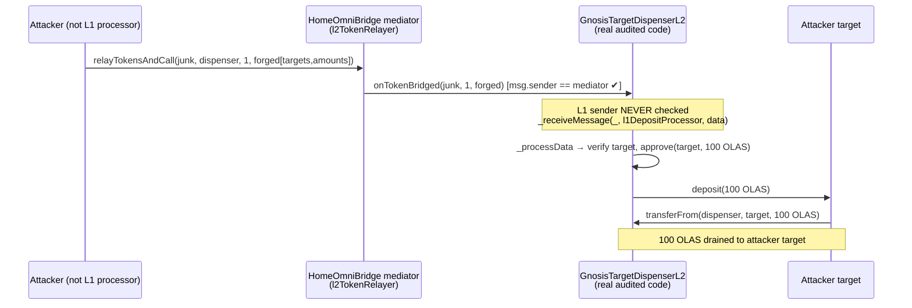

<!-- source-auditvault: 34921-h-02-arbitrary-tokens-and-data-can-be-bridged-to-gnosistarge.md -->
# Olas H-02 — Arbitrary tokens and data can be bridged to `GnosisTargetDispenserL2`

**Protocol:** Olas (autonolas-tokenomics) · **Contest:** Code4rena 2024-05-olas
**Repo:** [`code-423n4/2024-05-olas`](https://github.com/code-423n4/2024-05-olas) @ `3ce502ec8b475885b90668e617f3983cea3ae29f`
**Vulnerable source (byte-identical, vendored under `src/`):**
[`tokenomics/contracts/staking/GnosisTargetDispenserL2.sol`](https://github.com/code-423n4/2024-05-olas/blob/3ce502ec8b475885b90668e617f3983cea3ae29f/tokenomics/contracts/staking/GnosisTargetDispenserL2.sol)
· [`DefaultTargetDispenserL2.sol`](https://github.com/code-423n4/2024-05-olas/blob/3ce502ec8b475885b90668e617f3983cea3ae29f/tokenomics/contracts/staking/DefaultTargetDispenserL2.sol)

## Root cause

`GnosisTargetDispenserL2` receives OLAS + staking data from L1 in two ways: pure data via the AMB
(`receiveMessage`), or tokens-plus-data via the Gnosis Omnibridge, whose mediator invokes the
`onTokenBridged` callback. The AMB path validates the L1 origin (`_receiveMessage` reverts unless
`sourceProcessor == l1DepositProcessor`, where `sourceProcessor` is read from the trusted AMB via
`messageSender()`). The token path does **not**:

```solidity
function onTokenBridged(address, uint256, bytes calldata data) external {
    // Only checks that the OMNIBRIDGE MEDIATOR called us...
    if (msg.sender != l2TokenRelayer) {
        revert TargetRelayerOnly(msg.sender, l2TokenRelayer);
    }
    // ...then hardcodes l1DepositProcessor as the source, so the origin check in
    // _receiveMessage ALWAYS passes regardless of who initiated the bridge on L1.
    _receiveMessage(l2MessageRelayer, l1DepositProcessor, data);   // <-- H-02
}
```

The Omnibridge mediator relays a token transfer to any receiver for **anyone** who calls
`relayTokensAndCall` on L1, and it does not forward the original L1 sender. So an attacker bridges
a worthless token to the dispenser with a forged `(address[] targets, uint256[] amounts)` payload;
`onTokenBridged` accepts it and `_processData` treats it as authentic staking instructions.

## Impact

With the dispenser holding OLAS staking incentives, forged targets that pass
`StakingFactory.verifyInstanceAndGetEmissionsAmount` cause `_processData` to `approve` + `deposit`
those OLAS into an attacker-chosen target (or, when paused / low balance, to queue redeemable
amounts). Withheld incentives are redistributed to arbitrary targets — the judge confirmed **High**.

## This PoC (real audited code, local deploy)

The test deploys the **real** `GnosisTargetDispenserL2` (+ real `DefaultTargetDispenserL2` base) and
drives the real vulnerable path. Only the contracts the dispenser merely *calls* are minimal
real-interface stand-ins: an ERC20 OLAS, the `StakingFactory` (returns an emissions cap for the
attacker's registered proxy), and the Gnosis `HomeOmniBridge` mediator (`relayTokensAndCall` →
`onTokenBridged`, without forwarding the L1 sender — exactly the real mediator behavior).

Sequence:

1. The dispenser holds **100 OLAS** of withheld staking incentives; the attacker is neither the L1
   deposit processor nor the owner.
2. Attacker calls `bridge.relayTokensAndCall(junk, dispenser, 1, forgedData)` where
   `forgedData = abi.encode([attackerTarget], [100 OLAS])`.
3. The mediator invokes `onTokenBridged` (msg.sender == mediator, so the only check passes) →
   `_receiveMessage(l2MessageRelayer, l1DepositProcessor, data)` → `_processData`.
4. `_processData` verifies the attacker's target, then `approve` + `deposit` moves **100 OLAS** out
   of the dispenser into the attacker-controlled target.

Concrete harm asserted: `olas.balanceOf(attackerTarget) == 100 ether` and
`olas.balanceOf(dispenser) == 0`.



## Reproduce

```bash
_shared/run-poc/run_poc.sh 34921-h-02-arbitrary-tokens-and-data-can-be-bridged-to-gnosistarge_exp -vvvvv
```

## Mitigation

Send tokens and staking data separately: bridge tokens with `relayTokens()` (no data), transmit
data through the AMB via `requireToPassMessage()` (origin-validated in `receiveMessage`), and remove
the `onTokenBridged` callback. Olas
[mitigated in autonolas-tokenomics#156](https://github.com/valory-xyz/autonolas-tokenomics/pull/156).

Sources: [AuditVault finding #34921](https://github.com/Auditware/AuditVault/blob/main/findings/34921-h-02-arbitrary-tokens-and-data-can-be-bridged-to-gnosistarge.md) · [Code4rena report](https://code4rena.com/reports/2024-05-olas)
