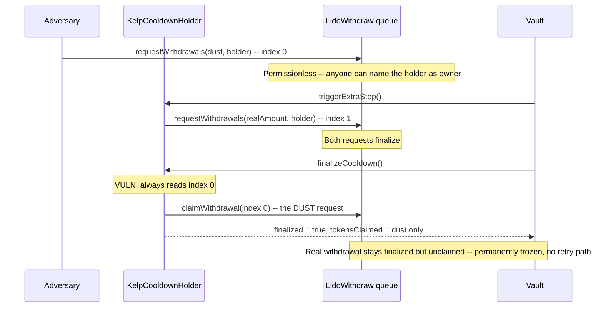

# Notional Leveraged Vaults (Kelp) — a dust withdrawal request permanently freezes the real one

> **Vulnerability classes:** vuln/dos/frozen-funds · vuln/logic/hardcoded-index · vuln/access-control/permissionless-griefing

> **Reproduction:** a self-contained Foundry PoC that compiles & runs in an
> isolated project with **only `forge-std`** — no fork, no RPC, no `anvil_state`.
> Full trace: [output.txt](output.txt). PoC:
> [test/35126-h-13-kelp-finalizecooldown-cannot-claim-the-withdrawal-if-ad_exp.sol](test/35126-h-13-kelp-finalizecooldown-cannot-claim-the-withdrawal-if-ad_exp.sol).

<!-- non-defihacklabs -->
<!-- source-auditvault: https://github.com/Auditware/AuditVault/blob/main/findings/35126-h-13-kelp-finalizecooldown-cannot-claim-the-withdrawal-if-ad.md -->
<!-- date: 2024-06 -->

---

## Key info

| | |
|---|---|
| **Impact** | **HIGH** — anyone can permanently freeze a Kelp withdrawal from a Notional leveraged vault by requesting a dust withdrawal on the same holder address before the real withdrawal request is submitted |
| **Protocol** | [Notional](https://notional.finance) Leveraged Vaults — Pendle PT and Vault Incentives (Kelp/rsETH staking integration) |
| **Vulnerable code** | `KelpCooldownHolder._finalizeCooldown` — hardcoded index-0 lookup |
| **Bug class** | Hardcoded index into a permissionlessly-appendable list |
| **Finding** | Sherlock — 2024-06-leveraged-vaults · H-13 · reporters **BiasedMerc, lemonmon, xiaoming90** |
| **Report** | [github.com/sherlock-audit/2024-06-leveraged-vaults-judging/issues/105](https://github.com/sherlock-audit/2024-06-leveraged-vaults-judging/issues/105) |
| **Source** | [AuditVault](https://github.com/Auditware/AuditVault/blob/main/findings/35126-h-13-kelp-finalizecooldown-cannot-claim-the-withdrawal-if-ad.md) |
| **Status** | Audit finding — caught in review, confirmed and escalated to High by the Sherlock judges (not exploited on-chain). Reproduced here as a standalone local PoC. |
| **Compiler** | `^0.8.24` (PoC) |

This is an **audit finding**, not a historical on-chain incident. The real
`KelpCooldownHolder` unwinds rsETH → stETH via Kelp's `WithdrawManager`, then stETH
→ ETH via Lido's withdrawal queue, in a two-step (`triggerExtraStep` +
`_finalizeCooldown`) process. The PoC keeps the blamed index-0 logic verbatim and
reduces the Lido withdrawal queue and the two-step trigger to the minimum needed
to make the permanent-loss harm measurable.

---

## TL;DR

1. `KelpCooldownHolder._finalizeCooldown()` always looks at **index 0** of
   `LidoWithdraw.getWithdrawalRequests(address(this))` to decide what's finalized
   and what to claim.
2. Lido's `requestWithdrawals` is **completely permissionless** — anyone can
   submit a withdrawal request naming any address (including a holder's) as the
   owner, with any amount, including dust.
3. If an adversary requests a dust withdrawal for the holder **before**
   `triggerExtraStep()` submits the holder's real, large withdrawal, the dust
   request lands at index 0 and the real one lands at index 1+.
4. `_finalizeCooldown()` only ever inspects index 0: it waits for the dust to
   finalize (which it will — it's a legitimate tiny withdrawal), claims it, and
   reports success.
5. The vault's withdraw-request bookkeeping is one-shot — once `finalizeCooldown`
   reports success it is torn down. The real, large withdrawal is now finalized on
   Lido's side but **permanently unclaimed** — there is no path left to recover it.

---

## The vulnerable code

From `Kelp.sol#L88-L106`:

```solidity
    function _finalizeCooldown() internal override returns (uint256 tokensClaimed, bool finalized) {
        if (!triggered) {
            return (0, false);
        }

        uint256[] memory requestIds = LidoWithdraw.getWithdrawalRequests(address(this));
        ILidoWithdraw.WithdrawalRequestStatus[] memory withdrawsStatus = LidoWithdraw.getWithdrawalStatus(requestIds);

❌      if (!withdrawsStatus[0].isFinalized) {
            return (0, false);
        }

❌      LidoWithdraw.claimWithdrawal(requestIds[0]);

        tokensClaimed = address(this).balance;
        (bool sent,) = vault.call{value: tokensClaimed}("");
        require(sent);
        finalized = true;
    }
```

`requestIds` can contain more than one entry the moment ANY third party calls
`LidoWithdraw.requestWithdrawals(amounts, holderAddress)` — a permissionless
function on Lido's own withdrawal queue (`Kelp.sol#L83`, the same call
`triggerExtraStep` itself makes for the real amount). `_finalizeCooldown` never
checks which entry corresponds to the real, holder-initiated request.

---

## Root cause

The code implicitly assumes the holder's withdrawal-request list on Lido has
exactly one entry — the one it itself created via `triggerExtraStep`. That
assumption is false the moment a third party (accidentally or maliciously) also
requests a withdrawal naming the same holder address, since Lido's queue is
append-only and globally permissionless.

## Preconditions

- The attacker can identify a `KelpCooldownHolder` clone's address before
  `triggerExtraStep()` is called for it (holder addresses are deterministic clones
  and/or observable on-chain once created).
- The attacker holds a dust amount of stETH (or can source it cheaply) to spend on
  the griefing request.

No special privilege is required — this works against any Kelp withdrawal in the
window between the holder starting its cooldown and `triggerExtraStep` being
called.

## Attack walkthrough

1. A user's position is unwound and a `KelpCooldownHolder` begins its cooldown.
2. Before anyone calls `triggerExtraStep()` for this holder, the adversary calls
   `LidoWithdraw.requestWithdrawals` with a dust amount of stETH, naming the
   holder's address as the request owner. This request gets index 0.
3. `triggerExtraStep()` is eventually called and submits the holder's real, large
   withdrawal request — it gets index 1 (or later).
4. Lido processes its queue; both requests eventually finalize.
5. The vault calls `_finalizeCooldown()`. It reads index 0 (the dust request),
   sees it's finalized, claims it, and reports `finalized = true`.
6. The vault's withdraw-request bookkeeping for this holder is now closed out. The
   real, large withdrawal sits finalized-but-unclaimed on Lido forever — there is
   no user-facing path left to claim it.

---

## Diagrams



---

## Impact

- **Permanent fund freeze**: the real, large withdrawal is stuck on Lido forever —
  finalized but never claimable, since the vault's bookkeeping already reports
  the withdrawal as complete.
- **Trivial, cheap griefing**: any third party can trigger this for the cost of a
  dust stETH request, against any Kelp holder they can identify in time.
- **Collateral mis-valuation risk**: if the vault's accounting treats a
  "finalized" withdrawal as recoverable value, positions built on top of it can
  be mis-valued, compounding the direct loss with downstream liquidation risk.

## Remediation

Claim every finalized request belonging to the holder (or, better, record and use
the specific `requestId` returned by `triggerExtraStep`'s call to
`requestWithdrawals`, instead of trusting index 0):

```diff
     function _finalizeCooldown() internal override returns (uint256 tokensClaimed, bool finalized) {
         if (!triggered) {
             return (0, false);
         }

         uint256[] memory requestIds = LidoWithdraw.getWithdrawalRequests(address(this));
         ILidoWithdraw.WithdrawalRequestStatus[] memory withdrawsStatus = LidoWithdraw.getWithdrawalStatus(requestIds);

-        if (!withdrawsStatus[0].isFinalized) {
-            return (0, false);
-        }
-
-        LidoWithdraw.claimWithdrawal(requestIds[0]);
+        for (uint256 i = 0; i < requestIds.length; i++) {
+            if (!withdrawsStatus[i].isFinalized) return (0, false);
+            LidoWithdraw.claimWithdrawal(requestIds[i]);
+        }
```

## How to reproduce

```bash
export PATH="$HOME/.foundry/bin:$PATH"
cd 35126-h-13-kelp-finalizecooldown-cannot-claim-the-withdrawal-if-ad_exp
forge test -vvv
```

Both tests pass: the main PoC front-runs `triggerExtraStep` with a dust request,
finalizes both requests, and asserts `finalizeCooldown()` reports success while
only having claimed the dust — with the real 10 ETH withdrawal left finalized but
permanently unclaimed. The control test shows that with no adversary interference,
the real withdrawal correctly lands at index 0 and is claimed in full — isolating
the bug to the hardcoded index.

---

## Sources

- AuditVault finding: [35126-h-13-kelp-finalizecooldown-cannot-claim-the-withdrawal-if-ad.md](https://github.com/Auditware/AuditVault/blob/main/findings/35126-h-13-kelp-finalizecooldown-cannot-claim-the-withdrawal-if-ad.md)
- Original report: [github.com/sherlock-audit/2024-06-leveraged-vaults-judging/issues/105](https://github.com/sherlock-audit/2024-06-leveraged-vaults-judging/issues/105)
- Reduced source: [github.com/sherlock-audit/2024-06-leveraged-vaults](https://github.com/sherlock-audit/2024-06-leveraged-vaults) — `leveraged-vaults/contracts/vaults/staking/protocols/Kelp.sol#L72-L106`

**Taxonomy (AuditVault):** `genome/frozen-funds` · `genome/variant` · `genome/locked-funds` · `genome/dos-resistance` · `genome/liquidation-underwater` · `sector/lending` · `sector/liquid-staking` · `sector/staking` · `severity/high`
