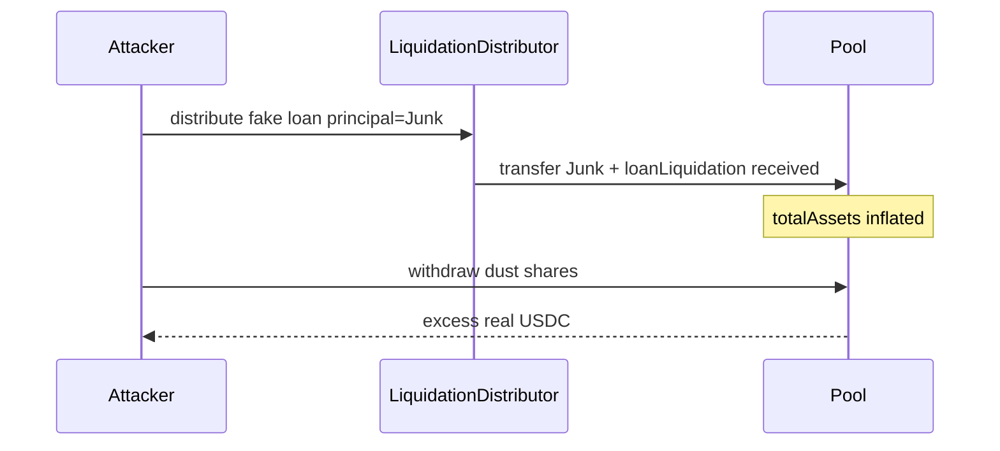

# Gondi — distribute() lacks access control (Pool accounting corruption)

> **Vulnerability classes:** vuln/access-roles · vuln/direct-drain · vuln/liquidation-logic

> **Reproduction:** self-contained Foundry PoC with **only `forge-std`** — no fork, no RPC.
> Full trace: [output.txt](output.txt). PoC:
> [test/35205-h-03-function-distribute-lacks-access-control-allowing-anyon.sol](test/35205-h-03-function-distribute-lacks-access-control-allowing-anyon.sol).

<!-- non-defihacklabs -->
<!-- source-auditvault: https://github.com/Auditware/AuditVault/blob/main/findings/35205-h-03-function-distribute-lacks-access-control-allowing-anyon.md -->
<!-- date: 2024-04 -->

---

## Key info

| | |
|---|---|
| **Impact** | **HIGH** — anyone calls `LiquidationDistributor.distribute` with a junk ERC20 as `principalAddress` and the Pool as lender; Pool credits junk as real assets; dust depositor drains victim USDC |
| **Protocol** | [Gondi](https://www.gondi.xyz) — NFT lending |
| **Vulnerable code** | `LiquidationDistributor.distribute` — no access control; `Pool.loanLiquidation` treats `_received` as asset inflow without a token check |
| **Bug class** | Missing access control → accounting inflation → fund theft |
| **Finding** | Code4rena — Gondi, 2024-04 · #35205 · reporter **zhaojie** |
| **Report** | [code4rena.com/reports/2024-04-gondi](https://code4rena.com/reports/2024-04-gondi) |
| **Source** | [AuditVault](https://github.com/Auditware/AuditVault/blob/main/findings/35205-h-03-function-distribute-lacks-access-control-allowing-anyon.md) |
| **Status** | Audit finding — confirmed and mitigated (caller check added) |
| **Compiler** | `^0.8.24` (PoC) |

---

## TL;DR

1. `distribute()` is permissionless.
2. Attacker crafts a loan: `principalAddress = Junk`, sole lender = Pool.
3. Junk is transferred to the Pool; `loanLiquidation` does `totalAssets += _received`.
4. Attacker with a dust USDC deposit withdraws ~2× real USDC, draining victims.

## The vulnerable code

```solidity
/// @> VULN: no access control
function distribute(address originator, Loan memory loan, uint256 amount) external {
    MockERC20 token = MockERC20(loan.principalAddress);
    token.transferFrom(msg.sender, address(this), amount);
    ...
    Pool(lender).loanLiquidation(..., _sent, ...);
}
```

**Fix:** only allow Loan contracts to call `distribute`.

## Root cause

`distribute` trusts caller-supplied loan struct fields. The Pool's `loanLiquidation` never receives `principalAddress`, so it cannot reject junk tokens — any amount reported as `_received` inflates share pricing.

## Attack walkthrough

1. Victim deposits 1000 USDC; attacker deposits 1 USDC dust.
2. Attacker calls `distribute` with 1000 Junk → Pool as lender.
3. `totalAssets` becomes 2001 while real USDC is still 1001.
4. Attacker withdraws 1 share → ~1.999 USDC stolen excess.

## Diagrams



## Impact

Direct theft of depositor USDC/WETH via share-price inflation. Permissionless surface means any address can spam and corrupt accounting.

## Taxonomy

- genome: liquidation-logic, variant, direct-drain, access-roles, liquidation-underwater, timestamp-dependence
- sector: lending, stable, staking-pool, token
- severity: high
- platform: code4rena

## Sources

- [AuditVault finding #35205](https://github.com/Auditware/AuditVault/blob/main/findings/35205-h-03-function-distribute-lacks-access-control-allowing-anyon.md)
- [Code4rena report 2024-04-gondi](https://code4rena.com/reports/2024-04-gondi)
- Reduced from [code-423n4/2024-04-gondi](https://github.com/code-423n4/2024-04-gondi) `LiquidationDistributor.distribute` + Pool `loanLiquidation`
