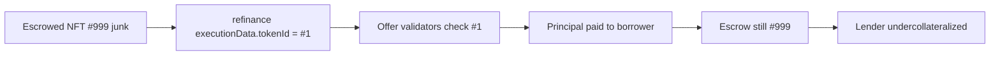

# Gondi — refinanceFromLoanExecutionData missing tokenId check

> **Vulnerability classes:** vuln/wrong-condition · vuln/direct-drain · vuln/access-roles

> **Reproduction:** self-contained Foundry PoC with **only `forge-std`** — no fork, no RPC.
> Full trace: [output.txt](output.txt). PoC:
> [test/35206-h-04-function-refinancefromloanexecutiondata-does-not-check.sol](test/35206-h-04-function-refinancefromloanexecutiondata-does-not-check.sol).

<!-- non-defihacklabs -->
<!-- source-auditvault: https://github.com/Auditware/AuditVault/blob/main/findings/35206-h-04-function-refinancefromloanexecutiondata-does-not-check.md -->
<!-- date: 2024-04 -->

---

## Key info

| | |
|---|---|
| **Impact** | **HIGH** — borrower refinances a junk-NFT loan using a blue-chip-only offer by spoofing `executionData.tokenId`; lender funds principal while only the junk NFT remains in escrow |
| **Protocol** | [Gondi](https://www.gondi.xyz) — NFT multi-source lending |
| **Vulnerable code** | `refinanceFromLoanExecutionData` passes `executionData.tokenId` into `_processOffersFromExecutionData` without requiring equality to `loan.nftCollateralTokenId` |
| **Bug class** | Missing collateral-id consistency check on refinance |
| **Finding** | Code4rena — Gondi, 2024-04 · #35206 · reporter **minhquanym** |
| **Report** | [code4rena.com/reports/2024-04-gondi](https://code4rena.com/reports/2024-04-gondi) |
| **Source** | [AuditVault](https://github.com/Auditware/AuditVault/blob/main/findings/35206-h-04-function-refinancefromloanexecutiondata-does-not-check.md) |
| **Status** | Audit finding — confirmed and mitigated (`tokenIdCheck` added) |
| **Compiler** | `^0.8.24` (PoC) |

---

## TL;DR

1. Refinance re-uses the NFT already in escrow (no transfer out/in).
2. Offer validation uses attacker-controlled `executionData.tokenId`.
3. No check that it matches the escrowed `loan.nftCollateralTokenId`.
4. Lender accepts a blue-chip id; escrow still holds junk → undercollateralized loan.

## The vulnerable code

```solidity
// FIX would be: require(executionData.tokenId == loan.nftCollateralTokenId);
uint256 newLoanId = _processOffersFromExecutionData(
    loan,
    executionData.principalReceiver,
    executionData.tokenId, // @> VULN: unmatched with loan.nftCollateralTokenId
    newOfferId
);
```

**Fix:** `require(executionData.tokenId == loan.nftCollateralTokenId)`.

## Root cause

Refinance optimizes by not moving the NFT, but still lets the borrower name a different token id for offer validation. Lenders' collateral constraints are checked against the spoofed id, not the asset actually secured by the protocol.

## Attack walkthrough

1. Open loan against junk NFT #999.
2. Post refinance offer requiring blue-chip #1.
3. Call refinance with `executionData.tokenId = 1`.
4. Offer validates; principal paid out; escrow still #999.

## Diagrams



## Impact

Lenders can be forced into loans secured by collateral they never accepted. Principal is at risk of total loss relative to the blue-chip they thought they underwrote.

## Taxonomy

- genome: wrong-condition, direct-drain, access-roles, liquidation-underwater, oracle-freshness, reward-accounting
- sector: lending, nft, nft-lending, staking
- severity: high
- platform: code4rena

## Sources

- [AuditVault finding #35206](https://github.com/Auditware/AuditVault/blob/main/findings/35206-h-04-function-refinancefromloanexecutiondata-does-not-check.md)
- [Code4rena report 2024-04-gondi](https://code4rena.com/reports/2024-04-gondi)
- Reduced from [code-423n4/2024-04-gondi](https://github.com/code-423n4/2024-04-gondi) `refinanceFromLoanExecutionData` / `_processOffersFromExecutionData` / `_checkValidators`
