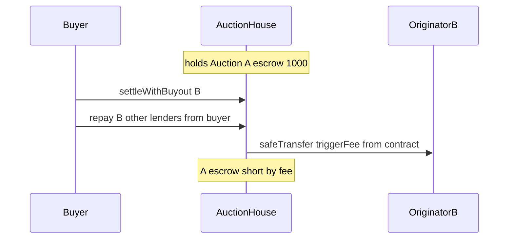

# Gondi — triggerFee stolen from other auctions in settleWithBuyout

> **Vulnerability classes:** vuln/fee-theft · vuln/single-function · vuln/reentrancy-guard

> **Reproduction:** self-contained Foundry PoC with **only `forge-std`** — no fork, no RPC.
> Full trace: [output.txt](output.txt). PoC:
> [test/35207-h-05-triggerfee-is-stolen-from-other-auctions-during-settlew.sol](test/35207-h-05-triggerfee-is-stolen-from-other-auctions-during-settlew.sol).

<!-- non-defihacklabs -->
<!-- source-auditvault: https://github.com/Auditware/AuditVault/blob/main/findings/35207-h-05-triggerfee-is-stolen-from-other-auctions-during-settlew.md -->
<!-- date: 2024-04 -->

---

## Key info

| | |
|---|---|
| **Impact** | **HIGH** — `settleWithBuyout` pays `triggerFee` from the auction contract balance via `safeTransfer`, siphoning escrow belonging to other concurrent auctions; later auctions cannot settle |
| **Protocol** | [Gondi](https://www.gondi.xyz) — NFT multi-source lending / liquidation auctions |
| **Vulnerable code** | `settleWithBuyout`: `asset.safeTransfer(_auction.originator, fee)` instead of `safeTransferFrom(buyer, …)` |
| **Bug class** | Fee paid from shared contract balance rather than buyer funds |
| **Finding** | Code4rena — Gondi, 2024-04 · #35207 · reporter **minhquanym** |
| **Report** | [code4rena.com/reports/2024-04-gondi](https://code4rena.com/reports/2024-04-gondi) |
| **Source** | [AuditVault](https://github.com/Auditware/AuditVault/blob/main/findings/35207-h-05-triggerfee-is-stolen-from-other-auctions-during-settlew.md) |
| **Status** | Audit finding — confirmed; mitigated to `safeTransferFrom` buyer |
| **Compiler** | `^0.8.24` (PoC) |

---

## TL;DR

1. Multiple auctions share one contract balance of the principal asset.
2. Buyout correctly pulls other-lender repayment from the buyer.
3. `triggerFee` is paid with `safeTransfer` from the **contract**, not the buyer.
4. Fee is stolen from other auctions' escrow → shortfall / unsettled principal.

## The vulnerable code

```solidity
// @> VULN: fee from contract balance
uint256 fee = totalOwed.mulDivDown(_auction.triggerFee, _BPS);
asset.safeTransfer(_auction.originator, fee);
// FIX: asset.safeTransferFrom(msg.sender, _auction.originator, fee);
```

## Root cause

The buyout path never collects the trigger fee from the main lender. Paying it from the shared balance treats other auctions' locked funds as free liquidity for the fee.

## Attack walkthrough

1. Auction A escrows 1000 USDC in the house.
2. Auction B opens with 100 USDC escrow and 10% trigger fee.
3. Buyer settles B with buyout (repays B's other lenders from own wallet).
4. Originator B receives 10 USDC taken from the shared balance (A's funds).
5. Combined expected escrow short by exactly the fee.

## Diagrams



## Impact

Loss of principal to other concurrent auctions (judge: high). Last auctions may be unable to settle due to insufficient balance. Originator is overpaid from others' funds.

## Taxonomy

- genome: single-function, fee-theft, use-reentrancy-guard, integer-bounds, liquidation-underwater, reentrancy-guard
- sector: lending, nft, nft-lending, token
- severity: high
- platform: code4rena

## Sources

- [AuditVault finding #35207](https://github.com/Auditware/AuditVault/blob/main/findings/35207-h-05-triggerfee-is-stolen-from-other-auctions-during-settlew.md)
- [Code4rena report 2024-04-gondi](https://code4rena.com/reports/2024-04-gondi)
- Reduced from [code-423n4/2024-04-gondi](https://github.com/code-423n4/2024-04-gondi) `settleWithBuyout` triggerFee payment
