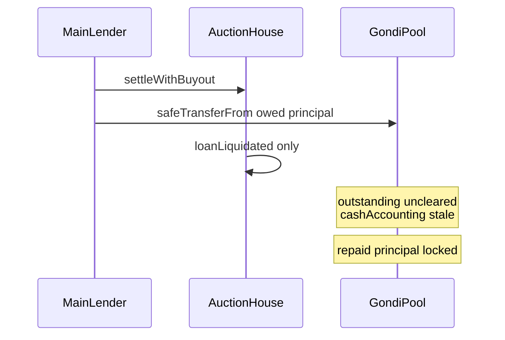

# Gondi — settleWithBuyout skips LoanManager.loanLiquidation

> **Vulnerability classes:** vuln/liquidation-logic · vuln/accounting · vuln/locked-funds

> **Reproduction:** self-contained Foundry PoC with **only `forge-std`** — no fork, no RPC.
> Full trace: [output.txt](output.txt). PoC:
> [test/35208-h-06-function-settlewithbuyout-does-not-call-loanmanagerloan.sol](test/35208-h-06-function-settlewithbuyout-does-not-call-loanmanagerloan.sol).

<!-- non-defihacklabs -->
<!-- source-auditvault: https://github.com/Auditware/AuditVault/blob/main/findings/35208-h-06-function-settlewithbuyout-does-not-call-loanmanagerloan.md -->
<!-- date: 2024-04 -->

---

## Key info

| | |
|---|---|
| **Impact** | **HIGH** — buyout pays pool lenders via `safeTransferFrom` but never calls `loanLiquidation()`, so outstanding/cash accounting stays stale and repaid principal is unclaimable |
| **Protocol** | [Gondi](https://www.gondi.xyz) — NFT multi-source lending / pool LoanManager |
| **Vulnerable code** | `AuctionWithBuyoutLoanLiquidator.settleWithBuyout` repay loop (no LoanManager hook) |
| **Bug class** | Missing liquidation accounting callback on buyout path |
| **Finding** | Code4rena — Gondi, 2024-04 · #35208 · reporter **minhquanym** |
| **Report** | [code4rena.com/reports/2024-04-gondi](https://code4rena.com/reports/2024-04-gondi) |
| **Source** | [AuditVault](https://github.com/Auditware/AuditVault/blob/main/findings/35208-h-06-function-settlewithbuyout-does-not-call-loanmanagerloan.md) |
| **Status** | Audit finding — confirmed; mitigated by adding `loanLiquidation` call |
| **Compiler** | `^0.8.24` (PoC) |

---

## TL;DR

1. Gondi Pool implements `LoanManager.loanLiquidation` to clear outstanding and credit cash/queues.
2. `settleWithBuyout` transfers owed principal to other lenders (including the Pool) and calls `loanLiquidated` on the loan contract.
3. It never calls `loanLiquidation` on pool lenders → accounting diverges from token balances.
4. Depositors cannot withdraw the returned principal (locked / unaccounted).

## The vulnerable code

```solidity
// AuctionWithBuyoutLoanLiquidator.settleWithBuyout
for (uint256 i; i < _loan.tranche.length;) {
    if (i != largestTrancheIdx) {
        // ... compute owed ...
        asset.safeTransferFrom(msg.sender, thisTranche.lender, owed);
        // @> VULN: no ILoanManager(lender).loanLiquidation(...)
    }
}
IMultiSourceLoan(_auction.loanAddress).loanLiquidated(_auction.loanId, _loan);
// FIX: for each pool lender, call loanLiquidation with principal/received
```

## Root cause

Buyout treats every other lender as a passive EOA address that only needs a token transfer. Pool lenders also need the LoanManager callback that updates outstanding principal and `getTotalReceived` / cash. Without it, tokens sit on the Pool while share accounting still believes the principal is on loan.

## Attack walkthrough

1. Depositors fund the Pool; Pool books a junior tranche.
2. Multi-tranche auction opens (main lender + Pool junior).
3. Main lender `settleWithBuyout` — pays Pool its principal from the buyer's wallet.
4. Pool `balanceOf` rises; `outstanding` and `cashAccounting` stay stale.
5. Depositors can only withdraw liquid cashAccounting — repaid principal is locked.

## Diagrams



## Impact

Pool depositors lose access to principal returned via buyout until (if ever) accounting is manually repaired. High severity accounting break on the liquidation buyout path.

## Taxonomy

- genome: liquidation-logic, data-corruption/price-manipulation, liquidation-underwater, timestamp-dependence
- sector: lending, token, vault
- severity: high
- platform: code4rena

## Sources

- [AuditVault finding #35208](https://github.com/Auditware/AuditVault/blob/main/findings/35208-h-06-function-settlewithbuyout-does-not-call-loanmanagerloan.md)
- [Code4rena report 2024-04-gondi](https://code4rena.com/reports/2024-04-gondi)
- Reduced from [code-423n4/2024-04-gondi@b9863d7](https://github.com/code-423n4/2024-04-gondi/blob/b9863d73c08fcdd2337dc80a8b5e0917e18b036c/src/lib/AuctionWithBuyoutLoanLiquidator.sol) `settleWithBuyout` + [Pool.sol loanLiquidation](https://github.com/code-423n4/2024-04-gondi/blob/b9863d73c08fcdd2337dc80a8b5e0917e18b036c/src/lib/pools/Pool.sol#L449-L463)
