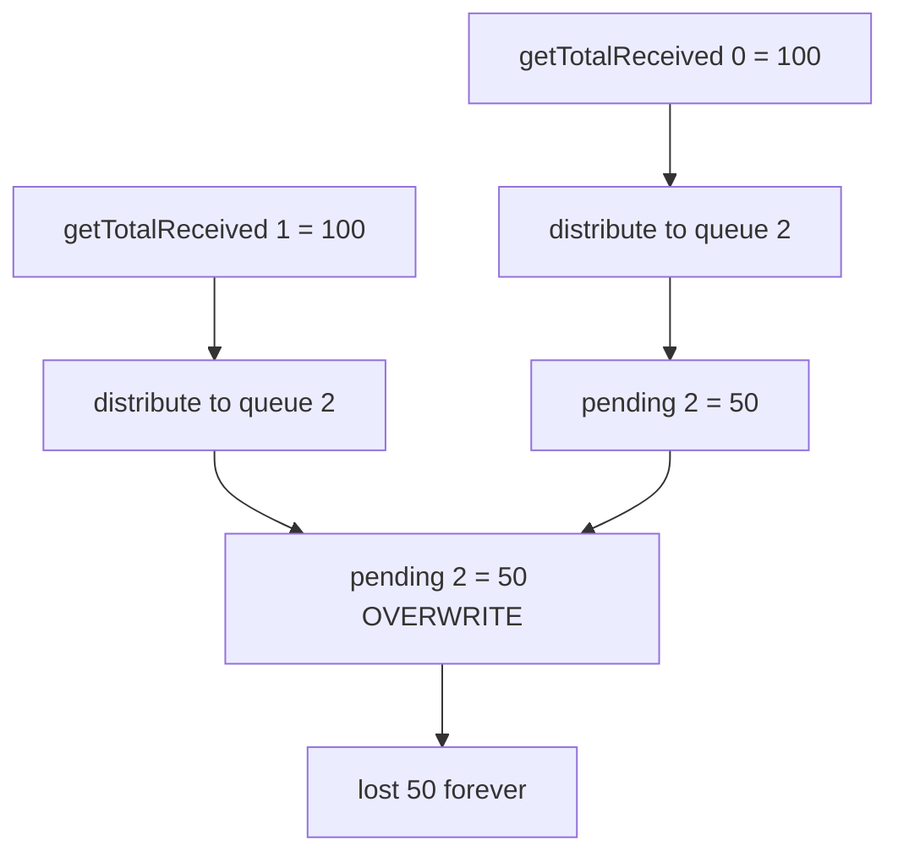

# Gondi — incorrect `_pendingWithdrawal` accounting in queueClaiming

> **Vulnerability classes:** vuln/precision-loss · vuln/locked-funds · vuln/accounting

> **Reproduction:** self-contained Foundry PoC with **only `forge-std`** — no fork, no RPC.
> Full trace: [output.txt](output.txt). PoC:
> [test/35211-h-09-incorrect-accounting-of-pendingwithdrawal-in-queueclai.sol](test/35211-h-09-incorrect-accounting-of-pendingwithdrawal-in-queueclai.sol).

<!-- non-defihacklabs -->
<!-- source-auditvault: https://github.com/Auditware/AuditVault/blob/main/findings/35211-h-09-incorrect-accounting-of-pendingwithdrawal-in-queueclai.md -->
<!-- date: 2024-04 -->

---

## Key info

| | |
|---|---|
| **Impact** | **HIGH** — assignment (`=`) instead of `+=` erases earlier queues' contributions to a newer queue's pending withdrawal; funds zeroed in `getTotalReceived` cannot be recovered |
| **Protocol** | [Gondi](https://www.gondi.xyz) — ERC4626 lending pool withdrawal queues |
| **Vulnerable code** | `Pool._updatePendingWithdrawalWithQueue`: `_pendingWithdrawal[secondIdx] = pendingForQueue` |
| **Bug class** | Missing accumulation in multi-queue distribution |
| **Finding** | Code4rena — Gondi, 2024-04 · #35211 · reporter **bin2chen** |
| **Report** | [code4rena.com/reports/2024-04-gondi](https://code4rena.com/reports/2024-04-gondi) |
| **Source** | [AuditVault](https://github.com/Auditware/AuditVault/blob/main/findings/35211-h-09-incorrect-accounting-of-pendingwithdrawal-in-queueclai.md) |
| **Status** | Audit finding — confirmed; mitigated (missing `+`) |
| **Compiler** | `^0.8.24` (PoC) |

---

## TL;DR

1. `queueClaimAll` walks each queue's `getTotalReceived` and distributes into newer queues.
2. Distribution writes `_pendingWithdrawal[secondIdx] = pendingForQueue`.
3. A second older queue overwrites the same index instead of accumulating.
4. Earlier claimable amounts are lost after `getTotalReceived` is cleared.

## The vulnerable code

```solidity
// Pool._updatePendingWithdrawalWithQueue
uint256 pendingForQueue = totalReceived.mulDivDown(queueAccounting.thisQueueFraction, PRINCIPAL_PRECISION);
totalReceived -= pendingForQueue;

// @> VULN: assignment erases prior distributions into secondIdx
_pendingWithdrawal[secondIdx] = pendingForQueue;
// FIX: _pendingWithdrawal[secondIdx] += pendingForQueue;
```

## Root cause

Multi-source distribution into a shared pending array must accumulate. Using `=` keeps only the last source's contribution; prior sources are already zeroed in `getTotalReceived`, so the lost amount is permanent.

## Attack walkthrough

1. Queue 0 and queue 1 each have `getTotalReceived = 100e18`.
2. Queue 2 has a 50% `thisQueueFraction` (claimant).
3. Processing queue 0 sets `pending[2] = 50e18`.
4. Processing queue 1 sets `pending[2] = 50e18` again (overwrite).
5. Expected with `+=`: `100e18`. Actual: `50e18`. **50e18 lost.**

## Diagrams



## Impact

Withdrawal-queue depositors under-receive their pro-rata liquidation proceeds; erased amounts are unrecoverable after `getTotalReceived` is zeroed. Confirmed high; fixed by changing `=` to `+=`.

## Taxonomy

- genome: precision-loss, locked-funds, liquidation-underwater, oracle-freshness
- sector: lending, staking-pool
- severity: high
- platform: code4rena

## Sources

- [AuditVault finding #35211](https://github.com/Auditware/AuditVault/blob/main/findings/35211-h-09-incorrect-accounting-of-pendingwithdrawal-in-queueclai.md)
- [Code4rena report 2024-04-gondi](https://code4rena.com/reports/2024-04-gondi)
- Reduced from [code-423n4/2024-04-gondi@b9863d7](https://github.com/code-423n4/2024-04-gondi/blob/b9863d73c08fcdd2337dc80a8b5e0917e18b036c/src/lib/pools/Pool.sol#L643-L684) `_updatePendingWithdrawalWithQueue`
