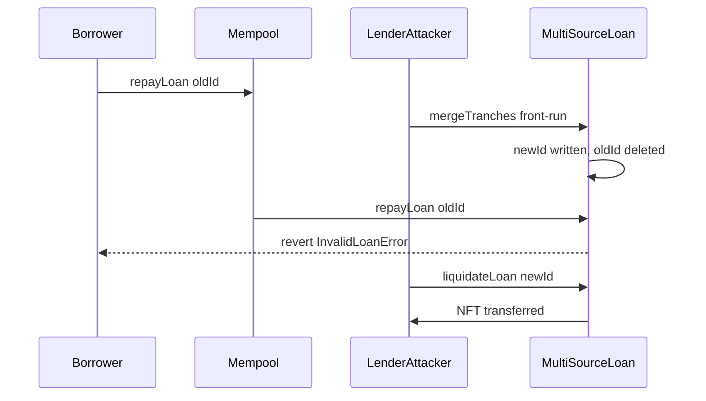

# Gondi — front-running repayLoan via loanId rotation

> **Vulnerability classes:** vuln/frontrun · vuln/liquidation-logic · vuln/dos

> **Reproduction:** self-contained Foundry PoC with **only `forge-std`** — no fork, no RPC.
> Full trace: [output.txt](output.txt). PoC:
> [test/35212-h-10-the-attackers-front-running-repayloans-so-that-the-debt.sol](test/35212-h-10-the-attackers-front-running-repayloans-so-that-the-debt.sol).

<!-- non-defihacklabs -->
<!-- source-auditvault: https://github.com/Auditware/AuditVault/blob/main/findings/35212-h-10-the-attackers-front-running-repayloans-so-that-the-debt.md -->
<!-- date: 2024-04 -->

---

## Key info

| | |
|---|---|
| **Impact** | **HIGH** — `mergeTranches` / `addNewTranche` / refinance rotate `loanId` and delete the old entry; a lender can front-run `repayLoan` so the borrower cannot repay, then liquidate and seize the NFT |
| **Protocol** | [Gondi](https://www.gondi.xyz) — multi-source NFT lending |
| **Vulnerable code** | `repayLoan` → `_baseLoanChecks` after id-changing `mergeTranches` |
| **Bug class** | Loan-id invalidation / MEV front-run DoS on repayment |
| **Finding** | Code4rena — Gondi, 2024-04 · #35212 · reporter **zhaojie** |
| **Report** | [code4rena.com/reports/2024-04-gondi](https://code4rena.com/reports/2024-04-gondi) |
| **Source** | [AuditVault](https://github.com/Auditware/AuditVault/blob/main/findings/35212-h-10-the-attackers-front-running-repayloans-so-that-the-debt.md) |
| **Status** | Audit finding — confirmed high (lender motivation); mitigated by limiting id-changing call paths |
| **Compiler** | `^0.8.24` (PoC) |

---

## TL;DR

1. `repayLoan` requires `_loan.hash() == _loans[loanId]`.
2. `mergeTranches` writes a **new** loanId and `delete _loans[old]`.
3. Front-running a repay with merge makes the old id invalid → repay reverts.
4. Near expiry the lender forces liquidation; with a single merged tranche the NFT is claimed directly.

## The vulnerable code

```solidity
function repayLoan(...) external {
    // ...
    _baseLoanChecks(loanId, loan); // @> VULN if loanId was rotated
}

function mergeTranches(...) external {
    _loans[loanId] = loanMergedTranches.hash();
    delete _loans[_loanId]; // invalidates in-flight repay with old id
}
// FIX: do not delete old id / block id-changing calls near expiry / restrict caller
```

## Root cause

Loan identity is a mutable mapping key. Any function that rotates the key without borrower consent can race a repay (or refinance/liquidate) mempool transaction. A hostile lender is highly motivated near expiry: block repayment, then foreclose the NFT.

## Attack walkthrough

1. Borrower has a 2-tranche loan; NFT escrowed; repay would succeed.
2. Attacker/lender calls `mergeTranches` (permissionless in the audited code) collapsing to one tranche and a new loanId.
3. Borrower's `repayLoan(oldId, …)` fails `InvalidLoanError`.
4. Liquidation on the new single-tranche loan claims the NFT to the remaining lender.

## Diagrams



## Impact

Borrowers can be prevented from repaying near expiry and lose NFT collateral. Severity raised to high once lender motivation was recognized. Mitigation limited who can rotate loan identity and under what conditions.

## Taxonomy

- genome: liquidation-logic, frontrun, use-reentrancy-guard, dos-resistance, frontrun-exposure, liquidation-underwater, reentrancy-guard, timestamp-dependence
- sector: lending, nft, nft-lending
- severity: high
- platform: code4rena
- impact: mev/frontrun

## Sources

- [AuditVault finding #35212](https://github.com/Auditware/AuditVault/blob/main/findings/35212-h-10-the-attackers-front-running-repayloans-so-that-the-debt.md)
- [Code4rena report 2024-04-gondi](https://code4rena.com/reports/2024-04-gondi)
- Reduced from [code-423n4/2024-04-gondi@b9863d7](https://github.com/code-423n4/2024-04-gondi/blob/b9863d73c08fcdd2337dc80a8b5e0917e18b036c/src/lib/loans/MultiSourceLoan.sol) `mergeTranches` / `repayLoan` / `_baseLoanChecks`
