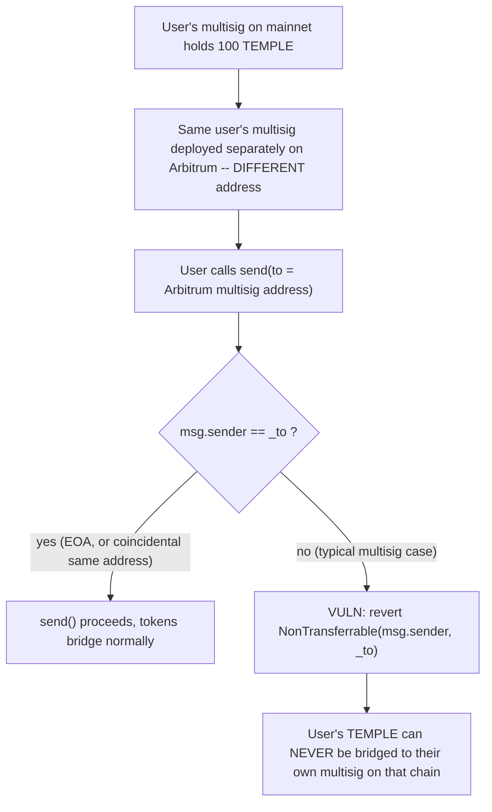
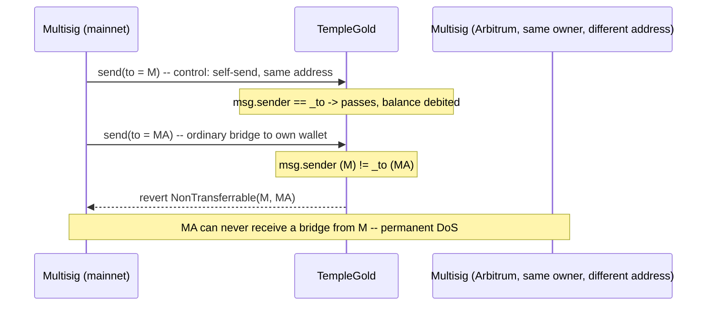

# TempleGold — incompatibility with multisig wallets in `send()`

> **Vulnerability classes:** vuln/logic/cross-chain-address-assumption · vuln/dos/permanent-revert · vuln/bridge/liveness

> **Reproduction:** a self-contained Foundry PoC that compiles & runs in an
> isolated project with **only `forge-std`** — no fork, no RPC, no `anvil_state`.
> Full trace: [output.txt](output.txt). PoC:
> [test/35290-incompatibility-with-multisig-wallets-in-templegoldsend-func_exp.sol](test/35290-incompatibility-with-multisig-wallets-in-templegoldsend-func_exp.sol).

<!-- non-defihacklabs -->
<!-- source-auditvault: https://github.com/Auditware/AuditVault/blob/main/findings/35290-incompatibility-with-multisig-wallets-in-templegoldsend-func.md -->
<!-- date: 2024-07 -->

**AuditVault taxonomy:** `lang/solidity` · `platform/codehawks` · `has/poc` · `severity/high` · `sector/bridge` · `sector/multisig` · genome: `griefing` · `permanent` · `dos-resistance`

---

## Key info

| | |
|---|---|
| **Impact** | **HIGH** — any TempleGold holder whose wallet is a multisig / smart-contract wallet (Safe, etc.) can **never** bridge their tokens to their own wallet on another chain; every such attempt permanently reverts |
| **Protocol** | [TempleGold](https://github.com/TempleDAO/temple) — the LayerZero-OFT cross-chain TEMPLE governance/rewards token |
| **Vulnerable code** | `TempleGold.send(SendParam, MessagingFee, address)` — the `if (msg.sender != _to) revert NonTransferrable(msg.sender, _to);` guard |
| **Bug class** | Incorrect cross-chain identity assumption: address equality across chains is assumed but not guaranteed for smart-contract wallets |
| **Finding** | Codehawks — TempleGold, 2024-07 · #35290 · reporter **n0kto** |
| **Report** | No direct `report:` URL in the AuditVault entry; sourced from `Cyfrin/2024-07-templegold` (Codehawks contest repo) |
| **Source** | [AuditVault](https://github.com/Auditware/AuditVault/blob/main/findings/35290-incompatibility-with-multisig-wallets-in-templegoldsend-func.md) |
| **Status** | Audit finding — caught in review (not exploited on-chain). Reproduced here as a standalone local PoC. |
| **Compiler** | `^0.8.24` (PoC) |

This is an **audit finding**, not a historical on-chain incident. The real
`TempleGold.send()` is a LayerZero `OFTCore.send()` override that quotes fees,
debits the sender, and forwards a cross-chain message through the LayerZero
endpoint. The PoC keeps the blamed `msg.sender != _to` guard **verbatim** and
reduces the endpoint/messaging machinery to the minimal local bookkeeping the
bug actually needs — the harm IS that `send()` reverts before any bridging
happens, so no live LayerZero endpoint is required to demonstrate it.

---

## TL;DR

1. `TempleGold.send(_sendParam, _fee, _refundAddress)` is the entry point users
   call to bridge TEMPLE from one chain to another via LayerZero.
2. Before doing anything else, it requires `msg.sender == _to` (the decoded
   destination address), reverting with `NonTransferrable` otherwise.
3. This assumes a user's address is identical on the source and destination
   chain. That's true for a plain EOA, but essentially **never** true for a
   Safe-style multisig wallet — each chain's deployment gets an independent
   address (different owner set / salt / factory nonce).
4. A multisig user who wants to bridge TEMPLE to their own wallet on another
   chain therefore hits `NonTransferrable` on every attempt, permanently.
   There is no workaround available to that user from inside the contract.
5. HARM in the PoC: the SAME user's multisig, deployed at two different
   addresses on two chains, successfully bridges to itself when the addresses
   happen to coincide (control), but the ordinary act of bridging to its real
   Arbitrum-chain wallet reverts with `NonTransferrable` every time.

---

## The vulnerable code

Verbatim from the finding (`TempleGold.send`, `Cyfrin/2024-07-templegold@57a3e59`,
`protocol/contracts/templegold/TempleGold.sol`):

```solidity
function send(
    SendParam calldata _sendParam,
    MessagingFee calldata _fee,
    address _refundAddress
) external payable virtual override(IOFT, OFTCore) returns (MessagingReceipt memory msgReceipt, OFTReceipt memory oftReceipt) {
    if (_sendParam.composeMsg.length > 0) { revert CannotCompose(); }
    /// cast bytes32 to address
    address _to = _sendParam.to.bytes32ToAddress();
    /// @dev user can cross-chain transfer to self
@>  if (msg.sender != _to) { revert ITempleGold.NonTransferrable(msg.sender, _to); }

    (uint256 amountSentLD, uint256 amountReceivedLD) = _debit(
        msg.sender, _sendParam.amountLD, _sendParam.minAmountLD, _sendParam.dstEid
    );
    (bytes memory message, bytes memory options) = _buildMsgAndOptions(_sendParam, amountReceivedLD);
    msgReceipt = _lzSend(_sendParam.dstEid, message, options, _fee, _refundAddress);
    oftReceipt = OFTReceipt(amountSentLD, amountReceivedLD);

    emit OFTSent(msgReceipt.guid, _sendParam.dstEid, msg.sender, amountSentLD, amountReceivedLD);
}
```

**Fix** (per the finding's recommendations): drop the address-equality check
entirely — the OFT debit already restricts spending to the caller's own
balance, so no further "same address" restriction is needed for correctness —
or replace it with a mechanism that doesn't assume address equality across
chains (e.g. a signed intent, or an allow-list of the user's known wallets).

---

## Root cause

`send()` conflates *"only the token owner may authorize this transfer"* (a
correct requirement, already enforced because `_debit` spends `msg.sender`'s
own balance) with *"the owner's address must be identical on the destination
chain"* (an assumption that simply doesn't hold for contract wallets). Every
multisig/Safe deployment is chain-specific: the CREATE2 salt, owner set, and
factory address can differ per chain, and in practice usually do for anything
beyond the most disciplined deployments. The `msg.sender != _to` check silently
converts that mismatch into a hard, permanent revert with no recovery path
inside the contract.

---

## Preconditions

- The caller holds TempleGold and wants to bridge some of it cross-chain.
- The caller's wallet on the destination chain is a smart-contract wallet
  deployed at an address different from the caller's address on the source
  chain (true for essentially any multisig unless it was deployed with
  identical parameters/nonce on every chain).

No privileged role, no market conditions, no timing window — this triggers on
the very first bridging attempt for any affected user.

---

## Attack walkthrough

1. A user's multisig wallet holds 100 TEMPLE on the source chain (mainnet).
2. The SAME user's multisig is separately deployed on Arbitrum, at a
   different address (this is normal for multisig factories — the address
   depends on the owner set, salt, and the deploying chain).
3. The user calls `send()` on mainnet with `_to` set to their Arbitrum
   multisig's address, wanting to move 1 TEMPLE there.
4. `msg.sender` (the mainnet multisig's address) `!= _to` (the Arbitrum
   multisig's address) → the call reverts with `NonTransferrable`, before any
   debit or LayerZero message is created.
5. The user cannot bridge to their own destination-chain wallet by any other
   call pattern — the check is unconditional and there is no allow-list or
   override.

---

## Diagrams





## Remediation

Per the finding's recommendations, either remove the restrictive check or
replace it with logic that doesn't assume cross-chain address equality:

```diff
-   if (msg.sender != _to) { revert ITempleGold.NonTransferrable(msg.sender, _to); }
+   // Removed: the OFT debit already restricts spending to msg.sender's own
+   // balance, so no additional "same address" restriction is required. If a
+   // destination allow-list is desired, key it off the USER (msg.sender),
+   // not off address equality with the destination.
```

## How to reproduce

```bash
cd ~/RustroverProjects/audits/evm-hack-registry/35290-incompatibility-with-multisig-wallets-in-templegoldsend-func_exp
forge test -vvv
# Fully local -- no fork, no RPC, no anvil_state required.
# Expected: both tests PASS:
#   test_multisig_cross_chain_send_permanently_reverts   (the bug: legitimate bridge reverts)
#   test_control_fixed_version_allows_multisig_bridge    (control: with the fix applied, it succeeds)
```

## Sources

- AuditVault finding: [35290-incompatibility-with-multisig-wallets-in-templegoldsend-func.md](https://github.com/Auditware/AuditVault/blob/main/findings/35290-incompatibility-with-multisig-wallets-in-templegoldsend-func.md)
- Codehawks TempleGold contest repo: [Cyfrin/2024-07-templegold](https://github.com/Cyfrin/2024-07-templegold) @ `57a3e59` — `protocol/contracts/templegold/TempleGold.sol` (`send()`), `protocol/test/forge/templegold/TempleGoldLayerZero.t.sol` (the finding's own PoC harness)
