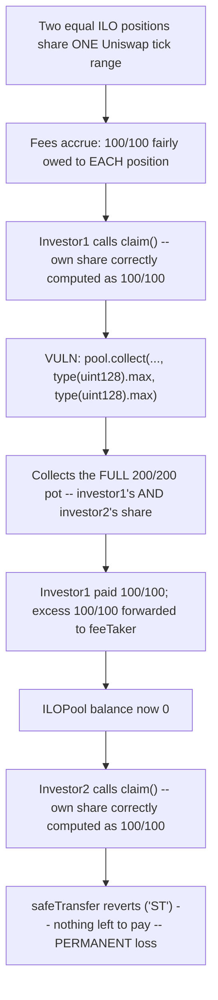
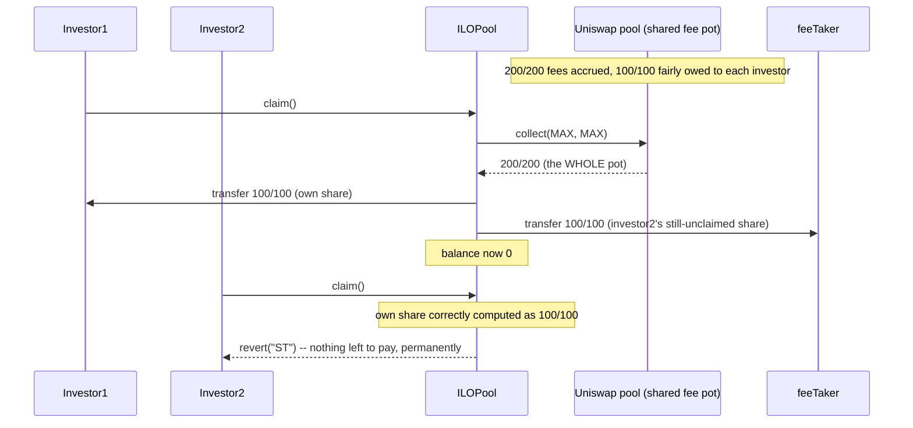

# Vultisig — most users won't be able to claim their share of Uniswap fees

> **Vulnerability classes:** vuln/accounting/shared-pool-drain · vuln/logic/max-collect-not-own-share · vuln/dos/fund-loss-cascading

> **Reproduction:** a self-contained Foundry PoC that compiles & runs in an
> isolated project with **only `forge-std`** — no fork, no RPC, no `anvil_state`.
> Full trace: [output.txt](output.txt). PoC:
> [test/35753-h-01-most-users-wont-be-able-to-claim-their-share-of-uniswap_exp.sol](test/35753-h-01-most-users-wont-be-able-to-claim-their-share-of-uniswap_exp.sol).

<!-- non-defihacklabs -->
<!-- source-auditvault: https://github.com/Auditware/AuditVault/blob/main/findings/35753-h-01-most-users-wont-be-able-to-claim-their-share-of-uniswap.md -->
<!-- date: 2024-06 -->

**AuditVault taxonomy:** `lang/solidity` · `platform/code4rena` · `has/github` · `has/poc` · `severity/high` · `sector/dex` · `sector/lending` · `sector/nft` · `sector/stable` · genome: `griefing` · `permanent` · `flashloan-callback-auth` · `integer-bounds`

---

## Key info

| | |
|---|---|
| **Impact** | **HIGH** — every claimant after the first permanently loses their rightful share of accumulated Uniswap fees; their `claim()` reverts forever once the shared fee pot is drained |
| **Protocol** | [Vultisig](https://code4rena.com/reports/2024-06-vultisig) — `ILOPool.sol`, the vesting NFT position contract for Vultisig's Initial Liquidity Offering (ILO) pools |
| **Vulnerable code** | `ILOPool.claim(uint256 tokenId)` — the `pool.collect(address(this), TICK_LOWER, TICK_UPPER, type(uint128).max, type(uint128).max)` call and the excess-forwarding lines right after it |
| **Bug class** | Shared-resource over-collection: computes an individual share correctly, then withdraws the WHOLE shared pot instead of just that share |
| **Finding** | Code4rena — Vultisig, 2024-06 · #35753 (H-01) · reporter **Ryonen** |
| **Report** | [2024-06-vultisig](https://code4rena.com/reports/2024-06-vultisig) |
| **Source** | [AuditVault](https://github.com/Auditware/AuditVault/blob/main/findings/35753-h-01-most-users-wont-be-able-to-claim-their-share-of-uniswap.md) |
| **Status** | Audit finding — caught in review (not exploited on-chain). Reproduced here as a standalone local PoC. |
| **Compiler** | `^0.8.24` (PoC) |

This is an **audit finding**, not a historical on-chain incident. The PoC
keeps `claim()`'s fee-collection block **verbatim** (the blamed
`pool.collect(..., type(uint128).max, type(uint128).max)` call and the two
`feeTaker` transfer lines) from `code-423n4/2024-06-vultisig` commit
`befb1b1`, `src/ILOPool.sol`. The liquidity-burn/vesting/platform-fee
machinery around it — irrelevant to this specific bug, which is purely about
the shared Uniswap fee pot — is dropped; each NFT position keeps a fixed
liquidity share and its own `feeGrowthInside` snapshot, exactly mirroring the
real accounting this bug exploits.

---

## TL;DR

1. Multiple ILO investor NFT positions share ONE underlying Uniswap V3
   position (same `TICK_LOWER`/`TICK_UPPER`), so they also share one pool of
   accrued swap fees.
2. `claim()` correctly computes the CALLING position's own fair share of
   those fees via `feeGrowthInside` deltas.
3. It then calls `pool.collect(..., type(uint128).max, type(uint128).max)`,
   which — per Uniswap V3 semantics — pays out the ENTIRE fee balance
   currently available for that tick range, not just the caller's own share.
4. The excess (`amountCollected - amount`) is forwarded to a fixed
   `feeTaker`, and `ILOPool`'s own token balance is now empty.
5. The NEXT position's `claim()` correctly computes a nonzero fair share —
   but `ILOPool` has nothing left to pay it with, and the `safeTransfer`
   reverts with `"ST"`. That position (and every position after it, in the
   worst case) can never claim its fees.
6. HARM in the PoC: with two equal-liquidity positions and 200 units of fees
   split 100/100, investor1's claim correctly pays them 100 but ALSO drains
   investor2's 100 to `feeTaker`; investor2's subsequent claim reverts
   permanently even though their own entitlement (100) is real and nonzero.

---

## The vulnerable code

Verbatim from the finding (`ILOPool.claim`, `code-423n4/2024-06-vultisig`
commit `befb1b1`, `src/ILOPool.sol` L242-L260):

```solidity
// real amount collected from uintswap pool
(uint128 amountCollected0, uint128 amountCollected1) = pool.collect(
    address(this),
    TICK_LOWER,
    TICK_UPPER,
@>  type(uint128).max,
@>  type(uint128).max
);
emit Collect(tokenId, address(this), amountCollected0, amountCollected1);

// transfer token for user
TransferHelper.safeTransfer(_cachedPoolKey.token0, ownerOf(tokenId), amount0);
TransferHelper.safeTransfer(_cachedPoolKey.token1, ownerOf(tokenId), amount1);

address feeTaker = IILOManager(MANAGER).FEE_TAKER();
// transfer fee to fee taker
TransferHelper.safeTransfer(_cachedPoolKey.token0, feeTaker, amountCollected0-amount0);
TransferHelper.safeTransfer(_cachedPoolKey.token1, feeTaker, amountCollected1-amount1);
```

**Fix** (per the finding): collect only the amount owed to THIS position
(`collect0`/`collect1`, tracked separately from the burn-principal amount),
never `type(uint128).max`.

---

## Root cause

`amount0`/`amount1` (the caller's own fair fee share) are computed correctly
from `feeGrowthInside` deltas. But Uniswap V3's `collect()` doesn't scope its
payout by "who is owed what" — it pays out up to `amount{0,1}Max` of
whatever fees are CURRENTLY sitting in the shared tick-range position,
regardless of which specific investor earned them. Passing
`type(uint128).max` requests "everything available," which necessarily
includes every OTHER investor's still-unclaimed share. Forwarding
`amountCollected - amount` to `feeTaker` then permanently removes those other
investors' fees from the pool.

---

## Preconditions

- Two or more ILO investor positions share the same tick range (true for
  every ILO pool with more than one participant).
- Any amount of Uniswap fees has accrued since the positions were opened
  (true for any pool that has seen swap activity).

No attacker role, no special timing — this occurs from completely ordinary
sequential use.

---

## Attack walkthrough

1. Investor1 and investor2 each hold an equal liquidity share in the same
   ILO pool's Uniswap position. A flash swap generates fees; 100 units in
   each token are fairly owed to each investor.
2. Investor1 calls `claim()`. Their own share is correctly computed as
   100/100.
3. `pool.collect(..., type(uint128).max, type(uint128).max)` pulls out the
   FULL 200/200 available — investor1's 100 and investor2's still-unclaimed
   100 — into `ILOPool`'s balance in one call.
4. `ILOPool` pays investor1 their 100/100, then forwards the remaining
   100/100 to `feeTaker`. Its own balance is now 0.
5. Investor2 calls `claim()`. Their own share is (correctly) computed as
   100/100 — but `ILOPool` holds nothing to pay it with. The transfer
   reverts with `"ST"`, permanently: no future claim can recover this share,
   since the tokens have already left the contract.

---

## Diagrams





## Remediation

```diff
+       uint128 collect0;
+       uint128 collect1;
        ...
-       (uint128 amountCollected0, uint128 amountCollected1) = pool.collect(
-           address(this), TICK_LOWER, TICK_UPPER, type(uint128).max, type(uint128).max
-       );
+       (uint128 amountCollected0, uint128 amountCollected1) = pool.collect(
+           address(this), TICK_LOWER, TICK_UPPER, collect0, collect1
+       );
```

Where `collect0`/`collect1` are accumulated from the burn-principal and
fee amounts actually owed to THIS position, not `type(uint128).max`.

## How to reproduce

```bash
cd ~/RustroverProjects/audits/evm-hack-registry/35753-h-01-most-users-wont-be-able-to-claim-their-share-of-uniswap_exp
forge test -vvv
# Fully local -- no fork, no RPC, no anvil_state required.
# Expected: both tests PASS:
#   test_second_investor_permanently_unable_to_claim_fees  (the bug: investor2's claim reverts)
#   test_control_fixed_version_both_investors_claim        (control: with the fix, both claim successfully)
```

## Sources

- AuditVault finding: [35753-h-01-most-users-wont-be-able-to-claim-their-share-of-uniswap.md](https://github.com/Auditware/AuditVault/blob/main/findings/35753-h-01-most-users-wont-be-able-to-claim-their-share-of-uniswap.md)
- Code4rena report: [2024-06-vultisig](https://code4rena.com/reports/2024-06-vultisig)
- Contest repo: [code-423n4/2024-06-vultisig](https://github.com/code-423n4/2024-06-vultisig) @ `befb1b1` — `src/ILOPool.sol` (`claim()`)
