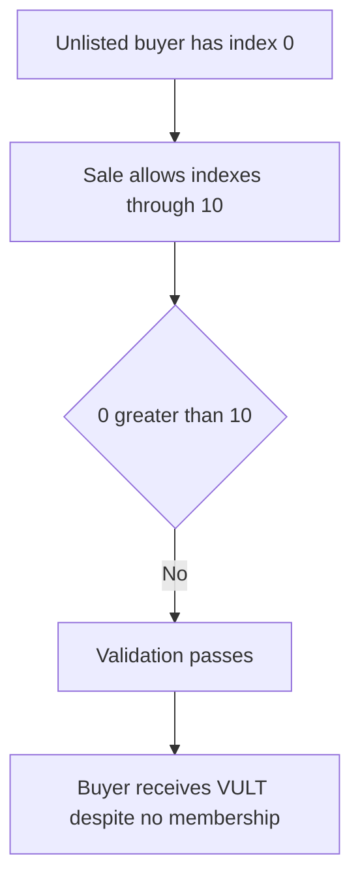

# Vultisig — whitelist index zero lets every unlisted buyer purchase

> **Vulnerability classes:** vuln/logic/wrong-condition · vuln/access-control/missing-validation · vuln/logic/missing-check

> **Reproduction:** self-contained Foundry PoC with no fork, RPC, or cheatcodes. Full trace: [output.txt](output.txt). Driver: [test/35754-h-02-vultisig-whitelisting-can-be-bypassed-by-anyone-code4re_exp.sol](test/35754-h-02-vultisig-whitelisting-can-be-bypassed-by-anyone-code4re_exp.sol).

<!-- non-defihacklabs -->
<!-- source-auditvault: https://github.com/Auditware/AuditVault/blob/main/findings/35754-h-02-vultisig-whitelisting-can-be-bypassed-by-anyone-code4re.md -->
<!-- date: 2024-06 -->

**AuditVault taxonomy:** `lang/solidity` · `sector/wallet` · `platform/code4rena` · `has/github` · `has/poc` · `severity/high` · genome: `wrong-condition` · `permanent` · `account-ownership`

## Key info

| | |
|---|---|
| **Impact** | **HIGH** — any account with the default whitelist index zero passes a launch gate configured for an index limit above zero. |
| **Protocol** | [Vultisig](https://code4rena.com/reports/2024-06-vultisig) |
| **Vulnerable code** | whitelist purchase validation |
| **Finding** | Code4rena Vultisig, 2024-06 · #35754 (H-02) · reporter **leegh** |
| **Status** | Audit finding; local reduction shows an unlisted buyer receiving 100 VULT. |
| **Compiler** | `^0.8.24` (local reduction) |

## TL;DR

The whitelist map returns zero for an account that has never been added. The
validation only rejects an index above the configured maximum. With a maximum of
10, index zero is not above the maximum, so an unlisted account passes exactly as
though it had a valid entry.

The local PoC enables a limit of 10, does not grant the attacker a whitelist
index, and completes a 100-token purchase. The asserted balance demonstrates the
launch restriction has been bypassed.

## The vulnerable code

```solidity
if (_allowedWhitelistIndex == 0 || _whitelistIndex[to] > _allowedWhitelistIndex) {
    revert NotWhitelisted();
} // @> VULN: default index zero passes when allowed index is nonzero
```

The predicate bounds only the upper edge of the accepted range; it never proves
that the caller has a membership index.

## Root cause

The sentinel value for missing membership overlaps the accepted range. The check
needs both an existence test and a range test, but only the range test is present.

## Preconditions

- A whitelist-limited sale has `_allowedWhitelistIndex > 0`.
- Unlisted accounts retain the default mapping value zero.
- The attacker can invoke the normal purchase route.

## Attack walkthrough

1. The sale operator configures an allowed whitelist index of 10.
2. The attacker remains absent from the whitelist and therefore reads index zero.
3. `0 > 10` is false, so the check does not revert.
4. The sale mints 100 VULT to the unwhitelisted attacker.

## Diagrams



## Remediation

Reject the zero sentinel in addition to values above the permitted index:

```solidity
uint256 index = _whitelistIndex[to];
if (_allowedWhitelistIndex == 0 || index == 0 || index > _allowedWhitelistIndex) {
    revert NotWhitelisted();
}
```

Use a separate boolean membership map where possible, and test the default mapping
value explicitly in whitelist tests.

## How to reproduce

```bash
cd /workspaces/RustroverProjects/audits/evm-hack-registry/35754-h-02-vultisig-whitelisting-can-be-bypassed-by-anyone-code4re_exp
forge test -vvv
```

## Sources

- [AuditVault finding #35754](https://github.com/Auditware/AuditVault/blob/main/findings/35754-h-02-vultisig-whitelisting-can-be-bypassed-by-anyone-code4re.md)
- [Code4rena Vultisig report](https://code4rena.com/reports/2024-06-vultisig)

*Reference: Code4rena Vultisig finding H-02, curated by AuditVault.*
