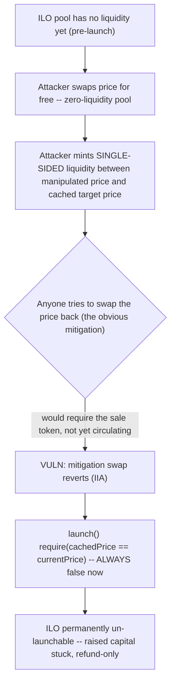
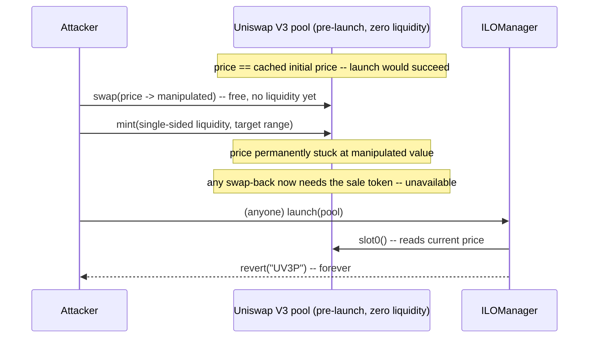

# Vultisig — adversary can prevent the launch of any ILO pool with enough raised capital, at any moment, by providing single-sided liquidity

> **Vulnerability classes:** vuln/oracle/spot-price-manipulation · vuln/dos/permanent-launch-block · vuln/uniswap-v3/single-sided-liquidity-lock

> **Reproduction:** a self-contained Foundry PoC that compiles & runs in an
> isolated project with **only `forge-std`** — no fork, no RPC, no `anvil_state`.
> Full trace: [output.txt](output.txt). PoC:
> [test/35755-h-03-adversary-can-prevent-the-launch-of-any-ilo-pool-with-e_exp.sol](test/35755-h-03-adversary-can-prevent-the-launch-of-any-ilo-pool-with-e_exp.sol).

<!-- non-defihacklabs -->
<!-- source-auditvault: https://github.com/Auditware/AuditVault/blob/main/findings/35755-h-03-adversary-can-prevent-the-launch-of-any-ilo-pool-with-e.md -->
<!-- date: 2024-06 -->

**AuditVault taxonomy:** `lang/solidity` · `platform/code4rena` · `has/github` · `has/poc` · `severity/high` · `sector/dex` · `sector/launchpad` · `sector/stable` · genome: `spot-price` · `data-corruption/price-manipulation` · `locked-funds` · `dos-resistance` · `oracle-manipulation-resistance` · `timestamp-dependence`

---

## Key info

| | |
|---|---|
| **Impact** | **HIGH** — any address can permanently prevent an ILO pool from launching, at any moment, for the cost of ~1 wei — even after the ILO fully raised its target capital |
| **Protocol** | [Vultisig](https://code4rena.com/reports/2024-06-vultisig) — `ILOManager.sol`, the launch coordinator for Vultisig's Initial Liquidity Offering (ILO) pools |
| **Vulnerable code** | `ILOManager.launch(address uniV3PoolAddress)` — the `require(_cachedProject[uniV3PoolAddress].initialPoolPriceX96 == sqrtPriceX96, "UV3P")` check |
| **Bug class** | Spot-price manipulation of a liquidity-less pool, compounded by an unmitigable single-sided-liquidity lock |
| **Finding** | Code4rena — Vultisig, 2024-06 · #35755 (H-03) · reporter **nnez** |
| **Report** | [2024-06-vultisig](https://code4rena.com/reports/2024-06-vultisig) |
| **Source** | [AuditVault](https://github.com/Auditware/AuditVault/blob/main/findings/35755-h-03-adversary-can-prevent-the-launch-of-any-ilo-pool-with-e.md) |
| **Status** | Audit finding — caught in review (not exploited on-chain). Reproduced here as a standalone local PoC. |
| **Compiler** | `^0.8.24` (PoC) |

This is an **audit finding**, not a historical on-chain incident. The PoC
keeps `launch()`'s price-equality gate **verbatim** (the blamed `@>` line)
from `code-423n4/2024-06-vultisig` commit `befb1b1`, `src/ILOManager.sol`.
The real Uniswap V3 pool (tick math, concentrated liquidity accounting) is
replaced by a minimal mock preserving exactly the two behaviors the bug
needs: a liquidity-less pool's price is freely swappable at zero cost, and
minting single-sided liquidity in the right range blocks any swap attempting
to move it back.

---

## TL;DR

1. `ILOManager.launch()` requires the ILO pool's CURRENT Uniswap V3 price to
   exactly equal the price cached when the project was initialized —
   otherwise it reverts with `"UV3P"`.
2. Before the ILO's own liquidity is added, the pool has NO liquidity, so
   ANY address can swap its price to anything, at zero cost.
3. Normally this would be trivially self-mitigated: swap the price back
   before calling `launch()`. But an attacker can also mint SINGLE-SIDED
   liquidity — supplying only the token on one side of the manipulated price
   — in a tick range straddling the manipulated price and the cached target
   price.
4. That liquidity makes swapping the price back require paying in the
   OTHER token (the sale token), which should not be circulating before
   launch. The mitigation itself becomes impossible.
5. `launch()` now reverts with `"UV3P"` forever, no matter how much capital
   the ILO raised, and no matter when the attack is repeated (the report
   notes it is especially damaging right at the end of a sale, after
   thousands of users have already paid gas to participate).
6. HARM in the PoC: manipulation + mitigation works fine before the attack
   (control), but after minting single-sided liquidity, the same mitigation
   swap reverts, and `launch()` permanently reverts with `"UV3P"`.

---

## The vulnerable code

Verbatim from the finding (`ILOManager.launch`,
`code-423n4/2024-06-vultisig` commit `befb1b1`, `src/ILOManager.sol` L187-L190):

```solidity
function launch(address uniV3PoolAddress) external override {
    require(block.timestamp > _cachedProject[uniV3PoolAddress].launchTime, "LT");
    (uint160 sqrtPriceX96, , , , , , ) = IUniswapV3Pool(uniV3PoolAddress).slot0();
@>  require(_cachedProject[uniV3PoolAddress].initialPoolPriceX96 == sqrtPriceX96, "UV3P");
    address[] memory initializedPools = _initializedILOPools[uniV3PoolAddress];
    require(initializedPools.length > 0, "NP");
    for (uint256 i = 0; i < initializedPools.length; i++) {
        IILOPool(initializedPools[i]).launch();
    }
    emit ProjectLaunch(uniV3PoolAddress);
}
```

**Fix** (per the finding): reserve some ILO liquidity for swapping back
before checking the price, or use a wrapper token around the sale token so
the price-equality dependency can be removed entirely.

---

## Root cause

An exact spot-price equality check is only safe if the price cannot be
manipulated by an outside party between project init and launch. Here it
provably can be — cheaply, at any time, by anyone — because the pool
legitimately has zero liquidity until the ILO's own launch flow adds it.
Worse, Uniswap V3's own single-sided-liquidity feature (perfectly normal
elsewhere) becomes a griefing primitive here: an attacker can lock the price
manipulation in place by making the "obvious" swap-back require a token
that, by design, is not supposed to exist outside the ILO contract before
launch.

---

## Preconditions

- An ILO project has been created and its target price cached (true for
  every ILO pool before launch).
- The Uniswap V3 pool has no liquidity yet from the ILO's own side (true
  before `launch()` succeeds — that's precisely when the pool gets its real
  liquidity).

No privileged role, no specific timing window (the attack can be repeated at
will), and negligible cost.

---

## Attack walkthrough

1. Before any attack, price manipulation on this fresh pool is trivially
   reversible: a swap moves the price down, and a second swap moves it back
   — `launch()` would succeed.
2. The ILO fully raises its target capital and is ready to launch.
3. The attacker swaps the pool's price away from the cached initial price —
   free, since the pool still has no liquidity.
4. The attacker mints single-sided liquidity (supplying only the raise
   token) in a tick range between the manipulated price and the cached
   target price — an ordinary, permissionless Uniswap V3 action, costing as
   little as 1 wei.
5. Anyone attempting the "obvious" mitigation (swap back to the cached
   price) now needs to supply the sale token to cross that liquidity — which
   is not circulating outside the ILO contract before launch. The mitigation
   swap reverts.
6. `launch()` is called: the pool's current price still does not match the
   cached initial price, so it reverts with `"UV3P"` — permanently. The
   ILO's raised capital is stuck; participants must fall back to
   `claimRefund()`.

---

## Diagrams





## Remediation

Per the finding's recommendations, either reserve ILO liquidity to swap
back to the target price before the check, or remove the price-equality
dependency entirely with a wrapper token:

```diff
    function launch(address uniV3PoolAddress) external override {
        require(block.timestamp > _cachedProject[uniV3PoolAddress].launchTime, "LT");
+       // Option A: swap a small reserved amount back toward the cached price first,
+       //           sized to make the attack prohibitively expensive to reverse.
+       // Option B: use a wrapper sale token minted/redeemed only at launch,
+       //           removing the dependency on live spot-price equality.
        (uint160 sqrtPriceX96, , , , , , ) = IUniswapV3Pool(uniV3PoolAddress).slot0();
        require(_cachedProject[uniV3PoolAddress].initialPoolPriceX96 == sqrtPriceX96, "UV3P");
        ...
    }
```

## How to reproduce

```bash
cd ~/RustroverProjects/audits/evm-hack-registry/35755-h-03-adversary-can-prevent-the-launch-of-any-ilo-pool-with-e_exp
forge test -vvv
# Fully local -- no fork, no RPC, no anvil_state required.
# Expected: both tests PASS:
#   test_launch_permanently_blocked_by_single_sided_liquidity  (the bug)
#   test_control_no_attack_launch_succeeds                     (control: no attack, launch works)
```

## Sources

- AuditVault finding: [35755-h-03-adversary-can-prevent-the-launch-of-any-ilo-pool-with-e.md](https://github.com/Auditware/AuditVault/blob/main/findings/35755-h-03-adversary-can-prevent-the-launch-of-any-ilo-pool-with-e.md)
- Code4rena report: [2024-06-vultisig](https://code4rena.com/reports/2024-06-vultisig)
- Contest repo: [code-423n4/2024-06-vultisig](https://github.com/code-423n4/2024-06-vultisig) @ `befb1b1` — `src/ILOManager.sol` (`launch()`)
