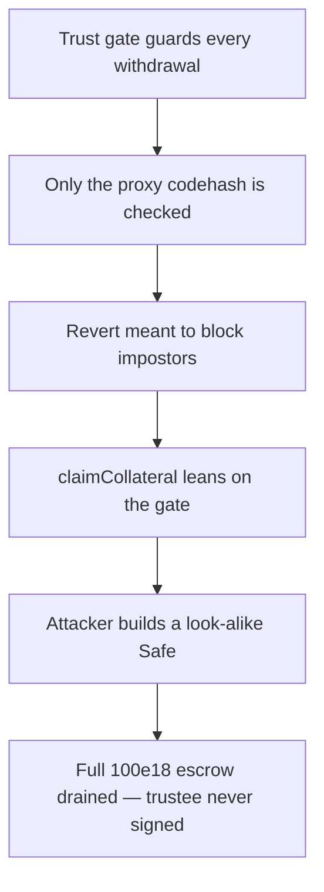

# Catalyst: `checkIfBeneficiaryIsATrustedSafe` validates only the Safe proxy codehash

> **Vulnerability classes:** vuln/theft · vuln/access-control · vuln/logic
>
> **Reproduction:** a faithful minimal reproduction of the vulnerable finding — the `checkIfBeneficiaryIsATrustedSafe` trust gate is reproduced **verbatim** (marked `@>`) with faithful minimal doubles; local deploy, no fork.

<!-- source-auditvault: https://github.com/pashov/audits/blob/master/team/md/Catalyst-security-review-april.md -->

## Root cause

`IPSeedTrust.checkIfBeneficiaryIsATrustedSafe` gates every collateral/fee withdrawal (`claimCollateral`, `projectSucceeded`) on the beneficiary being a genuine 2/2 Gnosis Safe co-owned by the `protocolTrustee`. But it only compares the beneficiary **proxy's** codehash to `SAFE_PROXY_130_CODEHASH` and then trusts the `getThreshold()`/`getOwners()`/`isOwner()` values that same proxy returns — it never validates the singleton the proxy delegatecalls to. The vulnerable check, reproduced verbatim from the audited source:

```solidity
  function checkIfBeneficiaryIsATrustedSafe(address beneficiary) public view {
    if (protocolTrustee == address(0)) {
      return; //when no trustee is configured, we're not checking for Safe accounts
    }
    IOwnerManager ownerManager = IOwnerManager(beneficiary);

    if (
@>    beneficiary.codehash != SAFE_PROXY_130_CODEHASH || ownerManager.getThreshold() != 2 // @audit check codehash = SAFE_PROXY_130_CODEHASH not ensure the Gnosis Safe is trusted.
        || ownerManager.getOwners().length != 2 || !ownerManager.isOwner(protocolTrustee)
    ) {
      revert BeneficiaryIsNotTrustful();
    }
  }
```

A Gnosis Safe proxy holds no logic of its own: its singleton address lives in proxy storage slot 0 and every call is delegatecalled to that singleton. Two v1.3.0 proxies pointing at *different* singletons therefore have **identical runtime code and identical codehash**. Checking only the proxy codehash cannot distinguish an honest Safe from one wired to a malicious singleton.

## Why it's exploitable here

Following the finding's `MaliciousGnosisSafe` construction:

1. The attacker deploys a genuine canonical v1.3.0 `GnosisSafeProxy` — so its codehash equals `SAFE_PROXY_130_CODEHASH` exactly — but points it at a **malicious singleton** they control.
2. The malicious singleton lies on the reads the gate depends on: `getThreshold()` returns `2`, `getOwners()` returns `[protocolTrustee, attacker]`, and `isOwner(protocolTrustee)` returns `true`. Every branch of the `if` is satisfied, so `checkIfBeneficiaryIsATrustedSafe` passes — even though the `protocolTrustee` has no real control.
3. The protocol has escrowed `COLLATERAL = 100e18` behind that beneficiary. The attacker calls `claimCollateral()`; the flawed gate passes and the full `100e18` is released to the attacker's Safe.
4. The attacker, as sole real controller, sweeps the drained collateral to itself. `trusteeApprovals` stays `0` — the 2/2 trust requirement was bypassed entirely and `profit == 100e18`.

## Attack path



## Marked-line walkthrough (Playground)

The EVM Playground pins each step to the exact executed source line in `IPSeedTrus…`:

1. **L212** — Trust gate guards every withdrawal: This trust check gates every collateral and fee withdrawal, meant to confirm the beneficiary is a real 2/2 Safe co-owned by the protocol trustee.
2. **L219** — Only the proxy codehash is checked: Root cause: it compares only the Safe proxy's codehash and trusts the owners/threshold the proxy reports, never validating the singleton behind it.
3. **L222** — Revert meant to block impostors: This revert should reject any untrusted beneficiary, but the malicious Safe reports every expected field, so the guard is skipped and execution proceeds.
4. **L230** — claimCollateral leans on the gate: The withdrawal path runs the same flawed trust check before releasing escrow, so passing it hands the project's collateral to the attacker's Safe.
5. **L239** — Attacker builds a look-alike Safe: Setup: the driver deploys a genuine v1.3.0 proxy over a malicious singleton, identical codehash to an honest Safe, clearing the check with no trustee approval.
6. **L242** — Exploit driver wires the pieces: Setup: the Exploit contract assembles the token, an honest reference Safe, the vulnerable IPSeedTrust, and the attacker-controlled malicious Safe.
7. **L250** — High-trust trustee that never signs: Setup: PROTOCOL_TRUSTEE is the high-trust wallet the 2/2 gate is supposed to require, yet it signs and approves nothing throughout the attack.
8. **L252** — Full project escrow at stake: Setup: COLLATERAL is the 100e18 of escrowed collateral and fees the attacker drains once the bypassed trust check lets the withdrawal through.

## PoC

Registry (Foundry, local deploy — verbatim vulnerable source + harm-asserting test):

```bash
cd 36310-c-01-withdrawing-collateral-and-fees-and-bypassing-trust-saf_exp && forge test -vvv
```

The browser Playground replays the same synthetic opcode-for-opcode and measures the harm: **a genuine v1.3.0 proxy over a malicious singleton clears the codehash-only trust gate, then `claimCollateral` drains the full 100e18 project escrow with zero `protocolTrustee` approvals**. Both gates are green (registry `forge test` PASS + Playground `_verify-poc` **VERDICT: PASS**).
