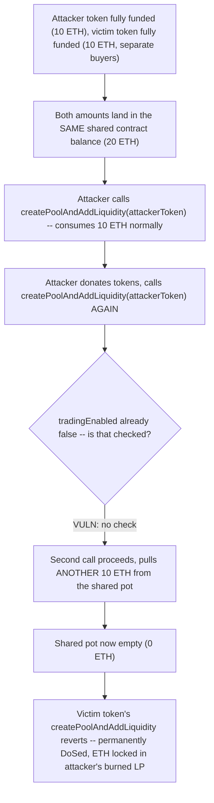
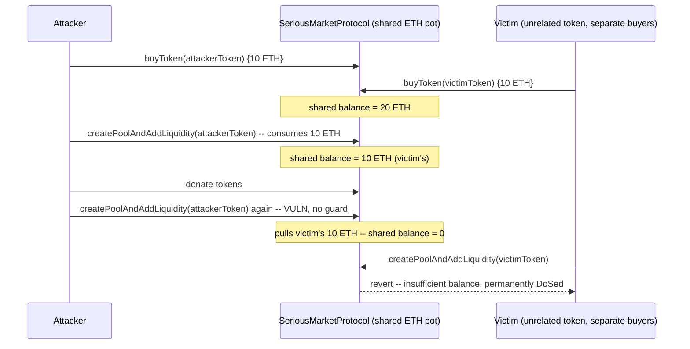

# Serious — locking other tokens' collected ETH by triggering `createPoolAndAddLiquidity` twice

> **Vulnerability classes:** vuln/access-control/missing-state-guard · vuln/accounting/shared-pot-drain · vuln/dos/fund-lock

> **Reproduction:** a self-contained Foundry PoC that compiles & runs in an
> isolated project with **only `forge-std`** — no fork, no RPC, no `anvil_state`.
> Full trace: [output.txt](output.txt). PoC:
> [test/36317-c-01-locking-collected-eth-by-triggering-createpoolandaddliq_exp.sol](test/36317-c-01-locking-collected-eth-by-triggering-createpoolandaddliq_exp.sol).

<!-- non-defihacklabs -->
<!-- source-auditvault: https://github.com/Auditware/AuditVault/blob/main/findings/36317-c-01-locking-collected-eth-by-triggering-createpoolandaddliq.md -->
<!-- date: 2024-06 -->

**AuditVault taxonomy:** `lang/solidity` · `platform/pashov` · `has/github` · `has/poc` · `severity/high` · `sector/dex` · `sector/token` · genome: `single-function` · `use-reentrancy-guard` · `permanent` · `reentrancy-guard`

---

## Key info

| | |
|---|---|
| **Impact** | **HIGH** — an attacker can permanently lock ANY other token's collected ETH into their own (burned) LP position for negligible cost, DoSing that token's own launch |
| **Protocol** | **Serious** market protocol — a bonding-curve-style token launcher that graduates fully-funded tokens into a Uniswap V3 pool |
| **Vulnerable code** | `SeriousMarketProtocol.createPoolAndAddLiquidity(address tokenAddress)` — sets `tradingEnabled = false` without checking it was still `true` |
| **Bug class** | Missing "already disabled" guard on a function that spends from a SHARED resource pool |
| **Finding** | Pashov Audit Group — Serious-security-review · #36317 (C-01) |
| **Report** | [pashov/audits — Serious-security-review.md](https://github.com/pashov/audits/blob/master/team/md/Serious-security-review.md) |
| **Source** | [AuditVault](https://github.com/Auditware/AuditVault/blob/main/findings/36317-c-01-locking-collected-eth-by-triggering-createpoolandaddliq.md) |
| **Status** | Audit finding — caught in review (not exploited on-chain). Reproduced here as a standalone local PoC. |
| **Compiler** | `^0.8.24` (PoC) |

This is an **audit finding**, not a historical on-chain incident. The client
repo for "Serious" is not publicly linked from the Pashov report (a common
situation for private-client Pashov reviews); this PoC is reduced directly
from the finding's own quoted `createPoolAndAddLiquidity` function and coded
PoC, matching this project's Class-C fallback for audits whose client repo
cannot be located. Uniswap V3's factory/position-manager/WETH are replaced
with minimal mocks preserving exactly the behavior the bug needs: a shared
ETH pot funded by every token's buyers, and a fixed per-pool ETH/token amount
pulled from it on every call.

---

## TL;DR

1. Every token's buyers pay ETH into the SAME `SeriousMarketProtocol`
   contract balance while their token is being funded.
2. Once a token is fully funded, anyone can call
   `createPoolAndAddLiquidity(tokenAddress)`, which pulls a fixed ETH amount
   out of that SHARED balance, converts it to WETH, and adds liquidity to a
   Uniswap V3 pool for that token — then burns the LP, permanently locking
   the ETH.
3. The function sets `tradingEnabled = false` at the top, but never checks
   that it was still `true` beforehand — so it can be called again for the
   SAME token.
4. An attacker fully funds their own token, calls
   `createPoolAndAddLiquidity` once (spending their own ETH), donates back
   enough of their own token, then calls it AGAIN. The second call pulls
   ANOTHER fixed ETH amount out of the shared pot — but the attacker's own
   contribution is already spent, so this ETH actually belongs to a
   completely unrelated, separately-funded token.
5. HARM in the PoC: a victim token is fully funded with 10 ETH from its own
   buyers. After the attacker's double-call on their own token, the shared
   pot is drained to zero, and the victim token's own
   `createPoolAndAddLiquidity` call reverts — permanently DoSing that
   token's launch, with its buyers' ETH locked forever in the attacker's
   burned LP position.

---

## The vulnerable code

Verbatim from the finding (`SeriousMarketProtocol.createPoolAndAddLiquidity`,
Pashov Audit Group, Serious-security-review):

```solidity
function createPoolAndAddLiquidity(address tokenAddress) external nonReentrant returns (address) {
    TokenData memory tokenData = tokenDatas[tokenAddress];
    require(tokenData.token != ERC20Token(address(0)), "Token does not exist");
    require(tokenData.tokensSold >= tradeableSupply, "Not enough tokens sold to create pool");

    uint256 ethAmount = totalLiquidity - poolCreationReward;
    uint256 tokenAmount = _getFractionalTokens(reservedSupply);

@>  // Disable trading on token
@>  tokenDatas[tokenAddress].tradingEnabled = false;

    // Convert ETH from contract to WETH
    weth.deposit{value: ethAmount}();

    // Approve the router to spend tokens
    SafeTransferLib.safeApprove(tokenData.token, address(positionManager), tokenAmount);
    require(weth.approve(address(positionManager), ethAmount), "Failed to approve WETH");

    // Create the pool if it doesn't already exist
    address pool = uniswapFactory.getPool(address(weth), tokenAddress, poolFee);
    if (pool == address(0)) {
        pool = uniswapFactory.createPool(address(weth), tokenAddress, poolFee);
        uint160 sqrtPriceX96 = tokenAddress < address(weth) ? sqrtPriceX96WETHToken1 : sqrtPriceX96ERC20Token1;
        IUniswapV3Pool(pool).initialize(sqrtPriceX96);
    }

    (uint256 tokenId, uint128 liquidity, uint256 amount0, uint256 amount1) = positionManager.mint(params);

    // Burn the LP token -- don't use safe transfer because it's a contract that doesn't implement receiver
    positionManager.transferFrom(address(this), customNullAddress, tokenId);

    return address(pool);
}
```

**Fix** (per the finding): "Add an additional check inside
`createPoolAndAddLiquidity`. if `tradingEnabled` is false, revert the
operation."

---

## Root cause

`nonReentrant` guards against *reentrant* re-entry within a single external
call chain, but this bug is a plain *sequential* re-entry: nothing stops the
function from being called a second time in an entirely separate
transaction, once trading has already been disabled. `tradingEnabled` is
written unconditionally rather than read-checked-then-written, so it can
never actually gate anything.

---

## Preconditions

- A token has already been fully funded and had its pool created once
  (`tokenData.tokensSold >= tradeableSupply` remains true forever after).
- The attacker can supply `tokenAmount` more of their own token back to the
  contract (a donation/transfer — the token is freely mintable/transferable
  by its own holders).

No privileged role. The attack can be repeated by the SAME token's creator
at any later time, against ANY other token's freshly-collected ETH.

---

## Attack walkthrough

1. Attacker fully funds their own token and calls
   `createPoolAndAddLiquidity` once — spending their own 10 ETH normally,
   locking it into a pool + burned LP.
2. Separately, and with no attacker involvement, a completely unrelated
   token is fully funded by its own buyers, contributing another 10 ETH
   into the SAME contract balance.
3. The attacker donates back `tokenAmount` of their own token to the
   contract, then calls `createPoolAndAddLiquidity` for their OWN token a
   SECOND time.
4. No check stops this: `tradingEnabled` is set to `false` again (it already
   was), and the function proceeds to pull ANOTHER 10 ETH out of the shared
   balance and lock it into a (new) burned LP position tied to the
   attacker's token.
5. The shared pot is now empty. When the unrelated victim token's own
   `createPoolAndAddLiquidity` is finally called, the WETH deposit reverts
   for lack of balance — that token can never launch, and its buyers' ETH is
   permanently locked in the attacker's LP instead.

---

## Diagrams





## Remediation

```diff
    function createPoolAndAddLiquidity(address tokenAddress) external nonReentrant returns (address) {
        TokenData memory tokenData = tokenDatas[tokenAddress];
        require(tokenData.token != ERC20Token(address(0)), "Token does not exist");
        require(tokenData.tokensSold >= tradeableSupply, "Not enough tokens sold to create pool");
+       require(tokenData.tradingEnabled, "Already disabled");

        // Disable trading on token
        tokenDatas[tokenAddress].tradingEnabled = false;
        ...
    }
```

## How to reproduce

```bash
cd ~/RustroverProjects/audits/evm-hack-registry/36317-c-01-locking-collected-eth-by-triggering-createpoolandaddliq_exp
forge test -vvv
# Fully local -- no fork, no RPC, no anvil_state required.
# Expected: both tests PASS:
#   test_second_pool_creation_locks_other_tokens_eth  (the bug: victim's ETH gets drained/locked)
#   test_control_fixed_version_blocks_second_call     (control: with the fix, the second call reverts)
```

## Sources

- AuditVault finding: [36317-c-01-locking-collected-eth-by-triggering-createpoolandaddliq.md](https://github.com/Auditware/AuditVault/blob/main/findings/36317-c-01-locking-collected-eth-by-triggering-createpoolandaddliq.md)
- Pashov report: [Serious-security-review.md](https://github.com/pashov/audits/blob/master/team/md/Serious-security-review.md)
- Client repo: not publicly linked from the report; this PoC is reduced from the finding's own quoted `SeriousMarketProtocol.createPoolAndAddLiquidity` source and coded PoC.
