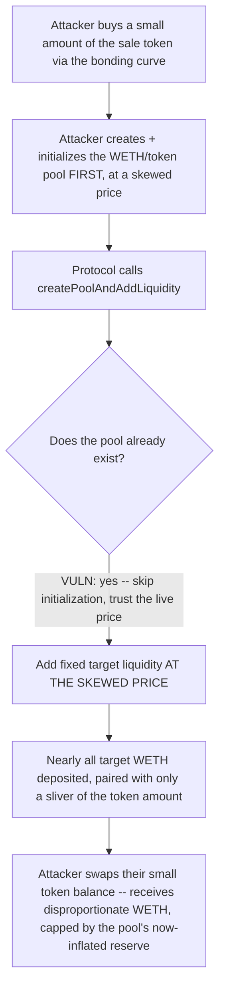
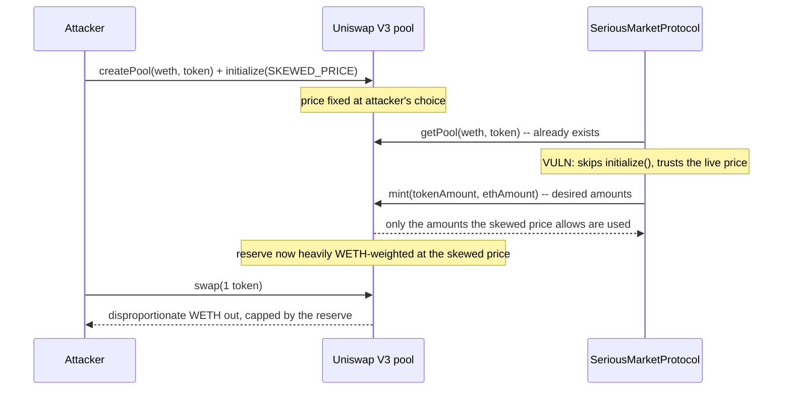

# Serious — Uniswap's pool can be initialized with a different price

> **Vulnerability classes:** vuln/oracle/spot-price-manipulation · vuln/dex/front-run-pool-init · vuln/logic/unverified-external-state

> **Reproduction:** a self-contained Foundry PoC that compiles & runs in an
> isolated project with **only `forge-std`** — no fork, no RPC, no `anvil_state`.
> Full trace: [output.txt](output.txt). PoC:
> [test/36318-c-02-uniswaps-pool-can-be-initialized-with-a-different-price_exp.sol](test/36318-c-02-uniswaps-pool-can-be-initialized-with-a-different-price_exp.sol).

<!-- non-defihacklabs -->
<!-- source-auditvault: https://github.com/Auditware/AuditVault/blob/main/findings/36318-c-02-uniswaps-pool-can-be-initialized-with-a-different-price.md -->
<!-- date: 2024-06 -->

**AuditVault taxonomy:** `lang/solidity` · `platform/pashov` · `has/github` · `has/poc` · `severity/high` · `sector/dex` · `sector/options` · `sector/token` · genome: `spot-price` · `data-corruption/price-manipulation` · `frontrun` · `frontrun-exposure` · `oracle-manipulation-resistance`

---

## Key info

| | |
|---|---|
| **Impact** | **HIGH** — an attacker can front-run pool creation to set an arbitrary price, then drain a large, disproportionate amount of WETH from the liquidity the protocol itself deposits |
| **Protocol** | **Serious** market protocol — a bonding-curve-style token launcher that graduates fully-funded tokens into a Uniswap V3 pool |
| **Vulnerable code** | `SeriousMarketProtocol.createPoolAndAddLiquidity(address tokenAddress)` — the "create the pool only if it doesn't already exist" branch |
| **Bug class** | Trusting unverified external state: the price of an already-existing pool is never checked against the protocol's intended target before liquidity is added |
| **Finding** | Pashov Audit Group — Serious-security-review · #36318 (C-02) |
| **Report** | [pashov/audits — Serious-security-review.md](https://github.com/pashov/audits/blob/master/team/md/Serious-security-review.md) |
| **Source** | [AuditVault](https://github.com/Auditware/AuditVault/blob/main/findings/36318-c-02-uniswaps-pool-can-be-initialized-with-a-different-price.md) |
| **Status** | Audit finding — caught in review (not exploited on-chain). Reproduced here as a standalone local PoC. |
| **Compiler** | `^0.8.24` (PoC) |

This is an **audit finding**, not a historical on-chain incident. The client
repo for "Serious" is not publicly linked from the Pashov report; this PoC
is reduced directly from the finding's own quoted
`createPoolAndAddLiquidity` function and coded PoC, matching this project's
Class-C fallback for audits whose client repo cannot be located. Uniswap
V3's tick math / concentrated liquidity is replaced with a minimal mock that
preserves exactly the economics the bug needs: a mint that only deposits
what the CURRENT price allows, and a swap whose payout scales with that same
price, capped by the pool's real reserves.

---

## TL;DR

1. `createPoolAndAddLiquidity` creates AND initializes the Uniswap V3 pool
   **only if it doesn't already exist**.
2. Anyone can create and initialize a Uniswap V3 pool for any token pair, at
   any price, at any time — including BEFORE the protocol's own call.
3. If the pool already exists when the protocol calls this function, the
   protocol skips initialization entirely and just adds its FIXED target
   liquidity amounts (a set WETH amount, a set token amount) — at whatever
   price is already live.
4. At an extreme price, Uniswap's concentrated-liquidity math deposits
   nearly ALL of the target WETH, paired with only a tiny sliver of the sale
   token — the rest of the token amount goes undeployed.
5. An attacker who holds even 1 unit of the sale token (bought cheaply
   beforehand via the bonding curve) can then swap it for a hugely
   disproportionate amount of WETH — up to the pool's now-inflated reserve,
   which the protocol's OWN deposit just created.
6. HARM in the PoC: the finding's own console output shows roughly 1 gwei
   spent buying 1 token, then ~7.03 WETH received back from the skewed pool.
   This reduction reproduces the same mechanism and a comparable ratio: the
   protocol deposits 10 ETH of target liquidity against a sliver of token at
   a 7x-skewed price, and the attacker's 1-token swap drains 7 of those 10
   ETH.

---

## The vulnerable code

Verbatim from the finding (`SeriousMarket.createPoolAndAddLiquidity`, Pashov
Audit Group, Serious-security-review):

```solidity
function createPoolAndAddLiquidity(address tokenAddress) external nonReentrant returns (address) {
    ...
    // Create the pool if it doesn't already exist
@>  address pool = uniswapFactory.getPool(address(weth), tokenAddress, poolFee);
@>  if (pool == address(0)) {
@>      pool = uniswapFactory.createPool(address(weth), tokenAddress, poolFee);
@>      uint160 sqrtPriceX96 = tokenAddress < address(weth) ? sqrtPriceX96WETHToken1 : sqrtPriceX96ERC20Token1;
@>      IUniswapV3Pool(pool).initialize(sqrtPriceX96);
@>  }

    // Mint parameters for providing liquidity
    // ...

    // Add liquidity
    (uint256 tokenId, uint128 liquidity, uint256 amount0, uint256 amount1) = positionManager.mint(params);
    ...
}
```

**Fix** (per the finding): create the token AND pool atomically inside this
function (removing the front-run window entirely), or use a wrapper token
with internal accounting until the pool has been safely initialized — and
remove the "if it doesn't exist" check, passing a `create2` salt so the
function is never a silent no-op.

---

## Root cause

The function treats "the pool already exists" as equivalent to "the pool is
at the price we expect." Those are unrelated facts: pool CREATION is
permissionless in Uniswap V3, and the resulting price is whatever the
FIRST caller to initialize it chose. Because there is no check comparing the
live price to any intended value, and no atomicity between token creation and
pool creation, an attacker gets a free window to set the price before the
protocol's liquidity is added at that price.

---

## Preconditions

- The attacker can create and initialize the WETH/sale-token pool before the
  protocol calls `createPoolAndAddLiquidity` (always possible — pool
  creation is permissionless and the protocol has no way to reserve the pool
  address in advance without a `create2` salt).
- The attacker holds at least a small amount of the sale token (bought
  cheaply beforehand via the bonding curve, before the pool exists).

No privileged role, and the cost is negligible (Uniswap pool creation +
initialization + minting a tiny amount of the sale token).

---

## Attack walkthrough

1. Before the protocol ever calls `createPoolAndAddLiquidity`, the attacker
   creates and initializes the WETH/sale-token pool themselves, choosing an
   extreme price.
2. The protocol later calls `createPoolAndAddLiquidity`. It checks whether
   the pool exists — it does — so it skips initialization and proceeds
   straight to adding liquidity, at the attacker's price, with no check.
3. At that skewed price, the protocol's fixed liquidity targets (a set WETH
   amount, a set token amount) resolve to: nearly all of the WETH gets
   deposited, paired with only a tiny fraction of the token amount. The rest
   of the token amount stays undeployed.
4. The attacker swaps their small pre-bought token balance into the pool.
   At the skewed price, this yields a hugely disproportionate amount of WETH
   — capped only by the pool's now-inflated WETH reserve, which the
   protocol's own deposit just created.

---

## Diagrams





## Remediation

Per the finding's recommendations, remove the front-run window by making
token/pool creation atomic and dropping the silent "already exists" no-op:

```diff
-   address pool = uniswapFactory.getPool(address(weth), tokenAddress, poolFee);
-   if (pool == address(0)) {
-       pool = uniswapFactory.createPool(address(weth), tokenAddress, poolFee);
-       uint160 sqrtPriceX96 = tokenAddress < address(weth) ? sqrtPriceX96WETHToken1 : sqrtPriceX96ERC20Token1;
-       IUniswapV3Pool(pool).initialize(sqrtPriceX96);
-   }
+   // Create the token itself (or a wrapper) and the pool atomically inside
+   // this same function/transaction, using a `create2` salt so the pool
+   // address cannot be pre-computed and pre-empted, and so this step is
+   // never a silent no-op against an attacker-controlled existing pool.
```

## How to reproduce

```bash
cd ~/RustroverProjects/audits/evm-hack-registry/36318-c-02-uniswaps-pool-can-be-initialized-with-a-different-price_exp
forge test -vvv
# Fully local -- no fork, no RPC, no anvil_state required.
# Expected: both tests PASS:
#   test_attacker_drains_disproportionate_weth_via_skewed_price  (the bug)
#   test_control_no_front_run_price_is_normal                    (control: no front-run, normal payout)
```

## Sources

- AuditVault finding: [36318-c-02-uniswaps-pool-can-be-initialized-with-a-different-price.md](https://github.com/Auditware/AuditVault/blob/main/findings/36318-c-02-uniswaps-pool-can-be-initialized-with-a-different-price.md)
- Pashov report: [Serious-security-review.md](https://github.com/pashov/audits/blob/master/team/md/Serious-security-review.md)
- Client repo: not publicly linked from the report; this PoC is reduced from the finding's own quoted `SeriousMarket.createPoolAndAddLiquidity` source and coded PoC.
