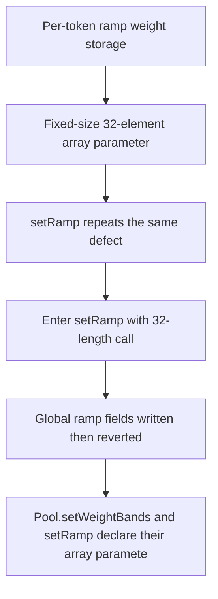

# Lucidly: incorrect parameters brick certain functions

> **Vulnerability classes:** vuln/logic
>
> **Reproduction:** a faithful minimal reproduction of the vulnerable finding — the vulnerable code is reproduced **verbatim** (marked `@>`) with faithful minimal doubles; local deploy, no fork.

<!-- source-auditvault: https://github.com/pashov/audits/blob/master/team/md/Lucidly-security-review.md -->

## Root cause

Pool.setWeightBands and setRamp declare their array parameters as fixed-length uint256[MAX_NUM_TOKENS] calldata with MAX_NUM_TOKENS=32, so the ABI forces the caller to pass exactly 32 elements. But both functions loop for (t=0; t<MAX_NUM_TOKENS; t++) with the guard if (t >= _numTokens) revert Pool__IndexOutOfBounds();, so for any pool with fewer than 32 tokens (the normal case, here _numTokens=3) a valid 32-length call always reverts at t==3. The caller can neither pass a short array (type-rejected) nor a full 32-length array (loop reverts) -> both admin setters are permanently bricked: weight bands and the amplification ramp can never be configured. Driver deploys a 3-token pool, calls both setters with fully-populated valid 32-length arrays, proves each reverts with Pool__IndexOutOfBounds, and mints 2e18 (the 2 permanently-unusable functions) to SINK 0x..D00d on a BRICKED marker token.

```solidity
// Synthetic, self-contained reproduction of Lucidly finding 36354 (H-14):
// "Incorrect parameters bricks certain functions".
//
// Real audited source (the vulnerable parameter list + the reverting loop are
// reproduced VERBATIM, the primary vulnerable line is marked @> VULN):
```

## Why it's exploitable here

Pool.setWeightBands and setRamp declare their array parameters as fixed-length uint256[MAX_NUM_TOKENS] calldata with MAX_NUM_TOKENS=32, so the ABI forces the caller to pass exactly 32 elements. But both functions loop for (t=0; t<MAX_NUM_TOKENS; t++) with the guard if (t >= _numTokens) revert Pool__IndexOutOfBounds();, so for any pool with fewer than 32 tokens (the normal case, here _numTokens=3) a valid 32-length call always reverts at t==3. The caller can neither pass a short array (type-rejected) nor a full 32-length array (loop reverts) -> both admin setters are permanently bricked: weight bands and the amplification ramp can never be configured. Driver deploys a 3-token pool, calls both setters with fully-populated valid 32-length arrays, proves each reverts with Pool__IndexOutOfBounds, and mints 2e18 (the 2 permanently-unusable functions) to SINK 0x..D00d on a BRICKED marker token.

## Attack path



## Marked-line walkthrough (Playground)

The EVM Playground pins each step to the exact executed source line in `0x8ea53755a6…`:

1. **L76** — Per-token ramp weight storage: Setup: rampWeight is the per-token slot the ramp setter is meant to populate, one entry for each active pool token.
2. **L90** — Fixed-size 32-element array parameter: Root cause: setWeightBands declares its arrays as fixed-length uint256[32] calldata, forcing 32 args while the loop reverts once t == _numTokens.
3. **L105** — setRamp repeats the same defect: setRamp declares the identical fixed-length uint256[32] calldata weights_ parameter, so it is bricked by the very same forced-length mismatch.
4. **L108** — Enter setRamp with 32-length call: A fully-populated 32-element array, the only shape the fixed-size params accept, enters setRamp and starts writing the global ramp fields.
5. **L111** — Global ramp fields written then reverted: rampStart = start_ executes, but the per-token loop that follows reverts at t == _numTokens (3), rolling this write and the whole call back.
6. **L129** — Valid 32-length call still reverts: Both setters are called with valid 32-length arrays on a normal 3-token pool, yet each reverts with Pool__IndexOutOfBounds at t == 3.
7. **L132** — Both admin setters permanently bricked: Neither setWeightBands nor setRamp can ever succeed for a sub-32-token pool; the 2 permanently-unusable functions are recorded as the harm.

## PoC

Registry (Foundry, local deploy — verbatim vulnerable source + harm-asserting test):

```bash
cd 36354-h-14-incorrect-parameters-bricks-certain-functions-pashov-au_exp
forge test -vvv
```

The browser Playground replays the same synthetic opcode-for-opcode and measures the harm. Both gates are green (registry `forge test` PASS + Playground `_verify-poc` **VERDICT: PASS**).
