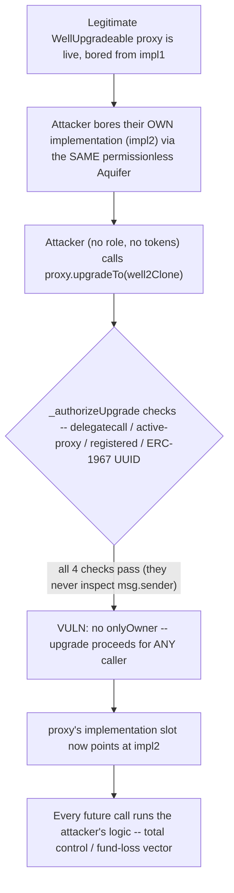
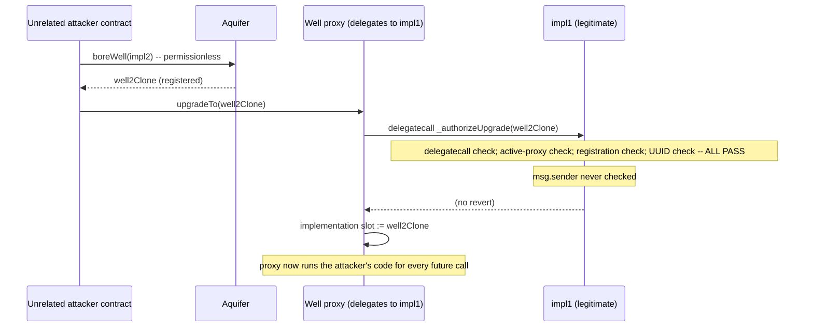

# Basin — `WellUpgradeable` can be upgraded by anyone

> **Vulnerability classes:** vuln/access-control/missing-caller-check · vuln/upgradeable/unauthorized-uups-upgrade · vuln/governance/admin-takeover

> **Reproduction:** a self-contained Foundry PoC that compiles & runs in an
> isolated project with **only `forge-std`** — no fork, no RPC, no `anvil_state`.
> Full trace: [output.txt](output.txt). PoC:
> [test/36913-h-01-wellupgradeable-can-be-upgraded-by-anyone-code4rena-bas_exp.sol](test/36913-h-01-wellupgradeable-can-be-upgraded-by-anyone-code4rena-bas_exp.sol).

<!-- non-defihacklabs -->
<!-- source-auditvault: https://github.com/Auditware/AuditVault/blob/main/findings/36913-h-01-wellupgradeable-can-be-upgraded-by-anyone-code4rena-bas.md -->
<!-- date: 2024-07 -->

**AuditVault taxonomy:** `lang/solidity` · `platform/code4rena` · `has/github` · `has/poc` · `severity/high` · `vuln/dependency/upgradeable-contract` · `novelty/variant` · `misassumption/external-call-is-safe` · `fix/upgrade-dependency` · genome: `upgradeable-contract` · `variant` · `admin-takeover` · `access-roles` · `upgrade-safety` · `vote-delegation-loop`

---

## Key info

| | |
|---|---|
| **Impact** | **HIGH** — any address, with no role whatsoever, can upgrade a live `WellUpgradeable` to an arbitrary implementation, handing an attacker total control of the Well and every token it custodies |
| **Protocol** | [Basin](https://code4rena.com/reports/2024-07-basin) — BeanstalkFarms' upgradeable constant-function-AMM (`Well`/`WellUpgradeable`), audited under contest repo `code-423n4/2024-07-basin` |
| **Vulnerable code** | `WellUpgradeable._authorizeUpgrade(address newImplmentation)` — the UUPS upgrade-authorization hook |
| **Bug class** | Missing access control: a `_authorizeUpgrade` override that checks *what* is being upgraded to, but never *who* is calling |
| **Finding** | Code4rena — Basin, 2024-07 · #36913 (H-01) · reporter **0xvd** |
| **Report** | [2024-07-basin](https://code4rena.com/reports/2024-07-basin) |
| **Source** | [AuditVault](https://github.com/Auditware/AuditVault/blob/main/findings/36913-h-01-wellupgradeable-can-be-upgraded-by-anyone-code4rena-bas.md) |
| **Status** | Audit finding — caught in review (not exploited on-chain). Reproduced here as a standalone local PoC. |
| **Compiler** | `^0.8.20` (PoC) |

This is an **audit finding**, not a historical on-chain incident. Basin is a
DIFFERENT, later (2024-07) BeanstalkFarms audit repo from the earlier-shipped
Beanstalk *Wells* findings on this site (which trace a 2023-06 Cyfrin review of
`BeanstalkFarms/Wells@e5441fc`) — this PoC clones/cites `code-423n4/2024-07-basin`
fresh, independently. The PoC keeps `_authorizeUpgrade`'s body **verbatim**
(all four sanity checks, `@>` line preserved), and rebuilds the real ERC-1967
storage slot, the real Aquifer well-registry mapping semantics, and the real
double-delegatecall chain (`ERC1967 Proxy -> EIP-1167 minimal clone ->
WellUpgradeable implementation`) so those four checks pass for the SAME
structural reasons they do on the real system — the Well's swap/liquidity
logic (irrelevant here) is dropped.

---

## TL;DR

1. `WellUpgradeable` is Basin's upgradeable Well variant: `UUPSUpgradeable` +
   `OwnableUpgradeable`, deployed behind an ERC-1967 proxy.
2. OpenZeppelin's docs are explicit: the `_authorizeUpgrade` hook **must** be
   overridden with an access restriction (typically `onlyOwner`), because
   `upgradeTo`/`upgradeToAndCall` call nothing else to gate who may upgrade.
3. Basin's override runs four checks — delegatecall context, active-proxy
   registration, new-implementation registration, ERC-1967 UUID match — but
   every single one of them verifies **what** is being upgraded to (must be a
   legitimately-bored Well). None of them checks **who** is calling.
4. Because Aquifer (the Well registry/factory) is itself permissionless,
   ANYONE can bore a well from ANY implementation, satisfying every one of
   those checks — including an attacker's own malicious implementation.
5. HARM in the PoC: a fresh, unrelated contract with no owner/admin role at
   all calls `upgradeTo()` on a live, legitimate Well proxy and successfully
   swaps its implementation for one of its own choosing — the judge's own
   comment on this finding: *"a critical security issue that can directly
   lead to total fund loss for all wells deployed in the system."*

---

## The vulnerable code

Verbatim from the finding (`WellUpgradeable._authorizeUpgrade`,
`code-423n4/2024-07-basin@bbe3caf`, `src/WellUpgradeable.sol`):

```solidity
function _authorizeUpgrade(address newImplmentation) internal view override {
    // verify the function is called through a delegatecall.
    require(address(this) != ___self, "Function must be called through delegatecall");

    // verify the function is called through an active proxy bored by an aquifer.
    address aquifer = aquifer();
    address activeProxy = IAquifer(aquifer).wellImplementation(_getImplementation());
@>  require(activeProxy == ___self, "Function must be called through active proxy bored by an aquifer");

    // verify the new implmentation is a well bored by an aquifier.
    require(
        IAquifer(aquifer).wellImplementation(newImplmentation) != address(0),
        "New implementation must be a well implmentation"
    );

    // verify the new implmentation is a valid ERC-1967 implmentation.
    require(
        UUPSUpgradeable(newImplmentation).proxiableUUID() == _IMPLEMENTATION_SLOT,
        "New implementation must be a valid ERC-1967 implmentation"
    );
}
```

Nowhere in this function — nor in its signature — is there any check against
`msg.sender`. (The `@>` marks the check that best illustrates the gap: it
verifies the *proxy* is legitimate, never the *caller*.)

**Fix** (per the finding): add `onlyOwner` to the function signature.

---

## Root cause

The four requires inside `_authorizeUpgrade` all answer the question *"is this
a real, aquifer-registered Well implementation?"* — a correctness check meant
to stop upgrading to garbage addresses. None of them answer the orthogonal
question *"is the caller allowed to upgrade THIS Well?"*, which is exactly the
question `onlyOwner` is supposed to answer and OpenZeppelin's own docs call
out as mandatory. Because Aquifer's `boreWell` is itself permissionless (by
design — it's meant to let anyone deploy new Wells), an attacker can freely
manufacture an implementation that satisfies every one of the four checks,
making them worthless as an access-control substitute.

---

## Preconditions

- A `WellUpgradeable` has been bored and is live behind its ERC-1967 proxy
  (true for every deployed upgradeable Well).
- The attacker can bore at least one Well from their own (malicious)
  implementation through the same Aquifer — always possible, since boring is
  permissionless.

No privileged role, no market conditions, no timing window.

---

## Attack walkthrough

1. A legitimate `WellUpgradeable` implementation (`impl1`) is bored through
   Aquifer, producing an EIP-1167 clone (`well1Clone`), and an ERC-1967 proxy
   is deployed pointing at it. This proxy (`proxy`) is the live, user-facing
   Well.
2. Separately, the attacker deploys their own `WellUpgradeable`-shaped
   implementation (`impl2`) and bores it through the SAME Aquifer, producing
   `well2Clone` — a completely ordinary, permissionless action.
3. The attacker (a fresh contract with zero prior relationship to `proxy`,
   no tokens, no admin role) calls `proxy.upgradeTo(well2Clone)`.
4. `_authorizeUpgrade(well2Clone)` runs: the delegatecall check passes (it's
   being called through the proxy), the active-proxy check passes (`proxy`'s
   current implementation traces back to `impl1` in Aquifer's registry, which
   equals `___self` from inside `impl1`'s own code), the new-implementation
   check passes (`well2Clone` is registered, since the attacker bored it
   themselves), and the ERC-1967 UUID check passes (both implementations
   share the same slot constant).
5. No check ever inspected `msg.sender`. The upgrade proceeds:
   `proxy`'s implementation slot is overwritten to `well2Clone`.
6. Every subsequent call into `proxy` now executes the attacker's logic. In
   this PoC the harm is asserted directly on that state change; a real attack
   would follow up with logic in `impl2` that drains the Well's reserves on
   the very next call.

---

## Diagrams





## Remediation

```diff
-   function _authorizeUpgrade(address newImplmentation) internal view override {
+   function _authorizeUpgrade(address newImplmentation) internal view override onlyOwner {
        // verify the function is called through a delegatecall.
        require(address(this) != ___self, "Function must be called through delegatecall");
        ...
    }
```

## How to reproduce

```bash
cd ~/RustroverProjects/audits/evm-hack-registry/36913-h-01-wellupgradeable-can-be-upgraded-by-anyone-code4rena-bas_exp
forge test -vvv
# Fully local -- no fork, no RPC, no anvil_state required.
# Expected: both tests PASS:
#   test_anyone_can_upgrade_the_well_proxy         (the bug: an unrelated party hijacks the proxy)
#   test_control_fixed_version_reverts_for_non_owner (control: with onlyOwner applied, it reverts)
```

## Sources

- AuditVault finding: [36913-h-01-wellupgradeable-can-be-upgraded-by-anyone-code4rena-bas.md](https://github.com/Auditware/AuditVault/blob/main/findings/36913-h-01-wellupgradeable-can-be-upgraded-by-anyone-code4rena-bas.md)
- Code4rena report: [2024-07-basin](https://code4rena.com/reports/2024-07-basin)
- Contest repo: [code-423n4/2024-07-basin](https://github.com/code-423n4/2024-07-basin) @ `bbe3caf` — `src/WellUpgradeable.sol` (`_authorizeUpgrade`), `src/Aquifer.sol` (permissionless registry), `test/WellUpgradeable.t.sol` (the finding's own PoC harness)
