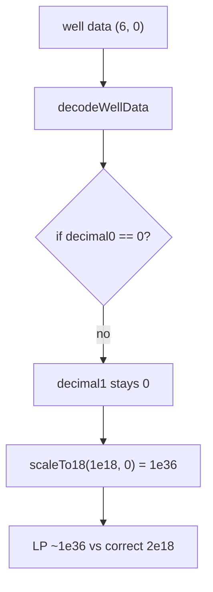

# Basin — Incorrectly assigned `decimal1` in `decodeWellData`

> **Vulnerability classes:** arithmetic/decimal-mismatch · token-decimal-normalization
>
> **Reproduction:** self-contained Foundry PoC with **only `forge-std`** — no fork.
> Full trace: [output.txt](output.txt).

<!-- non-defihacklabs -->
<!-- source-auditvault: https://github.com/Auditware/AuditVault/blob/main/findings/36914-h-02-incorrectly-assigned-decimal1-parameter-upon-decoding-c.md -->
<!-- date: 2024-07 -->

---

## Key info

| | |
|---|---|
| **Impact** | **HIGH** — wrong token1 decimals → severe LP/price misvaluation across Stable2 |
| **Protocol** | [Basin](https://basin.exchange/) — Stable2 well function |
| **Vulnerable code** | `Stable2.decodeWellData` second zero-check uses `decimal0` |
| **Finding** | Code4rena — Basin, 2024-07 · #36914 · [H-02] · reporter **rare_one** |
| **Report** | [code4rena.com/reports/2024-07-basin](https://code4rena.com/reports/2024-07-basin) |
| **Source** | [AuditVault](https://github.com/Auditware/AuditVault/blob/main/findings/36914-h-02-incorrectly-assigned-decimal1-parameter-upon-decoding-c.md) |
| **Compiler** | `^0.8.24` (PoC) |

## TL;DR

When well data encodes `decimal1 = 0` (meaning “default to 18”), the decoder checks `decimal0 == 0` instead of `decimal1 == 0`, so `decimal1` stays 0. Scaling token1 reserves by `10^(18-0)` massively overvalues token1 in `calcLpTokenSupply` and related swap math.

## The vulnerable code

```solidity
if (decimal0 == 0) {
    decimal0 = 18;
}
if (decimal0 == 0) { // @> VULN: should check decimal1
    decimal1 = 18;
}
```

## Root cause

Copy-paste error on the second zero-default branch. Judge confirmed high severity when decimal0 is non-zero and decimal1 needs the default.

## Diagrams



## Impact

Incorrect decimals feed every Stable2 pricing path (`calcLpTokenSupply`, `calcReserve`, `calcRate`, …) — direct economic mispricing.

## Sources

- AuditVault: https://github.com/Auditware/AuditVault/blob/main/findings/36914-h-02-incorrectly-assigned-decimal1-parameter-upon-decoding-c.md
- Report: https://code4rena.com/reports/2024-07-basin
- Repo@commit: code-423n4/2024-07-basin@7d5aacbb144d0ba0bc358dfde6e0cc913d25310e `src/functions/Stable2.sol`

Taxonomy: `[[decimal-mismatch]]` · `[[token-decimal-normalization]]` · `severity/high` · `sector/dex`
