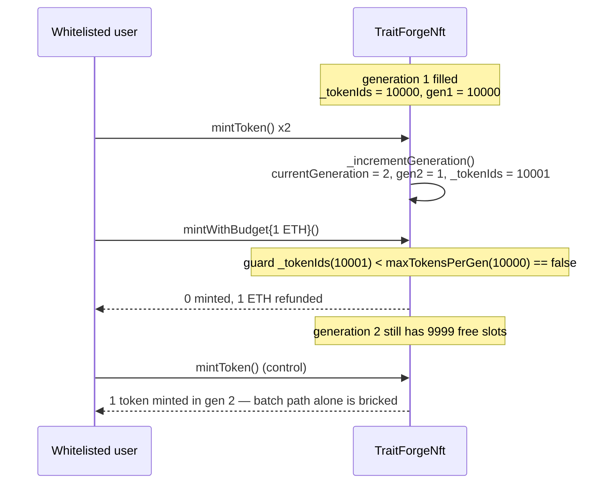

# TraitForge H-01 — wrong minting logic based on total token count across generations

**Severity:** High · **Source:** Code4rena *2024-07-traitforge* · AuditVault finding **#37915**

## Root cause

`TraitForgeNft.mintWithBudget` is meant to let a whitelisted user batch-mint as many
tokens as their budget affords, up to the current generation's cap. Its loop guard,
however, compares the **global** `_tokenIds` counter (total tokens minted across *all*
generations) against the *per-generation* cap `maxTokensPerGen`:

```solidity
// contracts/TraitForgeNft/TraitForgeNft.sol:215
while (budgetLeft >= mintPrice && _tokenIds < maxTokensPerGen) {
    _mintInternal(msg.sender, mintPrice);
    amountMinted++;
    budgetLeft -= mintPrice;
    mintPrice = calculateMintPrice();
}
```

Within generation 1 `_tokenIds == generationMintCounts[1]`, so the guard behaves. But
the moment generation 1 fills (`_tokenIds == maxTokensPerGen == 10_000`), `_tokenIds`
keeps growing forever while every new generation resets its own counter to zero. From
generation 2 onward the guard `_tokenIds < maxTokensPerGen` is **permanently false**, so
`mintWithBudget` enters its loop body **zero** times and refunds the entire budget —
even though the fresh generation has all 10,000 slots open. The correct guard is
`generationMintCounts[currentGeneration] < maxTokensPerGen`.

The bug is a permanent DoS of the batch-mint path in every generation after the first:
`mintToken` (which has no `_tokenIds` guard) still works, so the only way to mint in
generation 2+ is one token per transaction.

## What the PoC proves

Everything on the mint path is the **real, unmodified audited source**, compiled from
`code-423n4/2024-07-traitforge` @ `72077d0` with the project's real
OpenZeppelin contracts 4.9.3: `TraitForgeNft`, `EntropyGenerator`, `EntityForging`,
`Airdrop` and `NukeFund` are all deployed and wired exactly as in production
(EntropyGenerator/Airdrop ownership handed to the NFT; NukeFund receives the mint
proceeds).

`test/…_exp.sol`:

1. **Real mint path** — mints 3 generation-1 tokens and shows `_tokenIds` and
   `generationMintCounts[1]` move together.
2. **Compress history** — advances both counters to `maxTokensPerGen - 1` (9,999) via
   `vm.store` (equivalent to replaying the remaining real gen-1 mints; the on-chain
   trace stays readable). No contract code is modified.
3. **Real generation crossing** — two more real `mintToken` calls fill generation 1 and
   trigger the real `_incrementGeneration`, moving to generation 2 with
   `_tokenIds == 10_001`.
4. **Exploit** — a whitelisted user calls `mintWithBudget` with **1 ETH** (enough for
   ~198 generation-2 tokens). Result: **0 tokens minted, the full 1 ETH refunded**,
   `generationMintCounts[2]` untouched at 1 (9,999 slots still free).
5. **Control** — the same user's `mintToken` succeeds in generation 2, proving the
   generation is open and `mintWithBudget` alone is bricked.

Concrete harm asserted: **0 NFTs minted where a correct guard mints ≥ 198** for the same
1 ETH budget, with generation 2 fully open.



## Reproduce

```bash
_shared/run-poc/run_poc.sh 37915-h-01-wrong-minting-logic-based-on-total-token-count-across-g_exp -vvvvv
```

The in-browser Playground synthetic (`crypto-training`) runs the same real
`TraitForgeNft` (via a subclass that only shrinks `maxTokensPerGen` 10000→3 so a second
generation is reachable in one call) and measures the concrete harm: `mintWithBudget`
mints **0** of a 20-token generation-2 batch, and all 20 are recoverable only by sending
20 separate `mintToken` transactions.

Sources: [AuditVault finding #37915](https://github.com/Auditware/AuditVault/blob/main/findings/37915-h-01-wrong-minting-logic-based-on-total-token-count-across-g.md) · [Code4rena report](https://code4rena.com/reports/2024-07-traitforge) · [vulnerable file](https://github.com/code-423n4/2024-07-traitforge/blob/main/contracts/TraitForgeNft/TraitForgeNft.sol#L215)
