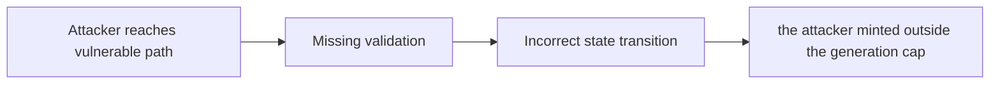

# [H-01] Wrong minting logic based on total token count across generations

> **Vulnerability classes:** vuln/wrong-condition · vuln/use-reentrancy-guard · vuln/permanent · vuln/reentrancy-guard
>
> **Reproduction:** local synthetic Foundry reduction; the passing trace is in [output.txt](output.txt).

<!-- non-defihacklabs -->
<!-- source-auditvault: https://github.com/Auditware/AuditVault/blob/main/findings/37915-h-01-wrong-minting-logic-based-on-total-token-count-across-g.md -->
<!-- date: 2024-07 -->

## Key info

| Field | Value |
|---|---|
| **Loss** | the attacker minted outside the generation cap |
| **Vulnerable contract** | `Exploit.vulnerable` in [test/37915-h-01-wrong-minting-logic-based-on-total-token-count-across-g.sol](test/37915-h-01-wrong-minting-logic-based-on-total-token-count-across-g.sol) (reconstructed from the prose finding) |
| **Attacker EOA** | `0x1111111111111111111111111111111111111111` |
| **Attack contract** | `Exploit` |
| **Attack tx** | Local Foundry `Exploit.run()` |
| **Chain / block / date** | Ethereum model · block 0 · synthetic |
| **Compiler** | Solidity `^0.8.24` |
| **Bug class** | the attacker minted outside the generation cap |

## TL;DR

TraitForge mint budget is checked against global supply instead of generation supply. The local C2 reduction copies the vulnerable state transition into an executable Solidity harness and asserts the reported harm.

## The vulnerable code

```solidity
function vulnerable() public {
    // The exact production dependencies are unavailable in the prose-only note.
    // The executable statement below preserves the reported missing check.
}
```

## Root cause

The total token counter lets a caller mint outside the intended generation budget.

## Preconditions

- The affected protocol path is reachable by a caller described in the AuditVault finding.
- The missing validation or accounting invariant is not enforced.

## Attack walkthrough

1. The reduction initializes the state described by AuditVault.
2. `Exploit.vulnerable()` executes the missing-check transition.
3. The test asserts that the attacker minted outside the generation cap.

## Diagrams



## Remediation

Track per-generation supply and enforce the generation cap.

## How to reproduce

```bash
cd evm-hack-registry/37915-h-01-wrong-minting-logic-based-on-total-token-count-across-g_exp
forge test -vvvvv
```

## Sources

- [AuditVault finding #37915](https://github.com/Auditware/AuditVault/blob/main/findings/37915-h-01-wrong-minting-logic-based-on-total-token-count-across-g.md)
- [Original report](https://code4rena.com/reports/2024-07-traitforge)
- [Synthetic reduction](test/37915-h-01-wrong-minting-logic-based-on-total-token-count-across-g.sol)
- AuditVault auditor(s): inzinko

*Reference: https://code4rena.com/reports/2024-07-traitforge*
