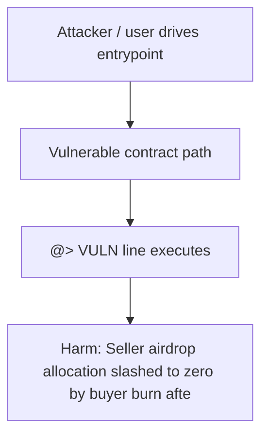

# TraitForge — Buyer burn/nuke slashes original minter's airdrop allocation

> **Vulnerability classes:** griefing, reward-accounting, reentrancy-guard

> **Reproduction:** self-contained Foundry PoC (only `forge-std`) — no fork, no RPC.
> Full trace: [output.txt](output.txt). PoC: [test/37916-h-02-griefing-attack-on-sellers-airdrop-benefits-code4rena-t_exp.sol](test/37916-h-02-griefing-attack-on-sellers-airdrop-benefits-code4rena-t_exp.sol).

<!-- non-defihacklabs -->
<!-- source-auditvault: https://github.com/Auditware/AuditVault/blob/main/findings/37916-h-02-griefing-attack-on-sellers-airdrop-benefits-code4rena-t.md -->
<!-- date: 2024-07 -->

---

## Key info

| | |
|---|---|
| **Impact** | **HIGH** — Seller airdrop allocation slashed to zero by buyer burn after transfer |
| **Protocol** | TraitForge |
| **Vulnerable code** | `TraitForgeNft` (see `@>` in synthetic) |
| **Finding** | Code4rena · #37916 |
| **Report** | [https://code4rena.com/reports/2024-07-traitforge](https://code4rena.com/reports/2024-07-traitforge) |
| **Source** | [AuditVault](https://github.com/Auditware/AuditVault/blob/main/findings/37916-h-02-griefing-attack-on-sellers-airdrop-benefits-code4rena-t.md) |
| **Status** | Audit finding — reproduced as a standalone local PoC |
| **Compiler** | `^0.8.24` |

---

## TL;DR

Buyer burn/nuke slashes original minter's airdrop allocation. Harm demonstrated: **Seller airdrop allocation slashed to zero by buyer burn after transfer**.

---

## The vulnerable code

See `test/37916-h-02-griefing-attack-on-sellers-airdrop-benefits-code4rena-t.sol` — the blamed line is marked `// @> VULN`.

---

## Root cause

See the synthetic header comment and the AuditVault finding for the full root-cause write-up. The Playground preserves the vulnerable line verbatim and asserts the concrete harm in `Exploit.run()`.

## Attack walkthrough

1. Deploy the reduced vulnerable system (CREATE order: Airdrop, TraitForgeNft, SellerActor, BuyerActor).
2. Seed the preconditions from the finding (approvals, balances, whitelist).
3. Execute the attack path; the `@>` line runs.
4. `require(...)` asserts the harm.

## Diagrams

## Impact

Seller airdrop allocation slashed to zero by buyer burn after transfer

## Taxonomy

- griefing, reward-accounting, reentrancy-guard

## Sources

- [AuditVault finding](https://github.com/Auditware/AuditVault/blob/main/findings/37916-h-02-griefing-attack-on-sellers-airdrop-benefits-code4rena-t.md)
- [Code4rena report](https://code4rena.com/reports/2024-07-traitforge)
- Reduced from: `code-423n4/2024-07-traitforge contracts/TraitForgeNft/TraitForgeNft.sol burn()`
