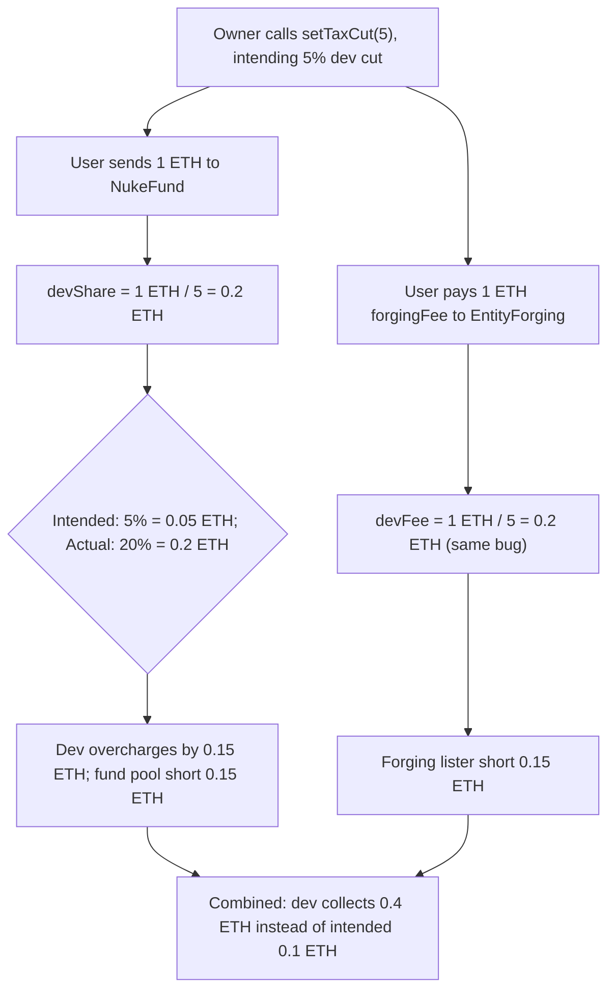
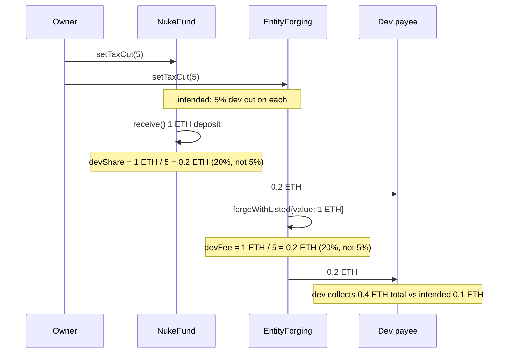

# TraitForge — incorrect percentage calculation in NukeFund and EntityForging

> **Vulnerability classes:** vuln/math/percentage-calculation · vuln/logic/fee-miscalculation · vuln/loss-of-funds/fee-misallocation

> **Reproduction:** a self-contained Foundry PoC that compiles & runs in an
> isolated project with **only `forge-std`** — no fork, no RPC, no `anvil_state`.
> Full trace: [output.txt](output.txt). PoC:
> [test/37917-h-03-incorrect-percentage-calculation-in-nukefund-and-entity_exp.sol](test/37917-h-03-incorrect-percentage-calculation-in-nukefund-and-entity_exp.sol).

<!-- non-defihacklabs -->
<!-- source-auditvault: https://github.com/Auditware/AuditVault/blob/main/findings/37917-h-03-incorrect-percentage-calculation-in-nukefund-and-entity.md -->
<!-- date: 2024-07 -->

---

## Key info

| | |
|---|---|
| **Impact** | **HIGH** — the owner-controlled `taxCut` parameter is documented and intended as a percentage, but both `NukeFund` and `EntityForging` compute the dev's cut as `amount / taxCut`. Any value other than the default (10) silently misallocates funds between the dev, the NukeFund pool, and NFT forgers |
| **Protocol** | [TraitForge](https://github.com/code-423n4/2024-07-traitforge) — generative-trait NFT protocol |
| **Vulnerable code** | `NukeFund.receive()` (`devShare = msg.value / taxCut`) and `EntityForging.forgeWithListed` (`devFee = forgingFee / taxCut`) |
| **Bug class** | Percentage math error: a denominator (`amount / taxCut`) used where a percentage (`amount * taxCut / 10_000`) was intended |
| **Finding** | Code4rena — TraitForge, 2024-07 · #37917 · [H-03] · reporter **Fitro** |
| **Report** | [code4rena.com/reports/2024-07-traitforge](https://code4rena.com/reports/2024-07-traitforge) |
| **Source** | [AuditVault](https://github.com/Auditware/AuditVault/blob/main/findings/37917-h-03-incorrect-percentage-calculation-in-nukefund-and-entity.md) |
| **Status** | Audit finding — caught in review (not exploited on-chain), sponsor-confirmed. Reproduced here as a standalone local PoC. |
| **Compiler** | `^0.8.24` (PoC) |

This is an **audit finding**, not a historical on-chain incident. The real
`NukeFund`/`EntityForging` sit inside the broader TraitForge NFT system; the PoC
keeps the two vulnerable one-line fee calculations verbatim and reduces the rest
to the minimal scaffolding needed to measure the misallocated ETH.

---

## TL;DR

1. `taxCut` is meant to be a **percentage** — the code's own comment calls the
   default value of 10 "the developer's share (**10%**)".
2. Both `NukeFund.receive()` and `EntityForging.forgeWithListed` compute the
   dev's cut as `amount / taxCut` — a **denominator**, not a percentage formula.
3. At the untouched default `taxCut = 10`, `1/10 == 10%`, so the bug is
   invisible — the math only *looks* correct by coincidence.
4. The owner calls `setTaxCut(5)` intending "5%" (there is no bound and no
   warning that the parameter is inverted). The actual cut becomes
   `1/5 = 20%` — **4x** the intended amount.
5. **Harm:** the dev silently collects 0.4 ETH across one NukeFund deposit and
   one forge payment (2 ETH total) instead of the intended 0.1 ETH — a 0.3 ETH
   misallocation taken directly out of the NukeFund pool (which pays nukers)
   and the forging lister's share. No attacker action is required; the bug
   fires on ordinary protocol traffic the instant an owner re-tunes the "tax
   percentage" to any value other than 10.

---

## The vulnerable code

`NukeFund.sol` (verbatim):

```solidity
// Fallback function to receive ETH and update fund balance
receive() external payable {
    uint256 devShare = msg.value / taxCut; // Calculate developer's share (10%)
    uint256 remainingFund = msg.value - devShare; // Calculate remaining funds to add to the fund
    ...
}
```

`EntityForging.sol` (verbatim, same bug):

```solidity
uint256 devFee = forgingFee / taxCut;
uint256 forgerShare = forgingFee - devFee;
```

The recommended fix (basis-point system), per the finding:

```diff
+  uint256 private constant BPS = 10_000;
-  uint256 public taxCut = 10;
+  uint256 public taxCut = 10_000;

-    uint256 devShare = msg.value / taxCut;
+    uint256 devShare = (msg.value * taxCut) / BPS;
```

## Location

| Contract | Function | Line (original) | Issue |
|----------|----------|------------------|-------|
| `EntityForging.sol` | `forgeWithListed` | L146 | `devFee = forgingFee / taxCut` |
| `NukeFund.sol` | `receive` | L41 | `devShare = msg.value / taxCut` |

---

## Root cause

`taxCut` is a single integer used directly as a **divisor**, not converted
into a percentage. `1 / taxCut` only equals `taxCut%` at the single point
`taxCut = 10` (since `1/10 = 0.1 = 10%`) — everywhere else the relationship is
inverted (`1/taxCut` shrinks as `taxCut` grows, the opposite of a percentage).
There is no basis-point constant, no bound in `setTaxCut`, and nothing in the
interface to warn that the parameter behaves this way.

## Preconditions

- The (trusted) owner calls `setTaxCut` with any value other than the default
  10, intending it as a percentage (exactly how the code's own comments and
  the finding's docs describe the parameter).
- Ordinary protocol traffic then flows through `NukeFund.receive` or
  `EntityForging.forgeWithListed` — no attacker action is needed.

## Attack walkthrough

From [output.txt](output.txt):

1. **Control** — at the untouched default `taxCut = 10`, a 1 ETH deposit into
   `NukeFund` correctly splits 0.1 ETH to the dev / 0.9 ETH to the fund (the
   coincidental case where `1/10 == 10%`).
2. The owner calls `setTaxCut(5)` on both `NukeFund` and `EntityForging`,
   intending a 5% dev cut.
3. A user's 1 ETH flows into `NukeFund` → the dev collects `1/5 = 0.2 ETH`
   (20%) instead of the intended `0.05 ETH` (5%); the fund pool books only
   0.8 ETH instead of the intended 0.95 ETH.
4. A 1 ETH forge payment flows into `EntityForging` → the identical bug fires:
   the dev collects another 0.2 ETH instead of 0.05 ETH; the forging lister
   receives 0.8 ETH instead of the intended 0.95 ETH.
5. **HARM:** across both contracts the dev collects **0.4 ETH** total instead
   of the intended **0.1 ETH** — a 0.3 ETH misallocation, straight out of the
   NukeFund pool and the forging lister's pocket.

## Diagrams





## Impact

- Any owner who changes `taxCut` from its default value — reading it as a
  percentage, exactly as the code's own comments describe it — silently
  misallocates funds. Depending on direction, the dev either **overcharges**
  (small `taxCut` values, e.g. 5 → actual 20%) or **undercharges** (large
  `taxCut` values, e.g. 20 → actual 5%).
- Overcharging directly shorts the NukeFund pool (which pays out to users who
  nuke their NFTs) and NFT forgers/listers of their intended share.
- Undercharging silently starves the protocol's own dev/treasury revenue.
- No attacker action is required — the bug fires on ordinary protocol traffic
  the instant the parameter is touched, undermining the protocol's stated
  economic model and, once noticed, user trust in the fee split.

## Remediation

Implement a basis-point (BPS) system as recommended by the finding: introduce
`uint256 private constant BPS = 10_000;`, change the default `taxCut` to
`10_000` (representing 10%), replace every `amount / taxCut` with
`(amount * taxCut) / BPS`, and bound `setTaxCut` so `_taxCut <= BPS`.

## How to reproduce

```bash
cd ~/RustroverProjects/audits/evm-hack-registry/37917-h-03-incorrect-percentage-calculation-in-nukefund-and-entity_exp
forge test -vvv
# Fully local — no fork, no RPC, no anvil_state required.
# Expected: both tests PASS:
#   test_defaultTaxCut_coincidentallyCorrect        (control: default taxCut=10 happens to be correct)
#   test_taxCutChanged_devOverchargesOnBothContracts (harm: taxCut=5 -> dev collects 20% on both contracts)
```

PoC source: [test/37917-h-03-incorrect-percentage-calculation-in-nukefund-and-entity_exp.sol](test/37917-h-03-incorrect-percentage-calculation-in-nukefund-and-entity_exp.sol)
— the verbatim vulnerable one-line fee calculations from both `NukeFund` and
`EntityForging`, plus a control test showing why the bug hides at the default
value.

---

## Sources

- AuditVault finding: [37917-h-03-incorrect-percentage-calculation-in-nukefund-and-entity.md](https://github.com/Auditware/AuditVault/blob/main/findings/37917-h-03-incorrect-percentage-calculation-in-nukefund-and-entity.md)
- Original report: [code4rena.com/reports/2024-07-traitforge](https://code4rena.com/reports/2024-07-traitforge), finding [#221](https://github.com/code-423n4/2024-07-traitforge-findings/issues/221)
- Reduced source: quoted directly from the finding (`NukeFund.sol` L38-43, `EntityForging.sol` L146), repo [code-423n4/2024-07-traitforge@279b288](https://github.com/code-423n4/2024-07-traitforge/blob/279b2887e3d38bc219a05d332cbcb0655b2dc644/contracts/NukeFund/NukeFund.sol#L38-L43)

## Taxonomy (AuditVault)

- `genome:` fee-calculation, fee-theft, timestamp-dependence
- `sector:` nft
- `severity:` high

---

*Reference: finding **#37917** [H-03] by **Fitro** in the [Code4rena TraitForge audit (Jul 2024)](https://code4rena.com/reports/2024-07-traitforge) · curated by [AuditVault](https://github.com/Auditware/AuditVault/blob/main/findings/37917-h-03-incorrect-percentage-calculation-in-nukefund-and-entity.md)*
