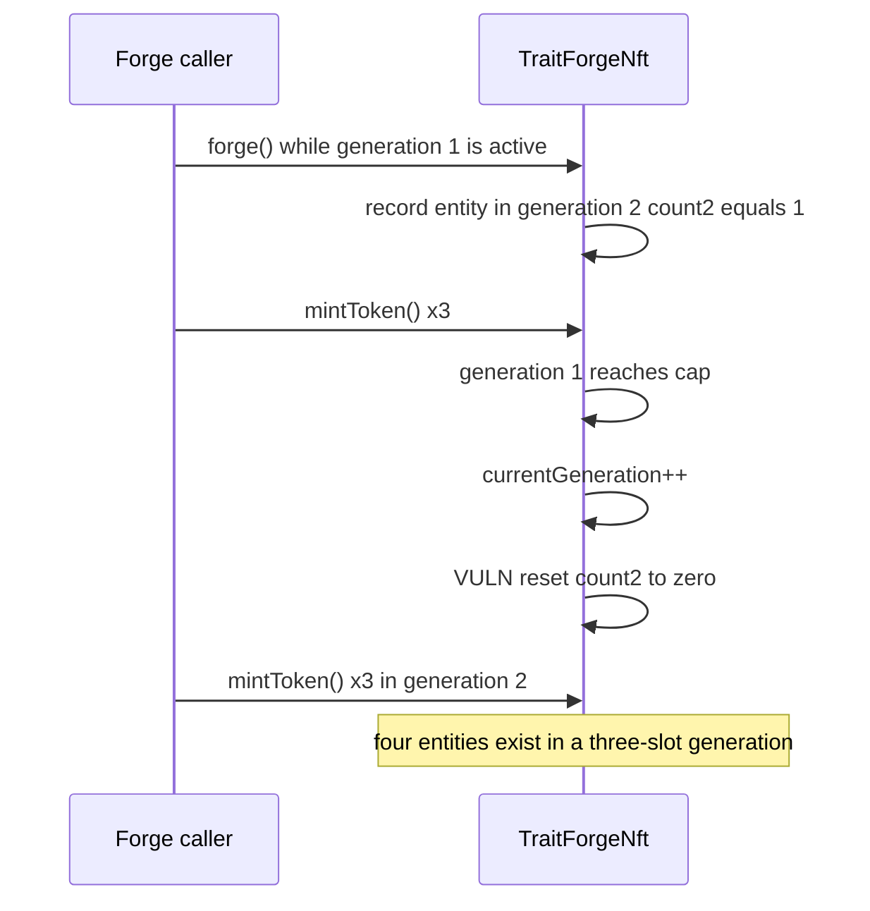

# TraitForge generation count reset lets forged entities bypass the cap

> **Vulnerability classes:** vuln/logic/wrong-condition · vuln/logic/state-update · vuln/input-validation/boundary
> **Reproduction:** local synthetic Foundry test; [output.txt](output.txt) and [test source](test/37918-h-04-generation-mint-count-reset-forged-token-cap-bypass-code4rena.sol).

<!-- non-defihacklabs -->
<!-- source-auditvault: https://github.com/Auditware/AuditVault/blob/main/findings/37918-h-04-number-of-entities-in-generation-can-surpass-the-10k-nu.md -->
<!-- date: 2024-07 -->

## Key info

| | |
|---|---|
| **Loss** | The per-generation entity cap is bypassed; forged entities are omitted from the next generation's counter, breaking TraitForge's supply/economy invariant. |
| **Vulnerable contract** | `TraitForgeNft._incrementGeneration()` |
| **Attacker EOA** | Any caller that forges an entity immediately before a generation rollover. |
| **Attack contract** | `Exploit` (local synthetic harness) |
| **Attack tx** | `Exploit.run()` — one forged entity plus six mints. |
| **Chain / block / date** | Local synthetic chain · block `0` · 2024-07 report |
| **Compiler** | `solc ^0.8.24` |
| **Bug class** | State-update/accounting reset of a pre-minted next-generation entity. |

## TL;DR

`forge()` can create an entity assigned to the next generation and increment
that generation's counter before the generation is active. When the current
generation reaches its cap, `_incrementGeneration()` advances the generation
and executes `generationMintCounts[currentGeneration] = 0`. The reset erases
the forged entity from accounting. Three ordinary mints then fit in generation
2 even though one entity was already there: four entities occupy a three-slot
generation.

## The vulnerable code

The finding blames this reset in `TraitForgeNft._incrementGeneration`:

```solidity
function _incrementGeneration() private {
    require(
        generationMintCounts[currentGeneration] >= maxTokensPerGen,
        'Generation limit not yet reached'
    );
    currentGeneration++;
    generationMintCounts[currentGeneration] = 0; // @> VULN
}
```

The recommended fix is to preserve the existing count (or explicitly account
for forged entities) rather than overwrite it with zero.

## Root cause and preconditions

The counter is treated as if only `mintToken()` can create an entity. The
forging path violates that assumption by recording a next-generation entity
first; the rollover then destroys that state. A caller only needs the normal
forge permission and a generation close to its mint cap.

## Attack walkthrough

1. Generation 1 is active; `forge()` creates token 1 in generation 2 and
   records `generationMintCounts[2] = 1`.
2. Three regular mints fill generation 1. The rollover advances to generation
   2 and resets its counter to zero (the blamed line).
3. Three more regular mints are accepted in generation 2. The accounting
   counter reaches its cap, but `generationEntityCounts[2]` is four: token 1
   plus the three regular mints.
4. `Exploit.run()` asserts `generationEntityCounts[2] > maxTokensPerGen`,
   demonstrating a cap breach without relying on a fork or fabricated profit.

## Diagrams



## Impact and remediation

The protocol's core per-generation supply invariant is false. Depending on
the real 10,000-entity scale, forged entities can make a generation exceed its
cap and invalidate rarity/economic assumptions. Preserve the pre-existing
counter during rollover, or reject/queue forged entities until the target
generation is active.

## How to reproduce

```bash
cd 37918-h-04-generation-mint-count-reset-forged-token-cap-bypass-code4rena_exp
forge test -vvvvv
```

The synthetic uses three slots instead of 10,000 to keep browser replay small;
the vulnerable state transition is unchanged.

## Sources

- [AuditVault finding #37918](https://github.com/Auditware/AuditVault/blob/main/findings/37918-h-04-number-of-entities-in-generation-can-surpass-the-10k-nu.md)
- [Code4rena TraitForge report](https://code4rena.com/reports/2024-07-traitforge)
- Reduced source: the finding's quoted `TraitForgeNft._incrementGeneration` and forging behavior.

*Reference: Code4rena TraitForge 2024-07, finding [#37918](https://code4rena.com/reports/2024-07-traitforge).* 
