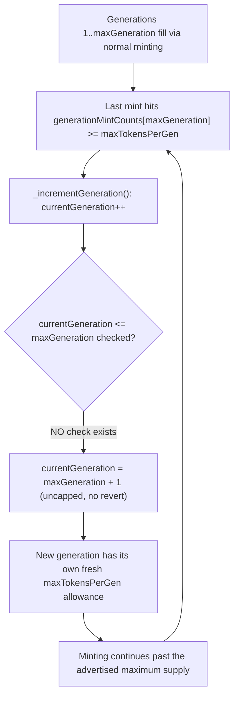
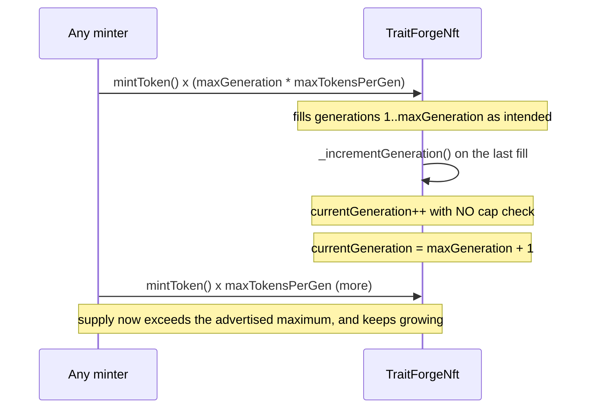

# TraitForge — the maximum number of generations is infinite

> **Vulnerability classes:** vuln/logic/missing-bounds-check · vuln/access-control/insufficient-guard · vuln/tokenomics/supply-cap-breach

> **Reproduction:** a self-contained Foundry PoC that compiles & runs in an
> isolated project with **only `forge-std`** — no fork, no RPC, no `anvil_state`.
> Full trace: [output.txt](output.txt). PoC:
> [test/37919-h-05-the-maximum-number-of-generations-is-infinite-code4rena_exp.sol](test/37919-h-05-the-maximum-number-of-generations-is-infinite-code4rena_exp.sol).

<!-- non-defihacklabs -->
<!-- source-auditvault: https://github.com/Auditware/AuditVault/blob/main/findings/37919-h-05-the-maximum-number-of-generations-is-infinite-code4rena.md -->
<!-- date: 2024-07 -->

---

## Key info

| | |
|---|---|
| **Impact** | **HIGH** — `TraitForgeNft` should cap total supply at `maxGeneration x maxTokensPerGen` NFTs, but `_incrementGeneration` never checks the new generation against `maxGeneration`, so the "cap" rolls over into a new, uncapped generation forever |
| **Protocol** | [TraitForge](https://github.com/code-423n4/2024-07-traitforge) — generative-trait NFT protocol |
| **Vulnerable code** | `TraitForgeNft._incrementGeneration` |
| **Bug class** | Missing bounds check: the generation counter is incremented with no upper-bound guard |
| **Finding** | Code4rena — TraitForge, 2024-07 · #37919 · [H-05] · reporter **inzinko** |
| **Report** | [code4rena.com/reports/2024-07-traitforge](https://code4rena.com/reports/2024-07-traitforge) |
| **Source** | [AuditVault](https://github.com/Auditware/AuditVault/blob/main/findings/37919-h-05-the-maximum-number-of-generations-is-infinite-code4rena.md) |
| **Status** | Audit finding — caught in review (not exploited on-chain), sponsor-confirmed. Reproduced here as a standalone local PoC. |
| **Compiler** | `^0.8.24` (PoC) |

This is an **audit finding**, not a historical on-chain incident. The real
`TraitForgeNft` sits inside a larger system (entropy generator, entity forging,
airdrop, whitelist minting); the PoC keeps the vulnerable
`_incrementGeneration` verbatim and reduces everything else to the minimal
mint/generation bookkeeping the bug needs.

---

## TL;DR

1. `TraitForgeNft` is meant to cap total supply at `maxGeneration` generations
   of `maxTokensPerGen` NFTs each (real protocol: 10 x 10,000 = 100,000).
2. Filling a generation's mint count calls `_incrementGeneration`, which
   re-checks the CURRENT generation's cap, then does `currentGeneration++`
   **unconditionally** — there is no check that the new value stays
   `<= maxGeneration`.
3. The instant the intended last generation fills up, the very next mint
   silently opens **generation N+1**, which has its own fresh
   `maxTokensPerGen` allowance and no memory of ever having "reached the max".
4. This repeats forever: every time a generation fills, a brand-new uncapped
   one opens. The finding's own PoC mints 110,000 NFTs against an advertised
   maximum of 100,000, twelve generations deep.
5. **Harm:** the protocol's advertised fixed maximum supply is not enforced
   anywhere in the contract — anyone willing to pay the (rising) mint price
   can mint without limit, diluting the fixed-supply guarantee every holder
   and buyer relied on.

---

## The vulnerable code

`TraitForgeNft.sol::_incrementGeneration` (verbatim):

```solidity
function _incrementGeneration() private {
    require(
      generationMintCounts[currentGeneration] >= maxTokensPerGen,
      'Generation limit not yet reached'
    );
    currentGeneration++;
    generationMintCounts[currentGeneration] = 0;
    priceIncrement = priceIncrement + priceIncrementByGen;
    entropyGenerator.initializeAlphaIndices();
    emit GenerationIncremented(currentGeneration);
}
```

The recommended fix, per the finding:

```diff
  function _incrementGeneration() private {
    require(
      generationMintCounts[currentGeneration] >= maxTokensPerGen,
      'Generation limit not yet reached'
    );
    currentGeneration++;
+   require(currentGeneration <= maxGeneration,
+    'Maximum generation reached'
+   );
    generationMintCounts[currentGeneration] = 0;
    ...
  }
```

---

## Root cause

`_incrementGeneration` validates the **precondition** for rolling over (the
current generation's mint count reached its cap) but never validates the
**postcondition** (the new generation must not exceed `maxGeneration`). The
two checks look similar but protect different things — the missing one is
exactly the check that would have made "maximum 10 generations" true.

## Preconditions

- None beyond ordinary usage: any user who mints enough tokens to fill the
  last intended generation automatically triggers the rollover into an
  unbounded new one. No special privilege or attacker setup required.

## Attack walkthrough

From [output.txt](output.txt), using a reduced scale (`maxGeneration = 3`,
`maxTokensPerGen = 2`, intended max supply = 6 — the real protocol uses
10 x 10,000 = 100,000; the bug and its mechanism are identical at any scale):

1. **Control** — minting up to one short of the intended max supply keeps
   `currentGeneration` within `[1, maxGeneration]`, exactly as designed.
2. Minting the intended max supply's **last** token triggers
   `_incrementGeneration` one time too many: `currentGeneration` becomes
   `maxGeneration + 1` (4) with **no revert** — the "maximum" has already
   been silently exceeded.
3. **HARM:** minting continues into this new, uncapped generation. An
   additional `maxTokensPerGen` (2) tokens are minted that should never have
   existed, bringing total supply to 8 against the advertised maximum of 6.
4. Nothing in the contract stops a further mint from repeating this
   indefinitely — the "10 generation" cap the protocol advertises is not a
   ceiling at all.

## Diagrams





## Impact

- The protocol's advertised, fixed maximum NFT supply
  (`maxGeneration x maxTokensPerGen`) is not actually enforced — anyone can
  keep minting past it as long as they pay the (increasing) mint price.
- This dilutes the scarcity/rarity guarantees every buyer and holder relied
  on, undermines the tokenomics model built around a capped generational
  structure, and — if noticed — destroys trust in the protocol's stated
  supply limits.
- Because each new generation resets its own per-generation counter and
  price-increment schedule, the dilution is unbounded and repeats forever,
  not a one-time overshoot.

## Remediation

Add the missing postcondition check immediately after the increment, exactly
as the finding recommends:

```solidity
currentGeneration++;
require(currentGeneration <= maxGeneration, 'Maximum generation reached');
```

## How to reproduce

```bash
cd ~/RustroverProjects/audits/evm-hack-registry/37919-h-05-the-maximum-number-of-generations-is-infinite-code4rena_exp
forge test -vvv
# Fully local — no fork, no RPC, no anvil_state required.
# Expected: both tests PASS:
#   test_mintingWithinCap_worksAsIntended  (control: minting up to the cap behaves as designed)
#   test_generationCap_isNotEnforced       (harm: cap is breached with no revert, supply keeps growing)
```

PoC source: [test/37919-h-05-the-maximum-number-of-generations-is-infinite-code4rena_exp.sol](test/37919-h-05-the-maximum-number-of-generations-is-infinite-code4rena_exp.sol)
— the verbatim vulnerable `_incrementGeneration`, reduced to a small scale
(`maxGeneration=3`, `maxTokensPerGen=2`) so the full breach-and-overmint
sequence is cheap to run and replay; the missing bounds check is identical
at the real protocol's 10 x 10,000 scale.

---

## Sources

- AuditVault finding: [37919-h-05-the-maximum-number-of-generations-is-infinite-code4rena.md](https://github.com/Auditware/AuditVault/blob/main/findings/37919-h-05-the-maximum-number-of-generations-is-infinite-code4rena.md)
- Original report: [code4rena.com/reports/2024-07-traitforge](https://code4rena.com/reports/2024-07-traitforge), finding [#217](https://github.com/code-423n4/2024-07-traitforge-findings/issues/217)
- Reduced source: quoted directly from the finding (`TraitForgeNft::_incrementGeneration`), repo [code-423n4/2024-07-traitforge](https://github.com/code-423n4/2024-07-traitforge)

## Taxonomy (AuditVault)

- `genome:` wrong-condition, ownership-transfer, access-roles
- `sector:` nft, token
- `severity:` high

---

*Reference: finding **#37919** [H-05] by **inzinko** in the [Code4rena TraitForge audit (Jul 2024)](https://code4rena.com/reports/2024-07-traitforge) · curated by [AuditVault](https://github.com/Auditware/AuditVault/blob/main/findings/37919-h-05-the-maximum-number-of-generations-is-infinite-code4rena.md)*
