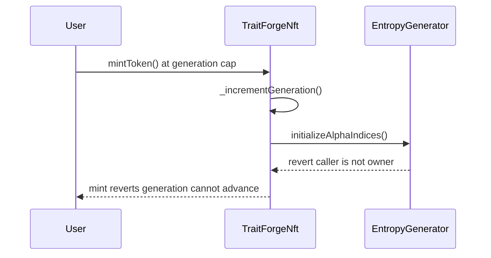

# TraitForge generation rollover is permanently blocked by the wrong modifier

> **Vulnerability classes:** vuln/access-control/missing-modifier · vuln/dos/init-constraint · vuln/logic/wrong-condition
> **Reproduction:** local synthetic Foundry test; [output.txt](output.txt) and [test source](test/37920-h-06-entropy-generator-initialize-alpha-indices-wrong-modifier-code4rena.sol).

<!-- non-defihacklabs -->
<!-- source-auditvault: https://github.com/Auditware/AuditVault/blob/main/findings/37920-h-06-minttoken-mintwithbudget-and-forge-in-the-traitforgenft.md -->
<!-- date: 2024-07 -->

## Key info

| | |
|---|---|
| **Loss** | Generation rollover reverts, bricking `mintToken`, `mintWithBudget`, and `forge` at the boundary. |
| **Vulnerable contract** | `EntropyGenerator.initializeAlphaIndices()` |
| **Attacker EOA** | Any caller can trigger the normal mint/forge path once the generation cap is reached. |
| **Attack contract** | `Exploit` (local synthetic harness) |
| **Attack tx** | `Exploit.run()` — catches the NFT mint revert and asserts no state persisted. |
| **Chain / block / date** | Local synthetic chain · block `0` · 2024-07 report |
| **Compiler** | `solc ^0.8.24` |
| **Bug class** | Access-control mismatch causing a generation-boundary denial of service. |

## TL;DR

`TraitForgeNft` is configured as `EntropyGenerator.allowedCaller`, but the
audited function uses `onlyOwner`. On every generation rollover the NFT calls
`initializeAlphaIndices`; `msg.sender` is the NFT, not the owner, so the call
reverts. The first capped mint in this reduction is therefore uncallable.

## The vulnerable code

The finding quotes the exact declaration:

```solidity
function initializeAlphaIndices() public whenNotPaused onlyOwner { // @> VULN
    // initialize alpha indices
}
```

The fix is the one-line modifier change:

```diff
- function initializeAlphaIndices() public whenNotPaused onlyOwner {
+ function initializeAlphaIndices() public whenNotPaused onlyAllowedCaller {
```

## Root cause and preconditions

The contract has two distinct authorities: the deployment owner and the NFT
contract allowed to update alpha indices. The function protects the latter
operation with the former role. No unusual setup is needed; ordinary traffic
that reaches the generation cap activates the broken call.

## Attack walkthrough

1. `Exploit` deploys `EntropyGenerator`, then `TraitForgeNft`, and configures
   the NFT as `allowedCaller`.
2. `mintToken()` reaches the one-token generation cap and calls
   `_incrementGeneration()`.
3. `_incrementGeneration()` calls `initializeAlphaIndices()` from the NFT
   address. `onlyOwner` rejects that caller and the complete mint reverts.
4. `Exploit.run()` catches the revert and asserts total supply, generation, and
   alpha-index version remain unchanged. The owner-only control call succeeds,
   isolating the bug to the modifier.

## Diagrams



## Impact and remediation

The protocol's minting and forging flows can be permanently unavailable at
each generation boundary. Replace `onlyOwner` with `onlyAllowedCaller` on
`initializeAlphaIndices`, then retain owner-only protection for administrative
functions such as setting the allowed caller.

## How to reproduce

```bash
cd 37920-h-06-entropy-generator-initialize-alpha-indices-wrong-modifier-code4rena_exp
forge test -vvvvv
```

This is a local synthetic with no RPC, fork, or fabricated token profit.

## Sources

- [AuditVault finding #37920](https://github.com/Auditware/AuditVault/blob/main/findings/37920-h-06-minttoken-mintwithbudget-and-forge-in-the-traitforgenft.md)
- [Code4rena TraitForge report](https://code4rena.com/reports/2024-07-traitforge)
- [EntropyGenerator.sol at audited commit](https://github.com/code-423n4/2024-07-traitforge/blob/279b2887e3d38bc219a05d332cbcb0655b2dc644/contracts/EntropyGenerator/EntropyGenerator.sol#L206)
- [TraitForgeNft.sol rollover call](https://github.com/code-423n4/2024-07-traitforge/blob/279b2887e3d38bc219a05d332cbcb0655b2dc644/contracts/TraitForgeNft/TraitForgeNft.sol#L353)

*Reference: Code4rena TraitForge 2024-07, finding [#37920](https://code4rena.com/reports/2024-07-traitforge).* 
