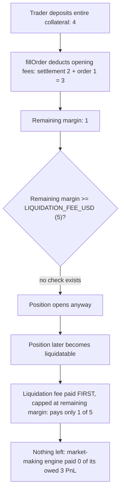
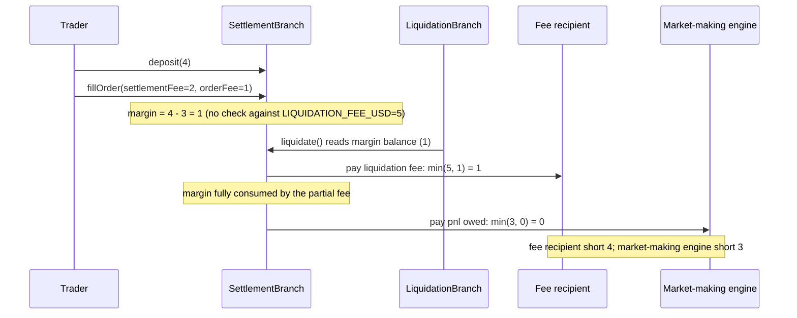

# Zaros — SettlementBranch._fillOrder does not guarantee collateral covers the future liquidation fee

> **Vulnerability classes:** vuln/logic/missing-validation · vuln/loss-of-funds/fee-shortfall · vuln/economic-design/underfunded-liquidation

> **Reproduction:** a self-contained Foundry PoC that compiles & runs in an
> isolated project with **only `forge-std`** — no fork, no RPC, no `anvil_state`.
> Full trace: [output.txt](output.txt). PoC:
> [test/37983-settlementbranch-fillorder-does-not-guarantee-the-collateral_exp.sol](test/37983-settlementbranch-fillorder-does-not-guarantee-the-collateral_exp.sol).

<!-- non-defihacklabs -->
<!-- source-auditvault: https://github.com/Auditware/AuditVault/blob/main/findings/37983-settlementbranch-fillorder-does-not-guarantee-the-collateral.md -->
<!-- date: 2024-07 -->

---

## Key info

| | |
|---|---|
| **Impact** | **HIGH** — `SettlementBranch._fillOrder` never checks that the margin remaining after opening fees can cover the fixed future liquidation fee, so a position can open with too little collateral to ever be liquidated fully |
| **Protocol** | [Zaros](https://github.com/Cyfrin/2024-07-zaros) — perpetuals trading engine |
| **Vulnerable code** | `SettlementBranch._fillOrder` (opening-fee deduction, missing post-condition check) |
| **Bug class** | Missing validation: no check that a post-fee state satisfies a downstream fixed requirement |
| **Finding** | Codehawks — Zaros, 2024-07 · #37983 · reporter **giraffe0x** |
| **Report** | Codehawks 2024-07-zaros contest |
| **Source** | [AuditVault](https://github.com/Auditware/AuditVault/blob/main/findings/37983-settlementbranch-fillorder-does-not-guarantee-the-collateral.md) |
| **Status** | Audit finding — caught in review (not exploited on-chain). Reproduced here as a standalone local PoC. |
| **Compiler** | `0.8.25` (PoC pragma matches the audited repo) |

This is an **audit finding**, not a historical on-chain incident. The real
`_fillOrder` operates over PRB-Math fixed-point margin/PnL accounting with
Chainlink Data Streams price verification; the PoC keeps the vulnerable
missing-check pattern verbatim and reduces margin accounting to the minimum
arithmetic needed to show the exact fee shortfall on liquidation.

---

## TL;DR

1. Opening a position (`_fillOrder`) deducts the settlement fee and order
   fee from the trader's margin balance.
2. It never checks that whatever margin remains afterward can still cover
   `LIQUIDATION_FEE_USD` — a **fixed** fee the position will unconditionally
   owe the moment it is liquidated.
3. A trader can deposit just enough to pay the opening fees while leaving
   far less behind than the future liquidation fee requires.
4. On liquidation, `TradingAccount.deductAccountMargin` pays the
   liquidation fee **first**, capped by whatever margin remains — so with
   too little margin left, the fee recipient is shorted.
5. **Harm:** because the (partial) fee payment consumes 100% of what
   remained, the market-making engine — which is owed the position's PnL —
   receives **nothing** either. In this reduction: deposit 4, opening fees 3,
   leaving 1; fixed liquidation fee is 5 but only 1 gets paid (a **4**
   shortfall to the fee recipient), and the market-making engine's owed 3
   in PnL is paid **0**.

---

## The vulnerable code

`SettlementBranch.sol::_fillOrder` (relevant deduction, per the finding —
verbatim structure preserved in the reduction):

```solidity
tradingAccount.deductAccountMargin({
    // ... pays settlementFeeUsdX18 + ctx.orderFeeUsdX18 out of margin ...
});

emit LogFillOrder(
```

The finding's recommended fix — add a post-deduction check:

```diff
            tradingAccount.deductAccountMargin({
                // ...
            });

+           tradingAccount.validateMarginRequirement(
+               UD60x18.wrap(0),
+               tradingAccount.getMarginBalanceUsd(accountTotalUnrealizedPnlUsdX18),
+               ctx.orderFeeUsdX18.add(UD60x18.wrap(globalConfiguration.liquidationFeeUsdX18))
+           );

            emit LogFillOrder(
```

---

## Root cause

`_fillOrder` validates that the trader has enough margin to pay the
**opening-time** fees, but never checks the resulting state against the
**fixed, unconditional** fee the position will owe later, at liquidation
time. The two checks look similar ("does the account have enough margin?")
but protect completely different moments in the position's lifecycle — the
missing one is exactly what guarantees a liquidatable position can actually
be liquidated for its full intended fee.

## Preconditions

- A trader opens a position with collateral just above the opening-fee
  threshold but below `opening fees + LIQUIDATION_FEE_USD`.
- The position later becomes liquidatable (ordinary market movement).

## Attack walkthrough

From [output.txt](output.txt):

1. **Control** — a trader who deposits enough to cover both the opening
   fees AND the fixed liquidation fee is liquidated cleanly: the fee
   recipient gets the full fixed fee, and the market-making engine gets its
   full owed PnL.
2. A trader deposits their entire collateral: 4 units.
3. `fillOrder` deducts the 3-unit opening fee (settlement fee 2 + order fee
   1), leaving 1 unit of margin.
4. **VULN:** nothing checks that 1 (remaining margin) covers
   `LIQUIDATION_FEE_USD` (5) — the position opens successfully anyway.
5. The position later becomes liquidatable; the market-making engine is
   owed 3 in PnL upon liquidation.
6. **HARM:** the liquidation fee is paid first, capped at the 1 unit that
   remains — the fee recipient gets **1 instead of 5** (a 4-unit shortfall).
   Because that payment already consumed everything left, the market-making
   engine gets **0 of its owed 3** in PnL.

## Diagrams





## Impact

- Traders can open positions with structurally insufficient collateral to
  ever pay a liquidation in full, regardless of how the market moves.
- On liquidation, the protocol's liquidation fee recipient (keeper
  incentive / insurance mechanism) receives less than the intended fixed
  fee — disincentivizing prompt liquidation of exactly the smallest,
  riskiest positions.
- The market-making engine, which is owed the position's realized PnL on
  liquidation, can receive nothing at all once the (already-reduced)
  liquidation fee consumes the little margin that remains — breaking the
  protocol's expected accounting between traders and its market-making
  counterparty.

## Remediation

Add a post-deduction check in `_fillOrder`, immediately after the opening
fees are deducted, requiring the remaining margin to cover at least the
order fee plus the fixed liquidation fee — as shown in the finding's diff
above (`tradingAccount.validateMarginRequirement(...)`).

## How to reproduce

```bash
cd ~/RustroverProjects/audits/evm-hack-registry/37983-settlementbranch-fillorder-does-not-guarantee-the-collateral_exp
forge test -vvv
# Fully local — no fork, no RPC, no anvil_state required.
# Expected: both tests PASS:
#   test_sufficientMargin_liquidatesCleanly                  (control: enough margin -> full fee + full pnl paid)
#   test_insufficientMargin_shortsFeeRecipientAndMarketMaking (harm: fee recipient shorted 4, market-making engine paid 0)
```

PoC source: [test/37983-settlementbranch-fillorder-does-not-guarantee-the-collateral_exp.sol](test/37983-settlementbranch-fillorder-does-not-guarantee-the-collateral_exp.sol)
— the verbatim vulnerable fee-deduction path (missing the post-condition
check), with a minimal margin model quantifying the resulting fee and PnL
shortfall.

---

## Sources

- AuditVault finding: [37983-settlementbranch-fillorder-does-not-guarantee-the-collateral.md](https://github.com/Auditware/AuditVault/blob/main/findings/37983-settlementbranch-fillorder-does-not-guarantee-the-collateral.md)
- Original contest: Codehawks 2024-07-zaros (Cyfrin), finding #37983
- Reduced source: quoted directly from the finding (`SettlementBranch::_fillOrder` L495-L516, `LiquidationBranch.sol` L152-L161, `TradingAccount.sol` L528-L566), repo [Cyfrin/2024-07-zaros@7439d79](https://github.com/Cyfrin/2024-07-zaros/blob/7439d79e627286ade431d4ea02805715e46ccf42/src/perpetuals/branches/SettlementBranch.sol#L495-L516)

## Taxonomy (AuditVault)

- `genome:` liquidation-logic, direct-drain, account-ownership, chainlink-round-completeness, liquidation-underwater
- `sector:` lending, oracle, perpetuals
- `severity:` high

---

*Reference: finding **#37983** by **giraffe0x** in the Codehawks 2024-07-zaros contest (Cyfrin) · curated by [AuditVault](https://github.com/Auditware/AuditVault/blob/main/findings/37983-settlementbranch-fillorder-does-not-guarantee-the-collateral.md)*
